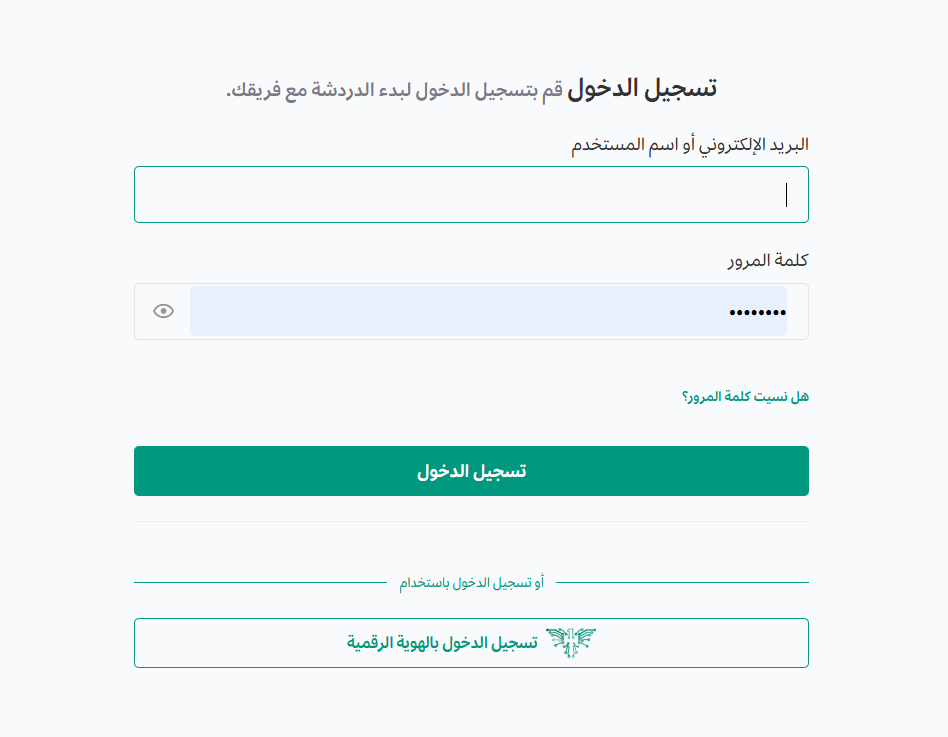
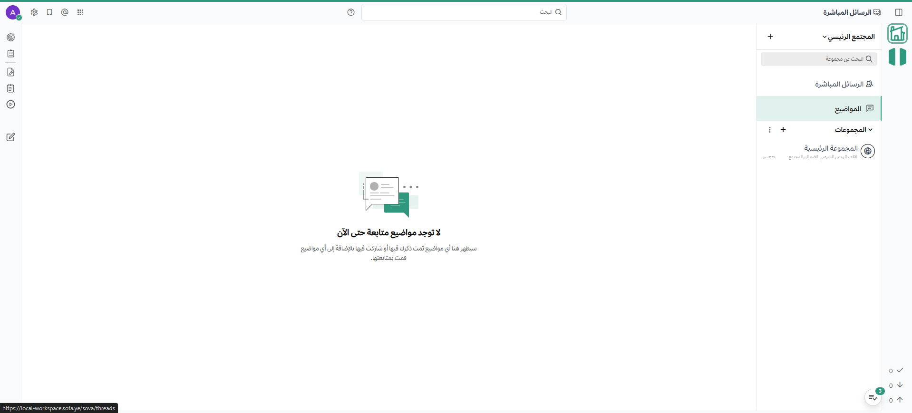

import { Aside, Steps } from '@astrojs/starlight/components';
import { Image } from 'astro:assets';

قم بتنزيل وتثبيت تطبيق سطح المكتب لـ **منصة تعاون** أو عبر استخدام مدير الحزم لنظام لينكس. نوصي بشدة بتثبيت التطبيق على محرك أقراص محلي، حيث أن مشاركات الشبكة غير مدعومة وقد تؤدي لمشاكل في الأداء.

<Steps>
1. عند تشغيل التطبيق لأول مرة، أدخل رابط خادم **منصة تعاون** واسم العرض للمحطة. اسم العرض يساعدك عند [الاتصال بمساحات عمل متعددة](/customize-your-preferences/connect-to-multiple-workspaces).
2. أدخل بيانات اعتماد المستخدم الخاصة بك لتسجيل الدخول.
3. سيفتح النظام تلقائياً الفريق الذي يظهر أولاً في الشريط الجانبي؛ وإذا لم تكن عضواً في فريق بعد، ستتم مطالبتك بالانضمام لأحد الفرق المتاحة.
</Steps>

### واجهة إعداد السيرفر في تطبيق سطح المكتب
توضح الصورة أدناه نافذة إضافة الخادم الجديد في التطبيق:

<Aside type="note">
عند تسجيل الدخول باستخدام بيانات اعتماد خارجية (مثل جوجل)، ستنتقل مؤقتاً إلى المتصفح لمصادقة بياناتك، ثم سيتم توجيهك تلقائياً للعودة إلى تطبيق سطح المكتب. راجع دليل [الوصول إلى مساحة عملك](/access-your-workspace/access-your-workspace) لمزيد من التفاصيل.
</Aside>

---

## تحديث تطبيق سطح المكتب 

تستخدم **منصة تعاون** إشعارات داخل التطبيق لتنبيهك عند توفر إصدارات جديدة. ستظهر لك أيقونة التنزيلات مع خيارات التحديث حسب نظام تشغيلك:

* **نظام ماك (عبر المتجر):** اختر **فتح متجر تطبيقات ماك** للتحديث المباشر.
* **نظام ماك (ملف DMG):** اختر **تنزيل التحديث**، ثم اسحب أيقونة المنصة إلى مجلد التطبيقات.
* **نظام ويندوز (عبر المتجر):** اختر **استخدام متجر مايكروسوفت** للتحديث التلقائي.
* **نظام ويندوز (ملف MSI):** اختر **تنزيل يدوي** لتشغيل المثبت الجديد.
* **نظام لينكس:** سيتم توجيهك لصفحة التنزيلات لتحميل الحزمة المناسبة لنظامك (مثل deb أو rpm).

### الواجهة الرئيسية للتطبيق (سطح المكتب)
بعد الدخول، ستظهر لك الواجهة المنظمة التي تتيح لك الوصول للقنوات والرسائل:

---

## التحقق اليدوي وتخطى التحديثات

يمكنك دائماً التحقق من التحديثات يدوياً عبر:
* الانتقال إلى **مساعدة > التحقق من وجود تحديثات**.
* أو من خلال **الإعدادات > التحديثات** والنقر على **التحقق الآن**.

إذا كنت لا ترغب في الترقية لإصدار معين حالياً، يمكنك اختيار **تخطي هذا الإصدار** في الإشعار؛ وسيتم إخطارك فقط عند توفر إصدار أحدث منه.

<Aside type="caution" title="تنبيه لمستخدمي ويندوز">
إذا قمت بالترقية وظهرت أيقونة التطبيق في شريط المهام بشكل غير صحيح:
1. قم بإلغاء تثبيت الاختصار الحالي من شريط المهام.
2. شغّل التطبيق من قائمة ابدأ.
3. انقر بزر الماوس الأيمن على الأيقونة النشطة واختر **تثبيت بشريط المهام**.
</Aside>

<Aside type="note">
في بيئات العمل المؤسسية، قد يقوم مسؤول النظام بتعطيل إشعارات التحديث تلقائياً؛ إذا لم تظهر لك الخيارات، يرجى مراجعة قسم تقنية المعلومات.
</Aside>