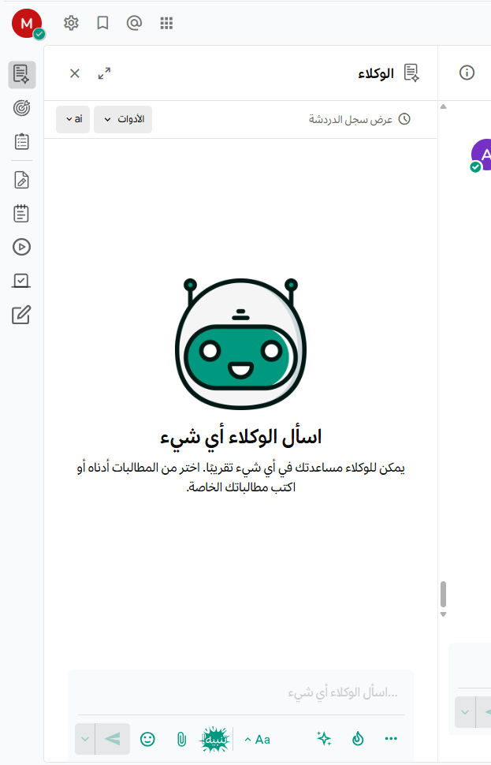
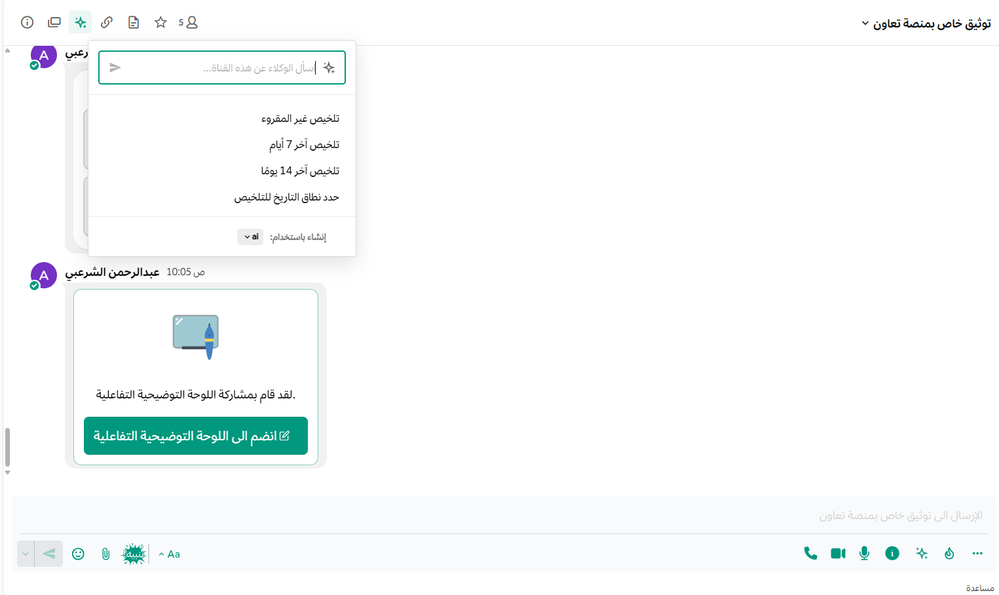
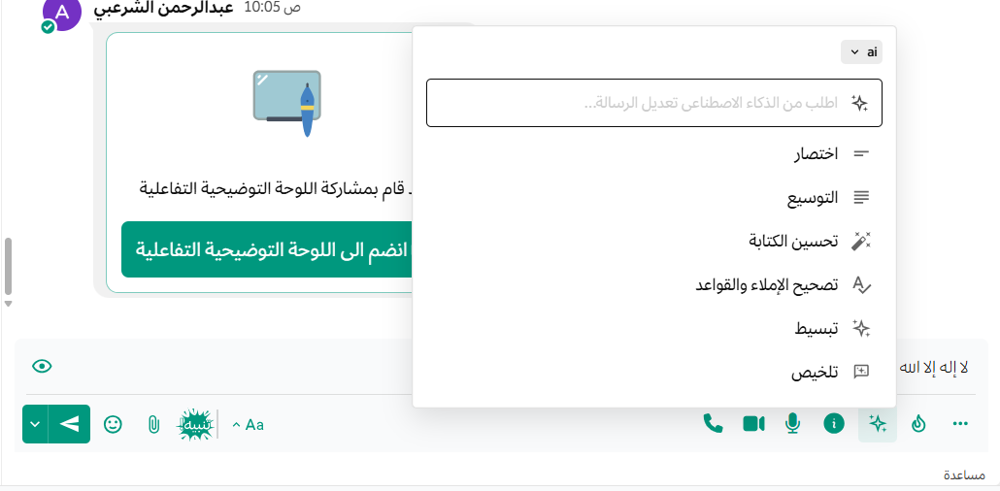

يوضح هذا الدليل كيفية استخدام ميزات الذكاء الاصطناعي المتاحة من خلال مساعدي منصة تعاون. يحوِّل هذا النظام منصة تعاون إلى منصة تعاونية معزّزة بالذكاء الاصطناعي لتحسين إنتاجية الفريق وتواصله.

باستخدام مساعدي منصة تعاون، يمكنك تلخيص تسجيلات المكالمات والاجتماعات، وتحويل مواضيع المحادثة الطويلة والرسائل غير المقروءة إلى ملخّصات موجزة، وتحديد الخطوات التالية والقرارات، واستخلاص المعارف وتحويل المحتوى إلى مخططات ووثائق، والتعمق في أي موضوع من خلال طلب الرؤى، والاستفادة من أدوات الإملاء الصوتي للتواصل دون استخدام اليدين.

:::note

**كان مساعدو منصة تعاون يُعرَفون سابقاً باسم تعاون كوبايلوت.**

:::

## الوصول إلى ميزات الذكاء الاصطناعي

يمكنك الوصول إلى ميزات الذكاء الاصطناعي في منصة تعاون بالطرق التالية:

### الويب وسطح المكتب

يمكنك الوصول إلى ميزات الذكاء الاصطناعي من خلال اللوحة اليمنى بإحدى الطرق التالية:

- اختر أيقونة **المساعدين** في الشريط الجانبي للتطبيقات.

- اذكر بوت المساعد (@mention) في أي قناة لديك صلاحية الوصول إليها (مثل `@copilot`).
- استخدم قائمة **الإجراءات الذكية** عن طريق تمرير الماوس فوق الرسالة الأولى في أي موضوع محادثة.
- استخدم خيار **اسأل الذكاء الاصطناعي** في القنوات التي تحتوي على رسائل غير مقروءة.

### الهاتف المحمول

ابدأ أو افتح رسالة مباشرة مع بوت المساعد. إذا قام مسؤول النظام بتكوين عدة بوتات، يمكنك التنقل بينها عن طريق فتح كل بوت باسمه.

## ميزات الذكاء الاصطناعي التفاعلية

### الدردشة مع المساعدين

يمكنك إجراء محادثات مع المساعدين بعدة طرق:

- **لوحة المساعدين:** استخدم اللوحة اليمنى لتجربة سلسة. ابدأ بمطالبات مقترحة، أو شارك في محادثة خاصة مع المساعد. يمكنك أيضاً إرفاق ملفات لتحليلها أو الرجوع إليها.
- **الرسائل المباشرة:** ابدأ رسالة مباشرة مع بوت المساعد لإجراء محادثة خاصة تماماً كما تفعل مع أي مستخدم آخر.
- **الإشارات في القنوات:** أشر إلى المساعد باسم المستخدم الخاص به (مثل `@copilot`) في أي موضوع محادثة لجلب قدرات الذكاء الاصطناعي إلى محادثتك. سيردّ البوت في موضوع المحادثة للحفاظ على تنظيم القناة.

### الموافقة على الأدوات 

عندما يستخدم المساعدون أدوات خارجية أو تكاملات، قد يُطلب منك الموافقة على استخدام الأداة لضمان الأمان. ستظهر بطاقة تعرض اسم الأداة، ووصفها، والمعاملات المُرسلة إليها، مع خياري **موافقة** أو **رفض**.

## تحليل مواضيع المحادثة والقنوات

### تلخيص مواضيع المحادثة

لتلخيص موضوع محادثة:

1. مرر الماوس فوق الرسالة الأولى في أي [موضوع محادثة](/messaging-collaboration/communicate-with-messages-and-threads/communicate-with-messages-and-threads).
2. اختر أيقونة المساعدين.
3. اختر تلخيص موضوع المحادثة.

سيتم إنشاء ملخص موضوع المحادثة في لوحة المساعدين، ولن يتمكن أحد غيرك من رؤيته.

### تلخيص القنوات غير المقروءة

1. انتقل إلى خط "الرسائل الجديدة" في قناة تحتوي على رسائل غير مقروءة.
2. اختر **اسأل الذكاء الاصطناعي**.
3. اختر **تلخيص الرسائل الجديدة**.

### إعادة صياغة الرسائل
تتيح لك منصة تعـــاون استخدام الذكاء الاصطناعي لإعادة صياغة رسائلك وتحسينها قبل إرسالها. تتوفر هذه الميزة مباشرة داخل حقل إرسال الرسائل، سواء كنت تكتب في خيط محادثة، أو في محادثة مباشرة مع شخص، أو في محادثة جماعية، أو في قناة.
**لاستخدام ميزة إعادة صياغة الرسائل:**

1. اكتب رسالتك في حقل إدخال الرسائل.
2. انقر على أيقونة **الذكاء الاصطناعي** المتاحة في شريط أدوات حقل الإدخال.
3. اختر أحد خيارات إعادة الصياغة المناسبة لك:
   - **تحسين الكتابة**: لتحسين الصياغة العامة للرسالة وجعلها أكثر احترافية ودقة.
   - **تصحيح الإملاء والقواعد**: للتحقق من الأخطاء اللغوية والنحوية وتصحيحها تلقائياً.
   - **الاختصار**: لتقليص نص الرسالة وجعلها موجزة ومركزة.
   - **التوسيع**: لإضافة تفاصيل وتوضيح الأفكار بشكل أوسع.
   - **التبسيط**: لتسهيل أسلوب الكتابة وجعل الرسالة أوضح وأبسط للقراءة.
   - **التلخيص**: لتكثيف الرسائل الطويلة وعرضها في نقاط رئيسية موجزة.

## البحث والتحليل المتقدم

### البحث باستخدام الذكاء الاصطناعي

يمكنك تحسين [البحث](/messaging-collaboration/communicate-with-messages-and-threads/search-for-messages) في منصة تعـــاون باستخدام قدرات الذكاء الاصطناعي. افتح لوحة الوكلاء واستخدم اللغة الطبيعية للبحث عن المحتوى (مثل "ابحث عن النقاشات حول إطلاق المنتج الجديد"). سيجد الذكاء الاصطناعي نتائج ذات صلة دلالياً حتى لو لم تحتوي على الكلمات الرئيسية بالضبط.

### تحليل الصور

بالنسبة لنماذج الذكاء الاصطناعي التي تدعم الرؤية، يمكنك إرفاق صورة عند الدردشة مع الوكيل لطرح أسئلة حولها أو طلب تحليلها.

### تسجيل المكالمات لتلخيص الاجتماعات

يمكنك تحويل تسجيلات [منصة تعـــاون مكالمات](/audio-and-screensharing/audio-and-screensharing) إلى ملخصات قابلة للتنفيذ:

1. ابدأ مكالمة في منصة تعـــاون وقم بتسجيلها.
2. بمجرد انتهاء المكالمة وجاهزية التسجيل والنص المكتوب، اختر **إنشاء ملخص الاجتماع** مباشرة فوق تسجيل المكالمة.
3. سيتم إنشاء ملخص الاجتماع ومشاركته كرسالة مباشرة معك.