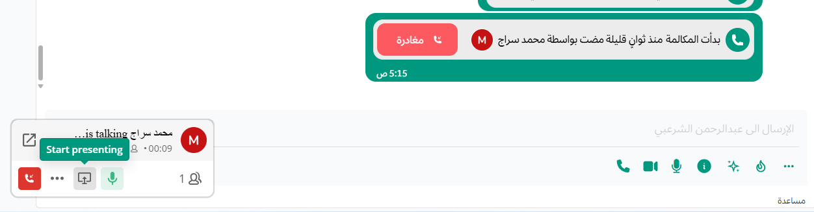
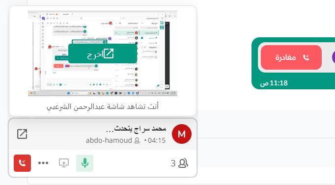
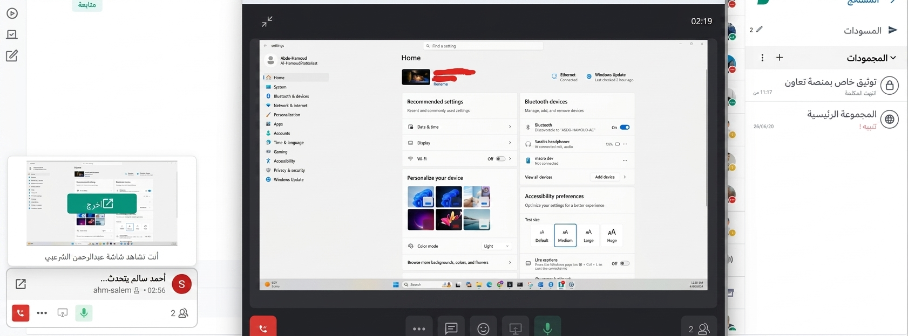

توفّر خدمة "مكالمات منصة تعاون" تجربة تواصل متكاملة تشمل الدردشة الفورية، والمكالمات الصوتية المستضافة ذاتيًا، ومشاركة الشاشة ضمن شبكتك الخاصة، مما يمكّن فرق العمل من التواصل والتعاون بأمان وفعالية. تعرّف على المزيد حول نشر خدمة مكالمات منصة تعاون في البيئات المستضافة ذاتيًا و[إجراء المكالمات](/messaging-collaboration/collaborate-within-channels/make-calls) باستخدام منصة تعاون.

تضمن ميزات المكالمات ومشاركة الشاشة في منصة تعاون استمرارية الاتصال حتى أثناء أعمال الصيانة أو الأعطال، وتتوسع بسلاسة لتلبية احتياجات فريقك المتنامية مع الحفاظ على سلامة العمليات ذات الأهمية الحرجة.

تشمل الوظائف الأساسية:

- **مكالمات صوتية ثنائية**: بدء اتصال صوتي مباشر بين شخصين لحل المشكلات بسرعة وإجراء المناقشات الهامة.
- **مؤتمرات صوتية**: استضافة مكالمات صوتية جماعية لتنسيق الفرق وتسريع حل المشكلات عبر البيئات الموزعة.
- **مشاركة الشاشة**: مشاركة شاشتك أثناء المكالمات للتعاون المرئي على المهام، أو مراجعة المستندات، أو استكشاف الأخطاء وإصلاحها فوراً.
- **الدردشة أثناء المكالمات**: تبادل الرسائل النصية إلى جانب الاتصال الصوتي لتحسين الوضوح ومشاركة الروابط وتوفير سياق مرئي.
- **البحث في سجل المحادثة**: الوصول إلى الرسائل المتبادلة أثناء المكالمة لاحقًا لتعقب القرارات والروابط والنقاط الرئيسية.
- **عناصر تحكم المضيف**: إدارة المشاركين، والتحكم في كتم الصوت، وتنظيم تدفق المحادثة لضمان إنتاجية الاجتماع.
- **تسجيل المكالمات**: تسجيل الجلسات الصوتية للمراجعة اللاحقة، أو لغايات الامتثال، أو لمشاركتها مع أعضاء الفريق الغائبين.
- **نسخ المكالمات**: تحويل المحتوى المنطوق إلى نص مكتوب لدعم التوثيق والامتثال وتحسين إمكانية الوصول.
- **التسمية التوضيحية الحية**: توفير ترجمة نصية فورية لتعزيز الشمولية ودعم المستخدمين في البيئات الصاخبة.
- **ملخصات المكالمات بالذكاء الاصطناعي**: إنشاء ملخصات موجزة تلقائيًا للمكالمات لتوفير الوقت واستخلاص النتائج الرئيسية.
- **ضوابط أمان متقدمة**: فرض تشفير وسياسات وصول صارمة تلبي متطلبات البيئات عالية الحساسية.
- **توفر عالٍ (High Availability)**: ضمان استمرارية الخدمة من خلال أنظمة التبديل الاحتياطي ومسارات الاتصال البديلة.

## تكاملات مؤتمرات الفيديو

تتكامل منصة تعاون بسلاسة مع أبرز مزوّدي خدمات مؤتمرات الفيديو (سواء المستضافة ذاتيًا أو السحابية)، مما يمنح المستخدمين مرونة تامة للانتقال من الدردشة النصية إلى الفيديو:

- **Pexip**: حل احترافي لمؤتمرات الفيديو بمستوى مؤسسي، يوفر ميزات أمان متقدمة وقابلية توسع عالية.
- **Zoom**: منصة سحابية رائدة تتميز بسهولة الاستخدام وتعدد أدوات التعاون مثل مشاركة الشاشة وغرف الاستراحة.
- **Webex**: حل شامل مصمم لأمن المؤسسات، يوفر ميزات مثل مشاركة الملفات، والخلفيات الافتراضية، وتسجيل الاجتماعات.
- **Microsoft Teams**: منصة تعاون سحابية تتكامل مع بيئة Microsoft 365، وتدعم النص والصوت والفيديو ومشاركة الملفات.

:::note
- التكاملات المدعومة من المجتمع غير متوفرة في الإصدارات السحابية من منصة تعاون.
- هل تبحث عن بديل لـ Skype for Business؟ تعرف على الأسباب التي تجعل منصة تعاون الحل الأمثل لترقية استراتيجية التعاون في مؤسستك.
:::

## مشاركة الشاشة 
أثناء إجراء مكالمة صوتية، يمكن للمتصل مشاركة شاشة جهازه مع المشاركين الآخرين من خلال النقر على زر **بدء العرض**.
 

## التحكم عن بُعد في الشاشة
يمكن للمتصل السماح للمشاركين الآخرين بالوصول إلى جهازه والتحكم فيه (أو في نافذة محددة) عن بُعد؛ وذلك بالنقر على زر **بدء العرض** واختيار نافذة معينة أو الشاشة بأكملها.
 

بمجرد النقر على **بدء العرض** واختيار نطاق المشاركة، ستظهر للمشارك الآخر نافذة منبثقة للتحكم بالشاشة تتضمن خيار **منح صلاحية التحكم**.
 

بعد النقر على **منح صلاحية التحكم**، سيتمكن الطرف الآخر من التحكم في جهازك عن بُعد.
 

:::note
- هذه الميزة متاحة حصرياً في تطبيق سطح المكتب، ولا تدعم متصفحات الويب.
:::
