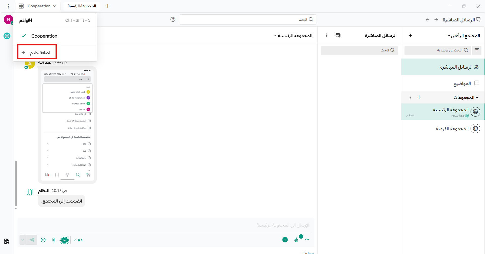
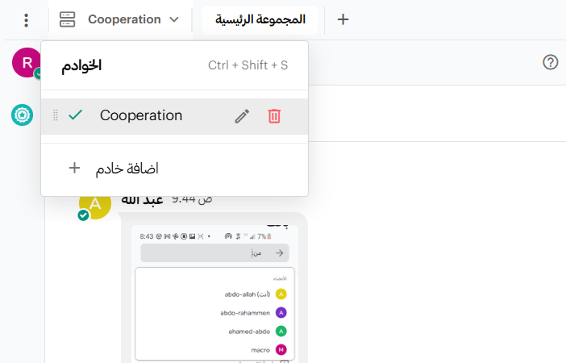

import { Tabs, TabItem } from "@astrojs/starlight/components";
import swipeLeftImg from "../../../images/swipe-left-to-remove.jpg"; 
import mobileEditServerImg from "../../../images/mobile-edit-server.jpg";

باستخدام تطبيق سطح المكتب أو تطبيق الجوال لمنصة تعاون، يمكنك الاتصال بعدة خوادم منصة تعاون من واجهة واحدة وإدارة أذونات النظام.

## إضافة خادم

<Tabs>
  <TabItem label="الويب وتطبيق سطح المكتب">
    تعرض قائمة **الخوادم** الموجودة في الزاوية العلوية اليسرى من النافذة جميع الخوادم المتاحة. يمكنك السحب لإعادة ترتيب الخوادم في القائمة، كما يمكنك التنقل باستخدام [اختصارات لوحة المفاتيح](/messaging-collaboration/keyboard-shortcuts/keyboard-shortcuts).

    :::note
    إذا كنت تستخدم تطبيق سطح المكتب بإصدار أقدم من v5.0، فإن الخوادم تظهر كعلامات تبويب منفصلة في أعلى النافذة بدلاً من قائمة في الزاوية العلوية اليسرى.
    :::

    1. اختر **إضافة خادم**.

    

    2. أدخل عنوان URL للخادم. يجب أن يبدأ العنوان بـ `http://` أو `https://`.

    :::tip
    لا تجد عنوان URL لخادم منصة تعاون الخاص بك؟ اسأل قسم تكنولوجيا المعلومات أو مسؤول منصة تعاون عن **عنوان موقع منصة تعاون** الخاص بمؤسستك. سيبدو العنوان مثل `https://example.com/company/sofa-workspace` أو `sofa-workspace.yourcompanydomain.com` أو `chat.yourcompanydomain.com`.
    :::

    3. أدخل **اسم العرض** للخادم.

    4. [تطبيق سطح المكتب فقط] إذا كان الخادم يتطلب رمز مصادقة سري، فسيُطلب منك إدخاله عند الاتصال. أدخل الرمز الذي قدمه لك المسؤول واختر **موافق**.

    5. اختر **إضافة**.

  </TabItem>
  <TabItem label="الهاتف المحمول">
    اضغط على أيقونة **الخوادم** في الزاوية العلوية اليسرى للوصول إلى جميع الخوادم المتاحة وإضافة خوادم جديدة.

    1. اضغط على **إضافة خادم**.
    2. أدخل عنوان URL للخادم (يجب أن يبدأ بـ `http://` أو `https://`).

    :::tip
    لا تجد عنوان URL للخادم؟ اسأل مسؤول منصة تعاون عن عنوان الموقع الخاص بمؤسستك.
    :::

    3. أدخل اسم العرض للخادم.
    4. يمكنك اختيارياً توسيع قسم **خيارات متقدمة** لإدخال **رمز المصادقة السري** إذا كانت مؤسستك تتطلب ذلك.
    5. اضغط على **تم**.

  </TabItem>
</Tabs>

## تعديل خادم

<Tabs>
  <TabItem label="الويب وتطبيق سطح المكتب">
    1. مرر مؤشر الماوس فوق الخادم واختر أيقونة **تعديل**.

    

    2. عدّل اسم العرض أو عنوان URL للخادم، ثم اختر **حفظ**.

    [تطبيق سطح المكتب فقط] لتحديث رمز المصادقة السري، اتصل بالخادم. إذا تغير الرمز، فسيُطلب منك إدخال الرمز الجديد الذي يقدمه لك مسؤول النظام.

  </TabItem>
  <TabItem label="الهاتف المحمول">
    1. اسحب لليسار على إدخال خادم موجود لإظهار خيارات إضافية. اضغط على **تعديل**.

    

    2. عدّل اسم العرض أو رمز المصادقة السري، ثم اضغط على **حفظ**.

    

    لعرض أو تحديث رمز المصادقة السري، قم بتوسيع قسم **خيارات متقدمة**.

  </TabItem>
</Tabs>

## حذف خادم

لا يؤدي حذف خادم من تطبيقك إلى حذف بياناته. يمكنك إعادة إضافة الخادم في أي وقت.

<Tabs>
  <TabItem label="الويب وتطبيق سطح المكتب">
    1. مرر مؤشر الماوس فوق الخادم واختر **إزالة**.

    

    2. اختر **إزالة** عند مطالبتك بالتأكيد.

  </TabItem>
  <TabItem label="الهاتف المحمول">
    اضغط على أيقونة **الخوادم** في الزاوية العلوية اليسرى للوصول إلى جميع الخوادم المتاحة.

    اسحب لليسار على إدخال خادم موجود لإظهار خيارات إضافية. اضغط على **إزالة**.

    

  </TabItem>
</Tabs>

## التبديل بين مساحات العمل

اختر مساحة عمل من قائمة **الخوادم** في الزاوية العلوية اليسرى من تطبيق سطح المكتب. راجع [اختصارات لوحة المفاتيح](/messaging-collaboration/keyboard-shortcuts/keyboard-shortcuts) لمزيد من خيارات التنقل.

## إدارة أذونات النظام

بدءاً من إصدار سطح المكتب v5.9، يمكنك إدارة أذونات النظام عند إنشاء أو إدارة اتصالات خوادم منصة تعاون الحالية، بما في ذلك: الوصول إلى الميكروفون، والكاميرا، والإشعارات، والموقع.

عند منح إذن النظام، يضبطه على **قبول**، وعند إلغائه يضبطه على **رفض دائماً**.

:::note

- لا يمكنك إدارة أذونات النظام عند استخدام تطبيق منصة تعاون للجوال.
- سيُطلب منك قبول أو رفض الإشعارات بعد إضافة اتصال خادم جديد، وفي أي وقت تفتح فيه تطبيق سطح المكتب إذا لم تكن قد قبلت أو رفضت الأذونات بشكل صريح.
- قد تحتاج أيضاً إلى تفعيل الإشعارات لمنصة تعاون ضمن تفضيلات نظام التشغيل الخاص بك.
  :::

## فتح مساحات عمل متعددة في آن واحد

بدءاً من إصدار سطح المكتب v6.0، يمكنك إبقاء عدة مساحات عمل مفتوحة في وقت واحد والعمل عبرها دون الحاجة إلى التبديل المستمر. هذه الميزة مفيدة بشكل خاص للمؤسسات التي تعمل في بيئات موزعة أو متعددة المجالات.

اختر أيقونة **علامة تبويب جديدة** في أعلى تطبيق سطح المكتب لفتح علامة تبويب جديدة لمساحة العمل الحالية. يمكنك السحب والإفلات لإعادة ترتيب علامات التبويب.

افتح روابط منصة تعاون الداخلية في علامة تبويب أو نافذة جديدة بالنقر بزر الماوس الأيمن على الرابط واختيار **فتح في علامة تبويب جديدة** أو **فتح في نافذة جديدة**.

- حوّل علامات التبويب إلى نوافذ جديدة بالنقر بزر الماوس الأيمن على تسمية علامة التبويب واختيار **نقل إلى نافذة جديدة**.
- أعد النوافذ المنبثقة إلى علامات تبويب في النافذة الرئيسية بالنقر بزر الماوس الأيمن على عنوان النافذة واختيار **نقل إلى النافذة الرئيسية**.
- أغلق النوافذ المنبثقة بالنقر بزر الماوس الأيمن على عنوان النافذة واختيار **إغلاق النافذة**.

:::tip
يمكنك إدارة النوافذ وعلامات التبويب من قائمة **ملف** في تطبيق سطح المكتب، واستعراض جميع علامات التبويب المفتوحة من قائمة **النوافذ**.
:::