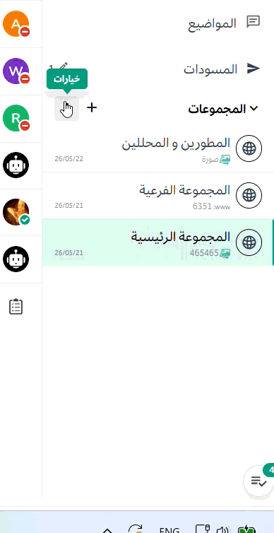
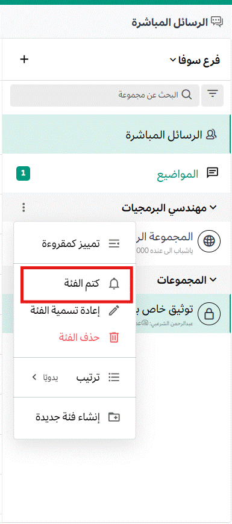
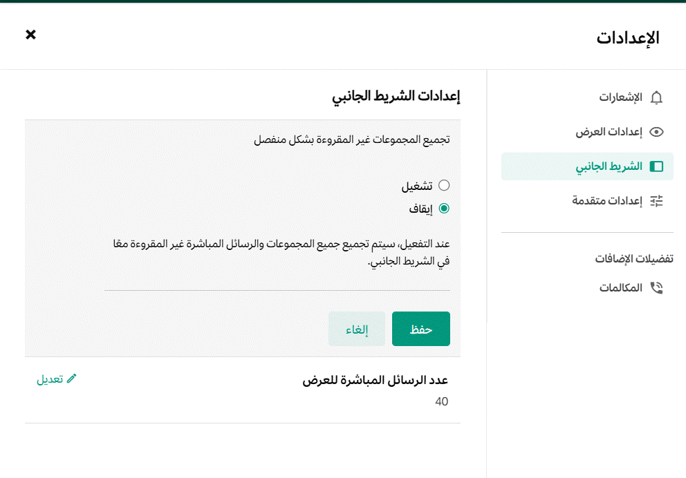

تعد المحادثات في منصة تعـــاون أمراً حاسماً لإنتاجية الشركة ونجاحها. الحفاظ على تنظيم المحادثات في الشريط الجانبي يخلق مساحة عمل فعالة. باستخدام متصفح الويب أو تطبيق سطح المكتب، يمكنك تخصيص الشريط الجانبي للقنوات الخاص بك بناءً على كيفية تفضيلك لاستخدام منصة تعـــاون. التخصيصات التي تقوم بها تكون مرئية لك فقط (وتكون مرئية أيضاً عند استخدام تطبيق الجوال)، ولن تؤثر على ما يراه زملاؤك في أشرطتهم الجانبية.

إليك كيفية إعداد الشريط الجانبي الخاص بك افتراضياً:

- يتم سرد جميع القنوات العامة والخاصة التي انضممت إليها في فئة **القنوات**، مرتبة أبجدياً.
- يتم سرد جميع رسائلك المباشرة ورسائل المجموعة في فئة **الرسائل المباشرة**، مرتبة حسب النشاط الأخير.

## ماذا يمكنك أن تخصص؟

باستخدام منصة تعـــاون في متصفح الويب أو تطبيق سطح المكتب، يمكنك تخصيص الشريط الجانبي بالطرق التالية:

- [إنشاء فئات مخصصة](#إنشاء-فئات-مخصصة)
- [تجميع وترتيب القنوات داخل فئاتك](#تنظيم-القنوات-في-الفئات)
- [كتم وإلغاء كتم الفئات بأكملها](#كتم-وإلغاء-كتم-الفئات)
- [تحديد الفئات بأكملها كمقروءة](#تحديد-فئات-القنوات-كمقروءة)
- [فرز القنوات داخل كل فئة](#فرز-القنوات-في-الفئات) يدوياً، أو أبجدياً، أو حسب النشاط الأخير.
- [تصفية الشريط الجانبي لعرض القنوات غير المقروءة فقط](#تجميع-القنوات-غير-المقروءة-بشكل-منفصل)، أو اختيار تجميع الرسائل غير المقروءة في فئة **غير المقروءة**.
- [إدارة رسائلك المباشرة](#إدارة-الرسائل-المباشرة) عن طريق فرزها أبجدياً أو حسب النشاط الأخير، وتحديد عدد الرسائل التي سيتم عرضها في الشريط الجانبي.
- [تطويع فئات القنوات لخدمتك](#اجعل-الفئات-تعمل-لصالحك) عن طريق إضافة رموز تعبيرية (Emojis) إلى أسماء الفئات، طي وتوسيع الفئات، إعادة ترتيبها، وإضافة محادثات الرسائل المباشرة إليها.

## إنشاء فئات مخصصة

قم بإنشاء فئات مخصصة لتجميع القنوات معاً من أجل تصفح أسرع وأسهل. على سبيل المثال، يمكنك إنشاء فئة باسم "Design" أو "Marketing".

لإنشاء فئات، انقر على رمز **+** في أعلى الشريط الجانبي. أو، انقر على أيقونة **المزيد من الخيارات** في أي ترويسة فئة داخل الشريط الجانبي، ثم اختر **إنشاء فئة جديدة**.

:::note 
إذا قام مسؤول النظام بتفعيل ميزة فرز فئات القنوات، فيمكنك تعيين القنوات لفئات جديدة أو موجودة عند [إنشاء القنوات](../messaging-collaboration/collaborate-within-channels/create-channels) و [إعادة تسمية القنوات](../messaging-collaboration/collaborate-within-channels/rename-channels).
:::

بعد ذلك، اكتب اسم الفئة، واختر **إنشاء**، ثم اسحب أي قنوات أو رسائل مباشرة وأفلتها في هذه الفئة الجديدة. يمكنك أيضاً تحديد قنوات ورسائل مباشرة متعددة لسحبها معاً كمجموعة بالضغط على مفتاح `Ctrl` أو `Shift` والنقر (على Windows أو Linux)، أو مفتاح `⌘` أو `⇧` والنقر (على Mac). راجع قسم [خيارات السحب والإفلات](#خيارات-السحب-والإفلات) أدناه للحصول على التفاصيل.

لا يمكن مشاركة فئاتك المخصصة مع مستخدمين آخرين في منصة تعـــاون.

## إعادة تسمية الفئات

1. انقر على أيقونة **خيارات الفئة** في الشريط الجانبي، ثم اختر **إعادة تسمية الفئة**.
2. اكتب الاسم الجديد للفئة، ثم اختر **إعادة تسمية**.

## حذف الفئات

1. انقر على أيقونة **خيارات الفئة** في الشريط الجانبي، ثم اختر **حذف الفئة**.
2. اختر **حذف** للتأكيد أو **X** للإلغاء.

تعود جميع القنوات ومحادثات الرسائل المباشرة في الفئة المحذوفة إلى فئاتها الافتراضية **القنوات** و **الرسائل المباشرة**. لا يؤدي حذف فئة أبداً إلى إزالتك من القنوات التي انضممت إليها.

## تنظيم القنوات في الفئات

بمجرد إنشاء الفئات، يمكنك نقل القنوات لتنظيم الشريط الجانبي إما عن طريق السحب والإفلات، أو باستخدام خيار النقل (Move to).

### خيارات السحب والإفلات

لتحديد قنوات متعددة:

- حدد قنوات متسلسلة أو رسائل مباشرة بالضغط على مفتاح `Shift` أثناء التحديد (على Windows و Linux)، أو `⇧` أثناء التحديد (على Mac).
- حدد قنوات غير متسلسلة أو رسائل مباشرة بالضغط على `Ctrl` أثناء التحديد (على Windows و Linux)، أو `⌘` (على Mac).
- اضغط على `ESC` لإلغاء تحديد القنوات أو الرسائل المباشرة.

باستخدام متصفح الويب أو تطبيق سطح المكتب، اسحب القنوات المحددة أو الرسائل المباشرة بين الفئات أو بداخلها.

:::tip
تتحرك القنوات والرسائل المباشرة المحددة معاً كمجموعة بنفس الترتيب الذي ظهرت به في الأصل.
:::

### خيارات النقل

بالإضافة إلى التحديد والسحب، يمكنك تحديد فئة كوجهة لنقل القنوات والرسائل المباشرة المحددة. للقيام بذلك، انقر على أيقونة **خيارات القناة** في الشريط الجانبي ثم اختر **نقل إلى**.

يمكنك أيضاً تحديد فئة كوجهة للقناة أو المحادثة الحالية باستخدام خيار **نقل إلى** مباشرة من ترويسة القناة. ستعرض القنوات التي تم نقلها إلى فئة علامة اختيار بجوار اسم الفئة.

### كتم وإلغاء كتم الفئات

عندما تقوم بكتم أو إلغاء كتم فئة، يتم كتم أو إلغاء كتم جميع القنوات داخل تلك الفئة أيضاً. يمكنك بشكل انتقائي إلغاء كتم قنوات محددة داخل فئة مكتومة.

انقر على أيقونة **خيارات الفئة** في الشريط الجانبي، ثم اختر **كتم الفئة**.

بمجرد كتم الفئة:

- يتم تعطيل إشعارات البريد الإلكتروني وسطح المكتب وإشعارات الدفع لجميع القنوات داخل الفئة.
- تظهر أيقونة "كتم" بجوار كل اسم قناة في الفئة.
- تظهر الفئة وجميع قنواتها بشفافية أقل في الشريط الجانبي. لن يتم تحديد القنوات في الفئة كغير مقروءة إلا إذا تمت الإشارة إليك بشكل مباشر (Mention).

لإلغاء كتم الفئة، انقر على أيقونة **خيارات الفئة** في الشريط الجانبي، ثم اختر **إلغاء كتم الفئة**.

### تحديد فئات القنوات كمقروءة

عندما تقوم بتحديد فئة قناة كمقروءة، يتم تحديد جميع القنوات داخل تلك الفئة كمقروءة. يمكنك بشكل انتقائي تحديد قنوات معينة كغير مقروءة متى فضلت ذلك.

انقر على أيقونة **خيارات الفئة** في الشريط الجانبي، ثم اختر **تحديد الفئة كمقروءة**.

### فرز القنوات في الفئات

انقر على أيقونة **خيارات الفئة** في الشريط الجانبي، ثم اختر **فرز** وحدد من: **أبجدياً**، أو **حسب النشاط الأخير**، أو **يدوياً**.

### تجميع القنوات غير المقروءة بشكل منفصل

بشكل افتراضي، يوفر منصة تعـــاون خيار تصفية بنقرة واحدة **Unreads** لإظهار القنوات ذات النشاط غير المقروء فقط. بدلاً من ذلك، يمكنك اختيار تجميع القنوات غير المقروءة تلقائياً في فئة خاصة بها في أعلى الشريط الجانبي.

انتقل إلى **الإعدادات > الشريط الجانبي**، واضبط **تجميع القنوات غير المقروءة بشكل منفصل** على وضع التشغيل، ثم اختر **حفظ**.

- عند تفعيل هذا الإعداد، ستظهر جميع الرسائل غير المقروءة فقط في فئة **غير المقروءة**، وتكون الرسائل التي تحتوي على إشارات في الأعلى.
- عند تعطيل هذا الإعداد، ستظهر جميع الرسائل غير المقروءة داخل فئاتها وقنواتها الأصلية. يمكنك استخدام تصفية "غير المقروءة" للتركيز فقط على القنوات غير المقروءة في الشريط الجانبي.

عند التفعيل، ستصعد القنوات غير المقروءة التي تحتوي على إشارات إلى أعلى الفئة.

:::tip
إذا كنت تفضل رؤية القنوات غير المقروءة فقط في فئاتها الأصلية، نوصي بطي (Collapse) فئاتك المخصصة وتعطيل إعداد **Group unread channels separately** الموجود في مسار **Settings > Sidebar**.
:::

### إدارة الرسائل المباشرة

لفرز رسائلك المباشرة، انقر على أيقونة **خيارات القناة** في الشريط الجانبي، ثم اختر **فرز** وحدد إما **أبجدياً** أو **حسب النشاط الأخير**.

### كم عدد الرسائل المباشرة المراد عرضها؟

يمكنك التحكم في عدد محادثات الرسائل المباشرة التي يتم عرضها في فئة **الرسائل المباشرة** للحفاظ على تنظيم محادثاتك وسهولة التعامل معها. يمكنك اختيار عرض جميع الرسائل أو عدد ثابت منها.

لتكوين عدد الرسائل المباشرة المراد عرضها، انتقل إلى **الإعدادات > الشريط الجانبي**، ثم اضبط **عدد الرسائل المباشرة المراد عرضها**. أو انقر على أيقونة **خيارات القناة** في الشريط الجانبي، ثم اختر **عرض**.

اختر عرض **10**، أو **15**، أو **20**، أو **40** رسالة. بمجرد تجاوز عدد الرسائل المباشرة المكون، سيتم إخفاء الرسائل القديمة من فئة **الرسائل المباشرة**. يمكنك دائماً زيادة عدد المحادثات المعروضة لرؤية الرسائل المباشرة الأقدم.

:::note
محادثات الرسائل المباشرة التي تقوم بإضافتها إلى فئات مخصصة لا تُحتسب ضمن الحد الأقصى لعدد المحادثات المعروضة في فئة **الرسائل المباشرة**.
:::

## اجعل الفئات تعمل لصالحك

### إضافة الرموز التعبيرية قبل أسماء فئات القنوات

يمكن أن تتضمن أسماء فئات القنوات رموزاً تعبيرية (Emojis). حدد الرمز التعبيري باسمه بالصيغة التوضيحية، مثل `:smile:`. نوصي بوضع رموز تعبيرية قبل أسماء فئات القنوات للأسباب التالية:

- يمكن للرموز التعبيرية أن تسهل على المستخدمين التعرف بسرعة على القنوات وفئات القنوات وإدارتها، خاصة في مساحات العمل الكبيرة التي تحتوي على العديد من القنوات.
- مشاركة نفس الرمز التعبيري عبر القنوات والفئات المرتبطة بوظيفة معينة تساعد في الحفاظ على التنظيم والتناسق في مساحة العمل.
- جعل فئات القنوات مميزة بصرياً من خلال الرموز التعبيرية يساعد المستخدمين في العثور على ما يحتاجون إليه بلمحة بصر، مما يقلل الوقت المستغرق في البحث.
- يمكن للمستخدمين الجدد استيعاب الغرض من مختلف القنوات وفئاتها بسرعة من خلال الرموز التعبيرية بدون الحاجة إلى شروحات طويلة.
- يقلل فهم بنية القنوات من خلال الرموز التعبيرية من الوقت والجهد المطلوب لتدريب الأعضاء الجدد على التصفح.
- يمكن أن تشجع مساحة العمل المنظمة والجذابة بصرياً المستخدمين على المشاركة بشكل أكثر نشاطاً، مما يؤدي إلى تواصل وتعاون فعال.

### الفئات قابلة للطي

عند طي (Collapse) فئة قناة، تُعرض القنوات غير المقروءة فقط لتقليل التمرير غير الضروري. بينما عند توسيع (Expand) الفئة، تُعرض جميع القنوات فيها، بما في ذلك القنوات ذات الرسائل غير المقروءة.

### إعادة ترتيب الفئات

اسحب الفئات بأكملها لإعادة ترتيبها وإعطاء الأولوية للمحادثات الأكثر أهمية.

### يمكن أن تحتوي الفئات على محادثات رسائل مباشرة

حدد واسحب الرسائل المباشرة إلى أي فئة. يمكنك أيضاً تحديد رسائل مباشرة متعددة في آن واحد وسحبها كمجموعة.