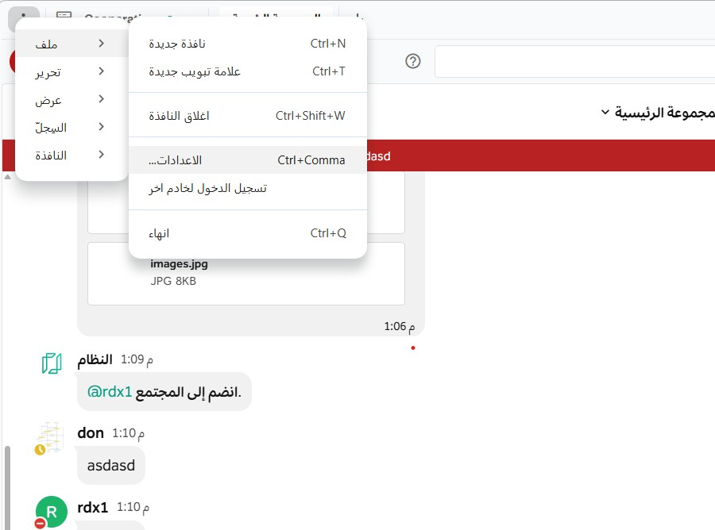

import { Tabs, TabItem } from '@astrojs/starlight/components';
import FAIcon from "../../../components/FAIcon.astro";

يمكنك تخصيص تطبيق سطح المكتب الخاص بك بشكل أكبر باستخدام إعدادات إضافية. اختر علامة التبويب أدناه التي تتوافق مع نظام التشغيل الخاص بك لمعرفة المزيد.

<Tabs>
  <TabItem label="macOS">
    مع التركيز على تطبيق منصة تعـــاون لسطح المكتب، اختر **منصة تعـــاون > الإعدادات...**

    ### عام

    - **موقع التنزيل:** حدد مكان تنزيل الملفات من تطبيق سطح المكتب على جهازك.
    - **إظهار الأيقونة في منطقة الإشعارات:** تظهر أيقونة منصة تعـــاون في منطقة الإشعارات. يمكنك إخفاء هذه الأيقونة إذا أردت. أعد تشغيل التطبيق لتطبيق التغييرات.
    - **مزامنة سمة تطبيق سطح المكتب مع الخادم:** تتطابق سمة تطبيق سطح المكتب تلقائياً مع السمة المعينة على خادم منصة تعـــاون الأساسي الخاص بك. قم بتعطيل هذا الإعداد لإدارة السمات بشكل مستقل.
    - **فتح التطبيق بملء الشاشة:** يتم فتح التطبيق في وضع ملء الشاشة. قم بتعطيل هذا الإعداد لفتح التطبيق في وضع النافذة.
    - **الحد الأقصى لعدد العروض المفتوحة:** بدءاً من Desktop v6.0، حدد العدد الأقصى من علامات التبويب والنوافذ المفتوحة لكل مساحة عمل. اترك الحقل فارغاً للسماح بعدد غير محدود.

    ### الإشعارات

    - **إظهار شارة حمراء على أيقونة Dock للإشارة إلى الرسائل غير المقروءة:** تعرض شارة حمراء على أيقونة Dock عدد الرسائل غير المقروءة والإشارات. يمكنك تكوين التطبيق لعرض عدد الإشارات فقط إذا أردت.
    - **قفز أيقونة Dock:** عند تلقي رسالة جديدة على أي من فرقك وخوادمك النشطة، ترتد أيقونة Dock مرة واحدة أو تستمر بالارتداد حتى تفتح التطبيق. يمكنك تكوين الارتداد ليكون أكثر أو أقل أو بدون ارتداد.

    ### اللغة

    - **لغة التطبيق:** حدد لغتك المفضلة لتطبيق سطح المكتب.
    - **التدقيق الإملائي:** يتم تمييز الكلمات المكتوبة بشكل خاطئ بناءً على تفضيل لغة التطبيق الخاص بك. يمكنك تعطيل التدقيق الإملائي إذا أردت.
    - **لغات المدقق الإملائي:** حدد لغات إضافية للتدقيق الإملائي إذا لزم الأمر. أعد تشغيل التطبيق لتغيير هذا الإعداد. وعند تكوين لغات متعددة:
      - تظهر جميع اللغات المحددة كمكتوبة بشكل صحيح عندما تتطابق كلمة مع لغة واحدة على الأقل.
      - تظهر جميع اللغات المحددة كمكتوبة بشكل خاطئ عندما لا تتطابق الكلمة مع أي من اللغات المحددة.
    - **استخدام عنوان URL لقاموس بديل:** حدد قاموساً بديلاً للتدقيق الإملائي كعنوان URL للموقع.

    ### الخوادم

    - **إضافة وإدارة اتصالات الخادم:** تعرف على المزيد حول [الاتصال بمساحات عمل منصة تعـــاون متعددة](/customize-your-preferences/connect-to-multiple-workspaces).

    ### متقدم

    - **مستوى التسجيل:** اضبط مستويات التسجيل لعزل المشاكل واستكشاف الأخطاء. زيادة مستوى التسجيل تزيد من استخدام مساحة القرص وقد تؤثر على الأداء.
    - **إرسال بيانات الاستخدام المجهولة إلى الخوادم المكونة:** أرسل بيانات استخدام وأداء تطبيق سطح المكتب إلى خوادم منصة تعـــاون المكونة.
    - **إرسال تقارير الأخطاء للمساعدة في تحسين التطبيق:** بدءاً من Desktop v6.1.0، يتم إرسال تقارير الأخطاء ومعلومات الأعطال تلقائياً إلى Sentry لتحسين التطبيق. لا يتم تضمين أي معلومات تعريف شخصية (PII). يمكنك تعطيل هذا الإعداد إذا أردت. أعد تشغيل التطبيق لتطبيق التغييرات.
    - **استخدام تسريع أجهزة GPU:** يجعل تسريع الأجهزة GPU عرض واجهة التطبيق أكثر كفاءة. إذا واجهت عدم استقرار، قم بتعطيل هذا الإعداد. أعد تشغيل التطبيق لتطبيق التغييرات.

  </TabItem>
  <TabItem label="Windows و Linux">
    مع التركيز على تطبيق منصة تعـــاون لسطح المكتب، اختر أيقونة **المزيد** <FAIcon name="ellipsis-vertical"/> في الزاوية العلوية اليسرى لشريط القوائم ثم اختر **ملف > الإعدادات...**

    

    ### عام

    - **موقع التنزيل:** حدد مكان تنزيل الملفات من تطبيق سطح المكتب على جهازك.
    - **بدء التطبيق عند تسجيل الدخول:** يبدأ تطبيق سطح المكتب تلقائياً عند تسجيل الدخول إلى جهازك. يمكنك تعطيل هذا الإعداد إذا أردت.
    - **تشغيل التطبيق مصغراً:** يتم تشغيل التطبيق مصغراً في شريط النظام .
    - **لون الأيقونة:** اعرض أيقونة منصة تعـــاون فاتحة أو داكنة أو بناءً على الإعداد الافتراضي للنظام.
    - **ترك التطبيق قيد التشغيل في منطقة الإشعارات عند إغلاق نافذة التطبيق:** عند إغلاق تطبيق سطح المكتب، يُطلب منك التأكيد. يمكنك تعطيل هذا التأكيد بتحديد **عدم السؤال مرة أخرى**. أعد تشغيل التطبيق لتطبيق التغييرات.
    - **فتح التطبيق بملء الشاشة:** يتم فتح التطبيق في وضع ملء الشاشة.
    - **مزامنة سمة تطبيق سطح المكتب مع الخادم:** تتطابق سمة التطبيق تلقائياً مع السمة المعينة على الخادم الأساسي.
    - **الحد الأقصى لعدد العروض المفتوحة:** بدءاً من Desktop v6.0، حدد العدد الأقصى من علامات التبويب والنوافذ المفتوحة لكل مساحة عمل.

    ### الإشعارات

    - **إظهار شارة حمراء على أيقونة شريط المهام للإشارة إلى الرسائل غير المقروءة:** تعرض شارة حمراء على أيقونة شريط المهام لعرض الرسائل غير المقروءة.
    - **وميض أيقونة شريط المهام عند تلقي رسالة جديدة:** تومض أيقونة شريط المهام عند تلقي رسالة جديدة. يمكنك تعطيل هذا الإعداد إذا أردت.

    ### اللغة

    - **لغة التطبيق:** حدد لغتك المفضلة لتطبيق سطح المكتب.
    - **التدقيق الإملائي:** يتم تمييز الكلمات المكتوبة بشكل خاطئ بناءً على تفضيل لغة التطبيق. يمكنك تعطيل التدقيق الإملائي إذا أردت.
    - **لغات المدقق الإملائي:** حدد لغات إضافية للتدقيق الإملائي. أعد تشغيل التطبيق لتغيير هذا الإعداد.
    - **استخدام عنوان URL لقاموس بديل:** حدد قاموساً بديلاً للتدقيق الإملائي كعنوان URL.

    ### الخوادم

    - **إضافة وإدارة اتصالات الخادم:** تعرف على المزيد حول [الاتصال بمساحات عمل منصة تعـــاون متعددة](/customize-your-preferences/connect-to-multiple-workspaces).

    ### متقدم

    - **مستوى التسجيل:** اضبط مستويات التسجيل لعزل المشاكل واستكشاف الأخطاء.
    - **إرسال بيانات الاستخدام المجهولة إلى الخوادم المكونة:** أرسل بيانات الاستخدام والأداء إلى خوادم منصة تعـــاون المكونة.
    - **إرسال تقارير الأخطاء للمساعدة في تحسين التطبيق:** بدءاً من Desktop v6.1.0، يتم إرسال تقارير الأخطاء تلقائياً إلى Sentry. لا يتم تضمين معلومات تعريف شخصية. يمكنك تعطيل هذا الإعداد. أعد تشغيل التطبيق لتطبيق التغييرات.
    - **استخدام تسريع أجهزة GPU:** يجعل تسريع GPU عرض واجهة التطبيق أكثر كفاءة. إذا واجهت عدم استقرار، قم بتعطيله. أعد تشغيل التطبيق لتطبيق التغييرات.

  </TabItem>
</Tabs>