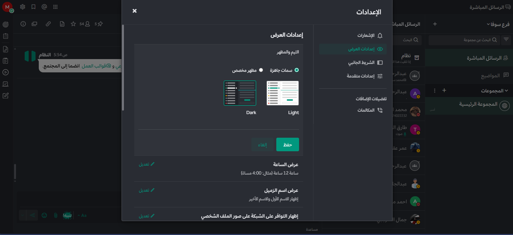

import { Tabs, TabItem } from "@astrojs/starlight/components";
import FAIcon from "../../../components/FAIcon.astro";

ألوان واجهة مستخدم ماترموست قابلة للتخصيص. يمكنك الاختيار من بين خمس سمات قياسية مصممة بواسطة ماترموست، أو تصميم سمة مخصصة خاصة بك. يتم تطبيق تغييرات السمات الخاصة بك على جميع الفرق التي تنتمي إليها، وتكون مرئية عبر جميع عملاء ماترموست. يمكن لعملاء مستوى Enterprise تكوين سمة مختلفة لكل فريق هم أعضاء فيه.

<Tabs>
  <TabItem label="الويب وسطح المكتب">
    اختر أيقونة **Settings** <FAIcon name="gear" /> ، ثم انتقل إلى **Display > Theme**. اختر **Theme Colors** للاختيار من بين خمس سمات قياسية مصممة بواسطة فريق ماترموست.

    يمكنك تخصيص السمة القياسية بشكل أكبر لجعلها خاصة بك حقاً. بعد تحديد سمة قياسية، اختر **Custom Theme** وقم بتعديل اختيارات الألوان بناءً على تفضيلاتك.

  </TabItem>
  <TabItem label="الجوال">
    اضغط على **Theme** لاختيار واحدة من 5 سمات قياسية لماترموست.

    :::note
    يمكنك فقط تحديد سمة مخصصة (Custom Theme) عند استخدام ماترموست في متصفح الويب أو تطبيق سطح المكتب.
    :::

  </TabItem>
</Tabs>

## السمات المخصصة

اختر **Custom Theme**، ثم قم بتوسيع خيارات **Sidebar Styles** و **Center Channel Styles** و **Link and Button Styles** لتخصيص ألوان واجهة فردية، مثل الخلفيات والروابط والنصوص والحدود.

يتم تطبيق تغييرات السمات المخصصة الخاصة بك في ماترموست بمجرد إجرائها (معاينة حية). اختر **Save** لتأكيد تغييرات السمات الخاصة بك. يمكنك تجاهل تغييراتك بالخروج من نافذة **Display Settings** واختيار **Yes, Discard**.

### تصدير واستيراد سماتك المخصصة

- **التصدير:** يمكنك تصدير سمة من ماترموست عن طريق نسخ قيم السمة من قائمة Custom Theme.
- **الاستيراد:** استورد سمة إلى ماترموست عن طريق لصق قيم السمة في حقل **Copy and paste to share theme colors**، ثم اختر **Save**.

## أمثلة على السمات المخصصة

قم بتخصيص ألوان السمات الخاصة بك وشاركها مع الآخرين. فيما يلي بعض الأمثلة مع الرموز البرمجية (JSON) الخاصة بها:

### Mattermost


```json
{
  "sidebarBg": "#145dbf",
  "sidebarText": "#ffffff",
  "sidebarUnreadText": "#ffffff",
  "sidebarTextHoverBg": "#4578bf",
  "sidebarTextActiveBorder": "#579eff",
  "sidebarTextActiveColor": "#ffffff",
  "sidebarHeaderBg": "#1153ab",
  "sidebarTeamBarBg": "#0b428c",
  "sidebarHeaderTextColor": "#ffffff",
  "onlineIndicator": "#06d6a0",
  "awayIndicator": "#ffbc42",
  "dndIndicator": "#f74343",
  "mentionBg": "#ffffff",
  "mentionBj": "#ffffff",
  "mentionColor": "#145dbf",
  "centerChannelBg": "#ffffff",
  "centerChannelColor": "#3d3c40",
  "newMessageSeparator": "#ff8800",
  "linkColor": "#2389d7",
  "buttonBg": "#166de0",
  "buttonColor": "#ffffff",
  "errorTextColor": "#fd5960",
  "mentionHighlightBg": "#ffe577",
  "mentionHighlightLink": "#166de0",
  "codeTheme": "github"
}
```

### Organization


```json
{
  "sidebarBg": "#2071a7",
  "sidebarText": "#ffffff",
  "sidebarUnreadText": "#ffffff",
  "sidebarTextHoverBg": "#136197",
  "sidebarTextActiveBorder": "#7ab0d6",
  "sidebarTextActiveColor": "#ffffff",
  "sidebarHeaderBg": "#2f81b7",
  "sidebarTeamBarBg": "#256996",
  "sidebarHeaderTextColor": "#ffffff",
  "onlineIndicator": "#7dbe00",
  "awayIndicator": "#dcbd4e",
  "dndIndicator": "#ff6a6a",
  "mentionBg": "#fbfbfb",
  "mentionColor": "#2071f7",
  "centerChannelBg": "#f2f4f8",
  "centerChannelColor": "#333333",
  "newMessageSeparator": "#ff8800",
  "linkColor": "#2f81b7",
  "buttonBg": "#1dacfc",
  "buttonColor": "#ffffff",
  "errorTextColor": "#a94442",
  "mentionHighlightBg": "#f3e197",
  "mentionHighlightLink": "#2f81b7",
  "codeTheme": "github"
}
```

### Mattermost Dark



```json
{
  "sidebarBg": "#1b2c3e",
  "sidebarText": "#ffffff",
  "sidebarUnreadText": "#ffffff",
  "sidebarTextHoverBg": "#4a5664",
  "sidebarTextActiveBorder": "#66b9a7",
  "sidebarTextActiveColor": "#ffffff",
  "sidebarHeaderBg": "#1b2c3e",
  "sidebarTeamBarBg": "#152231",
  "sidebarHeaderTextColor": "#ffffff",
  "onlineIndicator": "#65dcc8",
  "awayIndicator": "#c1b966",
  "dndIndicator": "#e81023",
  "mentionBg": "#b74a4a",
  "mentionColor": "#ffffff",
  "centerChannelBg": "#2f3e4e",
  "centerChannelColor": "#dddddd",
  "newMessageSeparator": "#5de5da",
  "linkColor": "#a4ffeb",
  "buttonBg": "#4cbba4",
  "buttonColor": "#ffffff",
  "errorTextColor": "#ff6461",
  "mentionHighlightBg": "#984063",
  "mentionHighlightLink": "#a4ffeb",
  "codeTheme": "solarized-dark"
}
```

### Discord Dark Theme (New)


```json
{
  "sidebarBg": "#121214",
  "sidebarText": "#ffffff",
  "sidebarUnreadText": "#ffffff",
  "sidebarTextHoverBg": "#1d1d1e",
  "sidebarTextActiveBorder": "#ffffff",
  "sidebarTextActiveColor": "#ffffff",
  "sidebarHeaderBg": "#121214",
  "sidebarHeaderTextColor": "#ffffff",
  "sidebarTeamBarBg": "#121214",
  "onlineIndicator": "#43a25a",
  "awayIndicator": "#ca9654",
  "dndIndicator": "#d83a42",
  "mentionBg": "#6e84d2",
  "mentionBj": "#6e84d2",
  "mentionColor": "#ffffff",
  "centerChannelBg": "#1a1a1e",
  "centerChannelColor": "#efeff0",
  "newMessageSeparator": "#ff4d4d",
  "linkColor": "#2095e8",
  "buttonBg": "#5865f2",
  "buttonColor": "#ffffff",
  "errorTextColor": "#ff6461",
  "mentionHighlightBg": "#a4850f",
  "mentionHighlightLink": "#a4850f",
  "codeTheme": "monokai"
}
```

### السمة الداكنة

في نظامي Windows و macOS، يتم تطبيق تفضيل العرض (الوضع الفاتح أو الوضع الداكن) الذي قمت بتعيينه على جهاز الكمبيوتر الخاص بك تلقائياً على تطبيق ماترموست لسطح المكتب. في نظام Linux، يمكنك إدارة ذلك يدوياً عبر قائمة **View**.


## دليل الأنماط المخصصة

يمكنك تخصيص كل جانب من جوانب السمة الخاصة بك كما هو موضح أدناه:

### أنماط الشريط الجانبي

- **خلفية الشريط الجانبي:** لون خلفية الشريط الجانبي للقنوات والتنقل.
- **نص الشريط الجانبي:** لون نص القنوات المقروءة.
- **خلفية ترويسة الشريط الجانبي:** لون خلفية الترويسة أعلى الشريط الجانبي.
- **نص ترويسة الشريط الجانبي:** لون نص الترويسة أعلى الشريط الجانبي.
- **نص القنوات غير المقروءة:** لون نص القنوات غير المقروءة.
- **خلفية تمرير الماوس في الشريط الجانبي:** لون الخلفية عند تمرير الماوس فوق أسماء القنوات.
- **إطار القناة النشطة:** لون علامة التحديد للقناة النشطة الحالية.
- **لون نص القناة النشطة:** لون نص القناة النشطة الحالية.
- **مؤشر متصل/بالخارج/ممنوع الإزعاج:** ألوان مؤشرات حالة الاتصال بجانب أسماء الفريق.
- **خلفية شارة التنبيه:** لون خلفية أيقونة التنبيه للرسائل غير المقروءة.
- **نص شارة التنبيه:** لون النص داخل أيقونة تنبيه الإشارات.

### أنماط القناة المركزية

- **خلفية القناة المركزية:** لون خلفية الشاشة المركزية والشريط الجانبي الأيمن.
- **نص القناة المركزية:** لون جميع النصوص الأساسية.
- **فاصل الرسائل الجديدة:** لون فاصل الرسائل الجديدة.
- **لون نص الخطأ:** لون نص رسائل الخطأ.
- **خلفية تمييز الإشارات:** لون إضاءة الخلفية للكلمات التي تشير إليك.
- **رابط تمييز الإشارات:** لون النص للكلمات التي تشير إليك.
- **سمة الأكواد:** ألوان الخلفية والنحو لكتل الأكواد البرمجية.

### أنماط الروابط والأزرار

- **لون الروابط:** لون نص جميع الروابط، والهاشتاجات، والإشارات للزملاء.
- **خلفية الأزرار:** لون خلفية الأزرار عالية الأولوية.
- **نص الأزرار:** لون نص الأزرار عالية الأولوية.