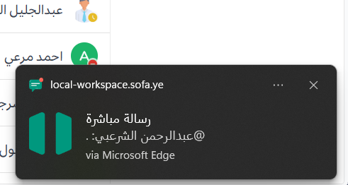

بدءاً من الإصدار v9.10، ستطلب منك منصة تعاون منح الإذن لمتصفح الويب الخاص بك لعرض الإشعارات.

## تفعيل الإشعارات

عند ظهور طلب تفعيل الإشعارات:

- **عند اختيار "تمكين الإشعارات":** لن يظهر هذا الطلب مرة أخرى، وستبدأ في استلام إشعارات المتصفح لكافة أنشطة منصة تعاون، بما في ذلك الشارات والتنبيهات الصوتية.
- **في حال تجاهل الطلب:** لن تتلقى إشعارات عبر المتصفح، وسيظهر لك الطلب مجدداً عند تشغيل منصة تعاون في المرة القادمة، أو عند الانتقال إلى **الإعدادات > الإشعارات > إشعارات سطح المكتب والجوال**.
- **عند اختيار "رفض" أو "رفض نهائياً":** لن يظهر الطلب مرة أخرى ولن تتلقى إشعارات. يمكنك تغيير هذا الإعداد لاحقاً من خلال إعدادات المتصفح الخاص بك.

## الإشعارات المستندة إلى الشارات

تعرض أيقونة منصة تعاون في متصفح الويب الأنواع التالية من الشارات:

- **الشارات الرقمية:** تظهر للرسائل المباشرة والجماعية غير المقروءة، والإشارات (@mentions)، والكلمات الرئيسية التي تتابعها.
- **النقطة الحمراء:** تشير إلى وجود إشارات أو كلمات رئيسية أو رسائل مباشرة/جماعية غير مقروءة.

## التنبيهات الصوتية

بشكل افتراضي، تتضمن إشعارات الويب تنبيهات صوتية عند استلام تنبيه جديد.

## تخصيص الإشعارات

:::tip
إعدادات الإشعارات المسماة "سطح المكتب" (Desktop) هي نفسها التي تتحكم في إشعارات الويب عند استخدام المنصة عبر المتصفح.
:::

### تقليل إشعارات الويب
للحد من عدد الإشعارات، انتقل إلى **الإعدادات > الإشعارات > إشعارات سطح المكتب والجوال**، واختر **الإشارات والرسائل المباشرة والرسائل الجماعية**، ثم احفظ التغييرات.

### تغيير الأصوات أو تعطيلها
يمكنك تخصيص نغمة الإشعار أو إيقافها عبر **أصوات إشعارات سطح المكتب > صوت إشعارات الرسائل**.

### إشعارات المكالمات الواردة
إذا كنت ترغب في استلام تنبيه صوتي عند بدء مكالمة عبر المنصة، يمكنك اختيار النغمة من **أصوات إشعارات سطح المكتب > صوت المكالمة الواردة** (في حال قام المسؤول بتفعيل هذه الميزة).

### تعطيل جميع إشعارات الويب
اختر **إشعارات سطح المكتب والجوال > لا شيء** لإيقاف كافة إشعارات الويب وسطح المكتب.

## الأسئلة الشائعة

### لماذا يظهر طلب تفعيل الإشعارات بصورة متكررة رغم عدم رغبتي بها؟
ستستمر منصة تعاون في إظهار طلب منح الإذن للمتصفح حتى يتم الرد عليه. إذا كنت ترغب في تعطيل كافة الإشعارات، فننصح باختيار **تمكين الإشعارات** أولاً، ثم إيقافها من داخل إعدادات منصة تعاون كما هو موضح أعلاه.
