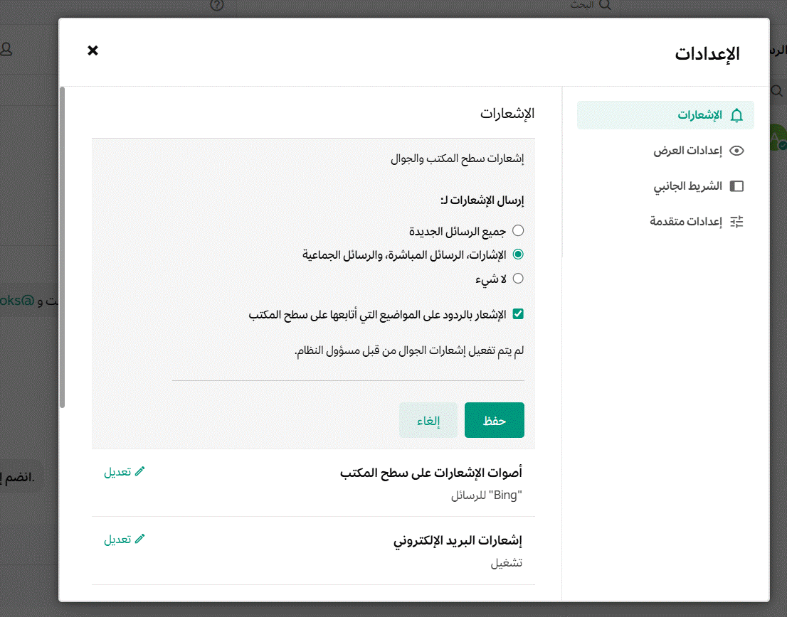
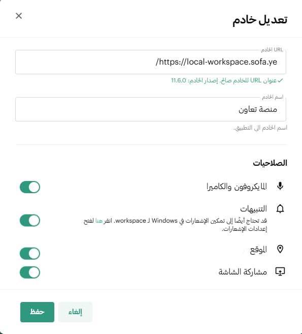
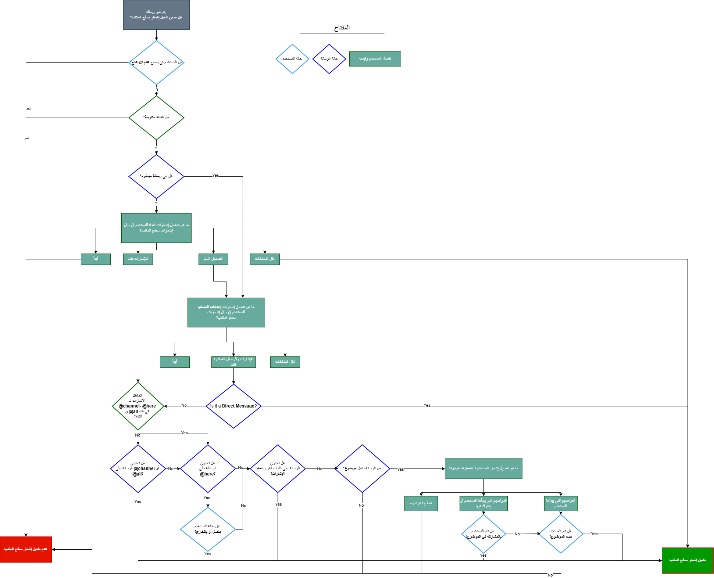
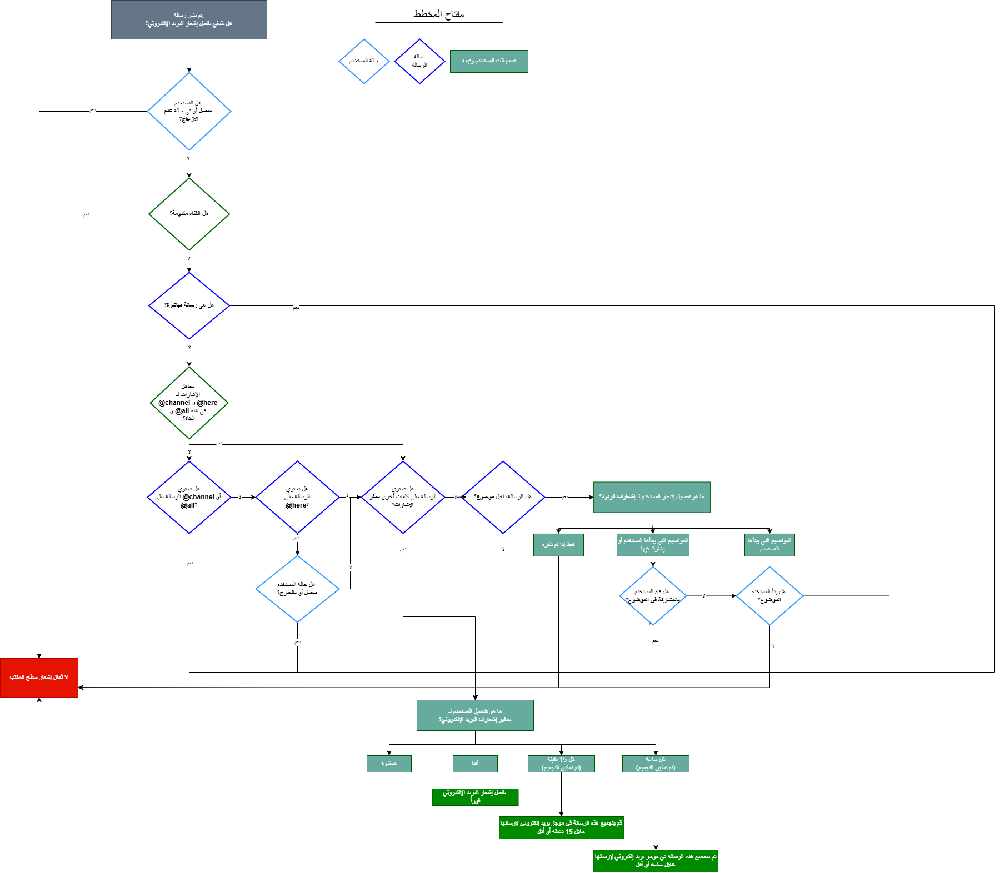
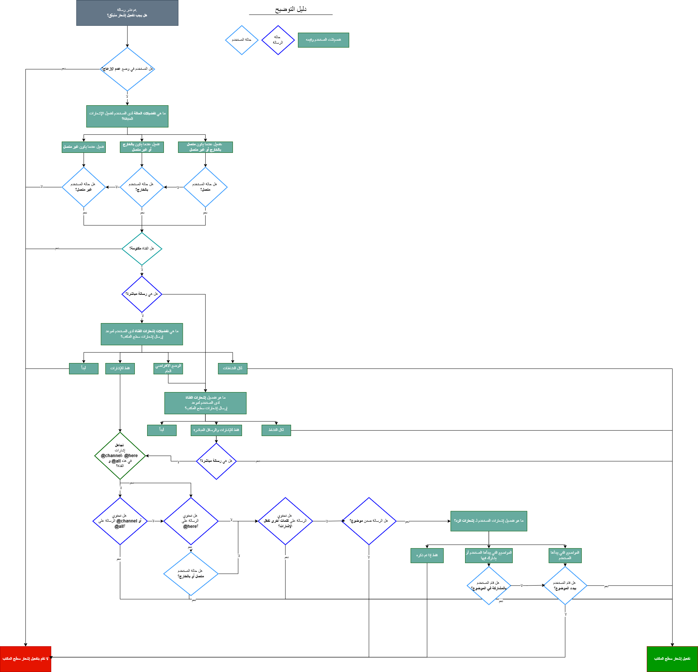

import { Tabs, TabItem } from "@astrojs/starlight/components";
import FAIcon from "../../../../components/FAIcon.astro";

تعتمد إشعارات منصة تعاون التي تتلقاها على تفضيلاتك داخل التطبيق، والعميل الذي تستخدمه، وإعدادات نظام التشغيل في جهازك.

## إرسال إشعار تجريبي

بدءاً من الإصدار v10.3 من منصة تعاون، يمكنك إرسال إشعار تجريبي لنفسك للتأكد من عمل التنبيهات:

1. انتقل إلى **الإعدادات** <FAIcon name="gear" />.
2. اختر قسم **الإشعارات**.
3. ضمن قسم **استكشاف أخطاء الإشعارات وإصلاحها**، اختر **إرسال إشعار اختبار**.

في حال كانت الإشعارات تعمل بشكل صحيح، ستتلقى رسالة مباشرة من بوت النظام تؤكد ذلك. إذا لم تصلك الرسالة، يرجى اتباع خطوات استكشاف الأخطاء الواردة أدناه.

## التحقق من تفضيلات منصة تعاون

تأكد أولاً من تفعيل الإشعارات داخل إعدادات منصة تعاون.

<Tabs>
  <TabItem label="سطح المكتب">
    1. اختر **الإعدادات** <FAIcon name="gear" /> من الزاوية العلوية للشاشة.
    2. اختر **إشعارات سطح المكتب والجوال**.
    3. إذا كان خيار **إرسال الإشعارات لـ** مضبوطاً على **لا شيء**، فهذا يعني أن الإشعارات معطلة. اختر **كل الرسائل الجديدة** أو **الإشارات والرسائل المباشرة والرسائل الجماعية** بدلاً من ذلك.

    

  </TabItem>
  <TabItem label="الويب">
    1. اختر **الإعدادات** <FAIcon name="gear" /> من الزاوية العلوية للشاشة.
    2. اختر **إشعارات سطح المكتب والجوال**.
    3. تأكد من أن خيار **إرسال الإشعارات لـ** ليس مضبوطاً على **لا شيء**.
  </TabItem>
  <TabItem label="الجوال">
    1. اضغط على صورة ملفك الشخصي.
    2. اضغط على **الإعدادات** <FAIcon name="gear" />.
    3. انتقل إلى **الإشعارات > إشعارات الدفع**.
    4. تأكد من اختيار **كل الرسائل الجديدة** أو **الإشارات والرسائل المباشرة والرسائل الجماعية**.
    5. تحت قسم **إرسال إشعارات الدفع عندما…**، اختر **متصل أو بعيد أو غير متصل** لضمان استلام التنبيهات دائماً.
  </TabItem>
</Tabs>

## التحقق من إعدادات عميل منصة تعاون

<Tabs>
  <TabItem label="سطح المكتب">
    تأكد من تفعيل الإشعارات لاتصال خادم منصة تعاون الخاص بك:
    1. اختر خيار الخادم في الزاوية العلوية، ثم قم بتحرير تفاصيل الخادم.
    2. ضمن قسم **الأذونات**، تأكد من تفعيل **الإشعارات** ثم احفظ التغييرات.

    

  </TabItem>
  <TabItem label="الويب">
    يجب عليك منح متصفح الويب أذونات لعرض إشعارات منصة تعاون. اختر المتصفح الذي تستخدمه أدناه:

    <Tabs>
      <TabItem label="Chrome">
        1. من قائمة Chrome، اختر **الإعدادات**.
        2. اختر **الخصوصية والأمان > إعدادات الموقع**.
        3. تحت **الأذونات**، اختر **الإشعارات**.
        4. تأكد من تفعيل خيار **يمكن للمواقع طلب إرسال الإشعارات**، وأضف رابط منصة تعاون إلى قائمة المواقع المسموح لها.
      </TabItem>
      <TabItem label="Edge">
        1. من قائمة Edge، اختر **الإعدادات**.
        2. اختر **ملفات تعريف الارتباط وأذونات الموقع > الإشعارات**.
        3. أضف رابط منصة تعاون إلى قسم **السماح**.
      </TabItem>
      <TabItem label="Firefox">
        1. من قائمة Firefox، اختر **الإعدادات**.
        2. اختر **الخصوصية والأمان > الأذونات**.
        3. اختر **الإعدادات** بجانب **الإشعارات** وأضف رابط منصة تعاون.
      </TabItem>
      <TabItem label="Safari">
        1. من قائمة Safari، اختر **الإعدادات**.
        2. اختر **المواقع الإلكترونية > الإشعارات**.
        3. قم بتفعيل الإشعارات لموقع منصة تعاون الخاص بك.
      </TabItem>
    </Tabs>

  </TabItem>
<<<<<<< HEAD
  <TabItem label="الجوال">
    تأكد من أن إعدادات النظام في جهازك لا تحظر إشعارات التطبيق.
=======
  <TabItem label="الهاتف المحمول">
    تأكد من أن جهازك لا يحظر الإشعارات من إعدادات النظام.
>>>>>>> 5d058bcf032d1aabaa5c95c22d9599d9d2b6b922

    :::note
    بدءاً من الإصدار v2.34 لتطبيق الجوال، ستظهر لافتة   في شاشة إعدادات منصة تعاون مع رابط سريع لإصلاح ذلك في حال كانت الإشعارات معطلة في الجهاز.
    :::

    <Tabs>
      <TabItem label="Android">
        1. افتح **إعدادات** الجهاز > **التطبيقات**.
        2. ابحث عن **Google Play Services** وتأكد من تفعيل الإشعارات له.
        3. ابحث عن تطبيق **منصة تعاون** وفعل الإشعارات له.
        4. تأكد من إيقاف وضع **عدم الإزعاج**  .
      </TabItem>
      <TabItem label="iOS">
        1. افتح **إعدادات** الجهاز > **الإشعارات**.
        2. ابحث عن تطبيق **منصة تعاون**.
        3. فعل خيار **السماح بالإشعارات** واضبط التسليم على **فوري**.
        4. تأكد من إيقاف وضع **عدم الإزعاج** أو **التركيز**.
      </TabItem>
    </Tabs>

  </TabItem>
</Tabs>

## التحقق من إعدادات نظام التشغيل

قد يقوم نظام التشغيل بحظر إشعارات منصة تعاون. اختر نظامك:

<Tabs>
  <TabItem label="Windows">
    1. افتح **إعدادات Windows** وانتقل إلى **النظام > الإشعارات**.
    2. تأكد من تفعيل خيار **الحصول على إشعارات من التطبيقات والمرسلين الآخرين**.
    3. ابحث عن تطبيق منصة تعاون في القائمة وفعل الإشعارات له.
    4. تأكد من إيقاف وضع **عدم الإزعاج** أو **مساعد التركيز**.
  </TabItem>
  <TabItem label="macOS">
    1. افتح **إعدادات النظام > الإشعارات**.
    2. ضمن **إشعارات التطبيقات**، تأكد من تفعيل الإشعارات لتطبيق منصة تعاون.
    3. تأكد من إيقاف وضع **التركيز**.
  </TabItem>
  <TabItem label="Linux">
    1. افتح **الإعدادات > الإشعارات**.
    2. فعل خيار **إظهار الإشعارات المنبثقة**.
    3. تأكد من إيقاف وضع **عدم الإزعاج**.
  </TabItem>
</Tabs>

## الأسئلة الشائعة

### ما الذي يحدد وقت إرسال إشعار سطح المكتب؟

يتم إرسال إشعارات سطح المكتب بناءً على شروط محددة؛ يمكنك مراجعة المخطط الانسيابي أدناه لمزيد من التفاصيل:

### ما الذي يحدد وقت إرسال إشعار عبر البريد الإلكتروني؟

يتم إرسال إشعارات البريد الإلكتروني وفقاً للشروط الموضحة في المخطط التالي (انقر للتكبير):

### ما الذي يحدد وقت إرسال إشعار دفع   عبر الجوال؟

يتم إرسال إشعارات الدفع عبر الجوال وفقاً للشروط الموضحة أدناه (انقر للتكبير):

### هل إشعارات الجوال مجانية؟

<<<<<<< HEAD
نعم، إشعارات الدفع مجانية عند استخدام خدمة **TPNS** التي توفرها منصة تعاون (دون التزامات بمستوى الخدمة للإنتاج)، أو في حال قمت بتشغيل وكيل إشعارات الدفع  الخاص بك. وللحصول على ميزات وموثوقية أعلى للإنتاج، يوصى بالاشتراك في خطة **منصة تعاون Professional** لاستخدام خدمة **HPNS**.
=======
نعم، إشعارات الدفع مجانية عند استخدام خدمة **TPNS** التي توفرها منصة تعاون (دون التزامات بمستوى الخدمة للإنتاج)، أو في حال قمت بتشغيل وكيل إشعارات الدفع   الخاص بك. وللحصول على ميزات وموثوقية أعلى للإنتاج، يوصى بالاشتراك في خطة **منصة تعاون Professional** لاستخدام خدمة **HPNS**.
>>>>>>> 5d058bcf032d1aabaa5c95c22d9599d9d2b6b922
