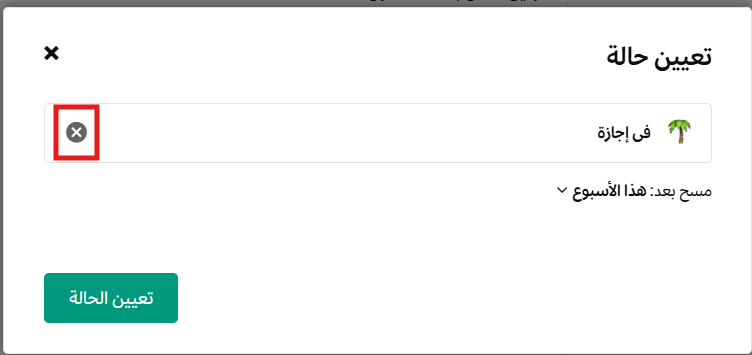
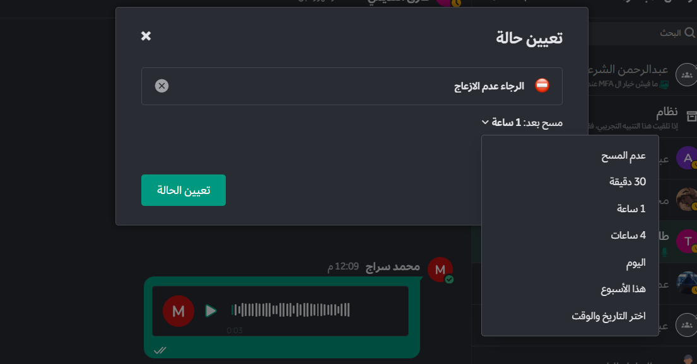

import { Tabs, TabItem } from '@astrojs/starlight/components';
import FAIcon from "../../../components/FAIcon.astro";

أخبر فريقك بمدى توفرك من خلال تعيين حالة مخصصة وتحديد حالتك: **متصل**، **بعيد**، **ممنوع الإزعاج**، أو **غير متصل**.

## تعيين حالة مخصصة

قم بتعيين حالة مخصصة لعرض رسالة وصفية ورمزاً تعبيرياً (Emoji) اختيارياً بجوار اسمك في منصة تعاون. يمكن للأعضاء الآخرين رؤية حالتك في أي مكان يظهر فيه اسمك، مثل الشريط الجانبي للقنوات والمحادثات.

لتعيين حالة مخصصة في منصة تعاون:

<Tabs>
  <TabItem label="الويب وسطح المكتب">
    1. انقر على صورة ملفك الشخصي، ثم اختر **تعيين حالة مخصصة**.
    2. اختر من قائمة الحالات المقترحة، أو أدخل رمزاً تعبيرياً وحالة جديدة. يتم استخدام رمز فقاعة الكلام 💬 افتراضياً إذا لم تحدد رمزاً تعبيرياً. يمكن أن تصل الحالة المخصصة إلى 100 حرف كحد أقصى.
    3. حدد متى يتم مسح حالتك المخصصة.
    4. انقر على **تعيين الحالة**.
  </TabItem>
  <TabItem label="الهاتف المحمول">
    1. اضغط على صورة ملفك الشخصي، ثم اضغط على **تعيين حالة**.
    2. اختر من قائمة الحالات المقترحة، أو أعد استخدام حالة سابقة، أو اضغط لإدخال حالة جديدة وتحديد رمز تعبيري. يتم استخدام رمز فقاعة الكلام 💬 افتراضياً.
    3. حدد متى يتم مسح حالتك المخصصة.
    4. اضغط على **تم**.
  </TabItem>
</Tabs>

:::tip
الحالات المخصصة مفعلة افتراضياً في منصة تعاون. يمكن لمسؤولي النظام تعطيل هذه الميزة من **لوحة التحكم > تكوين الموقع > المستخدمون والفرق > تفعيل الحالات المخصصة**.
:::

### مسح حالة مخصصة

لمسح حالة مخصصة، انقر على صورة ملفك الشخصي، ثم اختر **مسح الحالة**، أو اختر خيار **مسح** بجوار حالتك الحالية.

## تعيين توافرك

لتعيين توافرك، انقر على صورة ملفك الشخصي، ثم حدد توافرك كـ **متصل**، أو **بعيد**، أو **ممنوع الإزعاج**، أو **غير متصل**.

| التوافر | الوصف |
| :--- | :--- |
| <FAIcon name="check-circle" color="#00987E" />  **متصل** | يُضبط تلقائياً عندما تكون نشطاً في منصة تعاون باستخدام المتصفح أو التطبيق. عند استخدام تطبيق سطح المكتب، أي نشاط للماوس أو لوحة المفاتيح يبقي حالتك **متصل**. يتم إرسال الإشعارات إلى جميع أجهزتك. |
| <FAIcon name="clock" color="orange" />  **بعيد** | يُضبط تلقائياً عندما تكون غير نشط لأكثر من 5 دقائق. تعتبر غير نشط إذا لم تكتب أو تتنقل بين القنوات أو تبدل علامات التبويب، أو عندما تصغّر النافذة. يمكنك ضبط نفسك كـ **بعيد** يدوياً في أي وقت. |
| ⛔ **ممنوع الإزعاج** | اضبط توافرك على **ممنوع الإزعاج** في أي وقت لا تريد فيه تلقي إشعارات لفترة من الزمن. يتم تعطيل جميع إشعارات سطح المكتب، والبريد الإلكتروني، وإشعارات الدفع. |
| <FAIcon prefix="far" name="circle" />  **غير متصل** | يُضبط تلقائياً عند الخروج من تطبيق سطح المكتب أو إغلاق المتصفح أو قفل جهازك. يمكنك ضبط نفسك كـ **غير متصل** يدوياً في أي وقت. يتم توجيه الإشعارات إلى تطبيق الجوال. |

يمكن للأعضاء الآخرين رؤية توافرك في أي مكان يمكنهم فيه رؤية اسمك.

### ضبط توافرك على "ممنوع الإزعاج"

اضبط توافرك على **ممنوع الإزعاج** لتعطيل جميع الإشعارات عندما لا تكون متاحاً أو تحتاج إلى التركيز.

يمكنك تحديد المدة التي سيتم فيها تعطيل الإشعارات عن طريق اختيار وقت انتهاء محدد مسبقاً، أو تحديد وقت مخصص، أو اختيار **لا مسح**. يعود توافرك تلقائياً إلى حالته السابقة بمجرد الوصول إلى وقت الانتهاء (قد يستغرق ذلك ما يصل إلى خمس دقائق).

