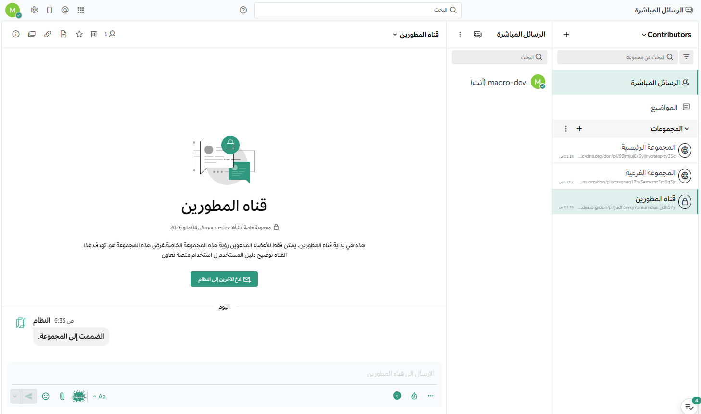

import { Card, CardGrid, Aside, Steps } from '@astrojs/starlight/components';

إذا كنت تستخدم **منصة تعاون** للتواصل والعمل المشترك، وبناء عمليات مؤتمتة وقابلة للتكرار، وترغب في تخصيص المنصة لتناسب تفضيلات عملك، فإن هذا الدليل مخصص لك.

في هذه الوثائق، ستتعلم كيفية استخدام المنصة بفعالية. لقد قام مسؤول النظام في مؤسستك بالفعل بتجهيز البيئة، وهي الآن جاهزة لتسجيل دخولك باستخدام بيانات الاعتماد الخاصة بك. مساحة عملك هي المكان الذي ستتبادل فيه الرسائل، وتتابع تنبيهات النشاط، وتدير المشاريع، وتخصص شكل الواجهة وتجربة الاستخدام.

---

## أقسام الدليل الأساسية

اكتشف الأقسام أدناه لتعلم كيفية تحقيق أقصى استفادة من المنصة:

<CardGrid stagger>
  <Card title="الوصول والمساحة" icon="rocket">
    تعلم كيفية الوصول للمنصة عبر المتصفح، أو تطبيقات سطح المكتب، أو الهاتف المحمول، وكيفية تسجيل الدخول بأمان.
    [اذهب للقسم](/access-your-workspace/access-your-workspace)
  </Card>
  <Card title="التعاون والمراسلة" icon="comment-alt">
    اكتشف كيفية التواصل اللحظي مع زملائك في الفريق، وإدارة القنوات والرسائل بفاعلية.
    [اذهب للقسم](/messaging-collaboration/messaging-collaboration)
  </Card>
  <Card title="أتمتة سير العمل" icon="setting">
    بناء عمليات متكررة، والعمل بسرعة أكبر، وتقليل الأخطاء باستخدام الأتمتة وقوائم المهام.
    [اذهب للقسم](/workflow-automation/workflow-automation)
  </Card>
  <Card title="إدارة المشاريع" icon="list-format">
    تنسيق العمل العملياتي باستخدام لوحات التخطيط الذكية لمتابعة سير المهام.
    [اذهب للقسم](/project-and-task-management/project-and-task-management)
  </Card>
</CardGrid>

---

## ميزات إضافية متطورة

* **المكالمات الصوتية ومشاركة الشاشة**: تعرف على ميزات المكالمات المدمجة ومشاركة الشاشة، بالإضافة إلى تكاملات منصات الفيديو المدعومة.
* **وكلاء الذكاء الاصطناعي**: اكتشف كيفية الاستفادة من الذكاء الاصطناعي لمساعدتك في اتخاذ القرارات والبحث عن المعلومات.
* **تخصيص التفضيلات**: اجعل المنصة تعمل بالطريقة التي تفضلها من خلال تخصيص الإشعارات، والمظهر، والإعدادات الأمنية.

---

## نظرة عامة على الواجهة

توفر الواجهة تصميماً هرمياً يسهل التنقل بين الفرق، القنوات، والمحادثات النشطة.

<Aside type="tip" title="نصيحة احترافية">
يمكنك تغيير حجم كل من شريط القنوات الجانبي وشريط الردود الأيمن عند استخدام المتصفح أو تطبيق سطح المكتب للحصول على مساحة رؤية أفضل!
</Aside>

---

## الخطوات التالية

هل أنت مستعد للبدء؟ اتبع المسار التالي لتسجيل دخولك الأول وتهيئة بيئة عملك:

<Steps>
1.  انتقل إلى صفحة **[الوصول إلى مساحة عملك](/access-your-workspace/access-your-workspace)**.
2.  قم بتحميل **تطبيق سطح المكتب** للحصول على أفضل تجربة تنبيهات.
3.  انضم إلى **الساحة العامة** للترحيب بزملائك.
</Steps>

---

<Aside type="note">
هذا الدليل محدث باستمرار ليعكس آخر الميزات المضافة في **منصة تعاون**.
</Aside>