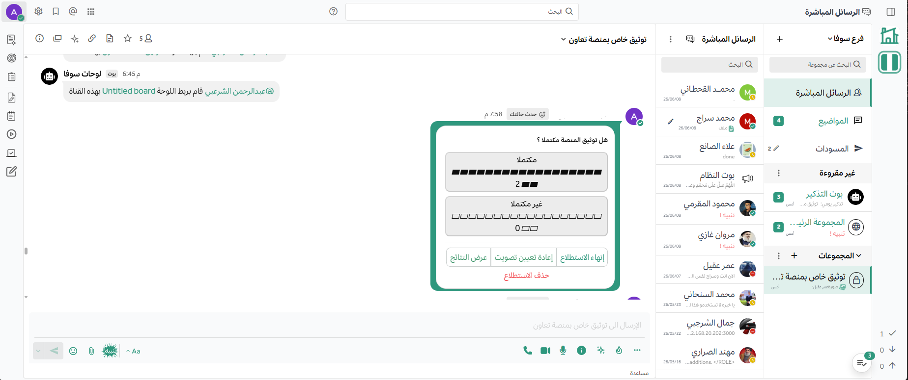

import { Card, CardGrid, Aside, Steps } from '@astrojs/starlight/components';

## بيئة المهام الذكية 

تُعدّ **منصة تعاون** بيئة مهام ذكية ، مصممة خصيصاً للعمليات الحرجة. توفّر المنصة منصة موحّدة للتعاون الآمن والقابل للتوسع والمزوّد بالذكاء الاصطناعي وأتمتة العمليات، قابلة للنشر في أكثر البيئات تطلّباً — من الشبكات المصنّفة إلى الحافة التكتيكية.

تستخدم المؤسسات **منصة تعاون** للاحتفاظ بالسيطرة الكاملة على الاتصالات وسير العمل والبنية التحتية مع تسريع عملية اتخاذ القرارات. تُدمج بيئة المهام الذكية المراسلة الآمنة، وأتمتة سير العمل، وإدارة المهام، ووكلاء الذكاء الاصطناعي (AI Agents)، والاتصال الفعلي في آنٍ واحد ضمن بنية سيادية متينة سيبرانياً. تدعم المنصة قابلية التوسع عبر واجهات برمجة التطبيقات المفتوحة (APIs) والتكاملات، وتعمل بمرونة عبر الأنظمة المحلية والسحابية والمعزولة — مما يتيح التركيز العملي، والمرونة، والمتانة من عُقد الحافة إلى مراكز البيانات المركزية.

صُمّمت لتلبية الاحتياجات المتطورة لقطاعات الأمن القومي، والدفاع، والاستخبارات، والأمن السيبراني، والبنية التحتية الحرجة في سير العمل الميداني، بما في ذلك:

- **الدفاع السيبراني**: اتصالات آمنة خارج النطاق وأتمتة لسير العمل في مراكز عمليات الأمن  وفرق الاستجابة لحالات الطوارئ الحاسوبية .
- **عمليات التطوير والأمن والعمليات**: تكامل مستمر وتسليم مستمر  سيادي، وإدارة خدمات تقنية المعلومات ، وإدارة الأنظمة الرقمية على نطاق واسع.
- **العمليات الميدانية**: التعاون عبر القيادة والسيطرة، والتصنيع، والطاقة، والعمليات المشتركة.

راجع [دليل حالات الاستخدام](/use-case-guide/use-cases-index) لتتعرّف على كيفية استخدام الفرق التشغيلية لمنصة تعاون لتسريع العمل الميداني الحرجة عبر مجموعة متنوعة من التخصصات.

---

## سير العمل التعاوني الآمن

المبنية على بنية مفتوحة المصدر قابلة للتوسع، توفّر **منصة تعاون** مجموعة من أدوات التعاون عبر [تطبيقات سطح المكتب المدارة لنظامَي Windows وMac وLinux](/deployment-guide/desktop/desktop-app-deployment)، ومتصفحات الويب الآمنة مع أو بدون اتصال بالإنترنت، والأجهزة الشخصية  أو [الأجهزة المحمولة المدارة عبر إدارة الأجهزة المحمولة ](/security-guide/mobile-security)، وتجارب المستخدم [المدمجة مع Microsoft 365](/integrations-guide/mattermost-mission-collaboration-for-m365).

### التعاون في المراسلة

تُتيح [قنوات تعاون](/end-user-guide/messaging-collaboration) اتصالاً آمناً في الوقت الفعلي وغير المتزامن عبر الويب وسطح المكتب والمحمول — مما يُشغّل التعاون الحرجة وسير عمل عمليات الدردشة  عبر البيئات المتصلة والهجينة والمعزولة.

تتضمن القنوات القدرات التالية:

- القنوات [العامة](/end-user-guide/collaborate/channel-types#public-channels) و[الخاصة](/end-user-guide/collaborate/channel-types#private-channels)، و[الرسائل المباشرة](/end-user-guide/collaborate/channel-types#direct-message-channels)، و[المحادثات المتسلسلة](/end-user-guide/collaborate/organize-conversations) للتنسيق التشغيلي المنظّم.
- [ضوابط الوصول القائمة على الأدوار](/end-user-guide/collaborate/learn-about-roles) و[سجلات التدقيق](/administration-guide/manage/logging#audit-logging) لدعم تطبيق مبدأ الحاجة إلى المعرفة.
- [الإشعارات](/end-user-guide/preferences/manage-your-notifications) القابلة للتهيئة (مثل: [التنبيهات](/end-user-guide/preferences/manage-your-notifications#default-notifications)، و[مشغّلات الكلمات الرئيسية](/end-user-guide/preferences/manage-your-mentions-keywords-notifications)، و[كتم الصوت](/end-user-guide/preferences/manage-your-channel-specific-notifications)) لعرض الأنشطة ذات الأولوية العالية.
- قدرات عمليات الدردشة  المدمجة عبر [الأوامر المائلة](/integrations-guide/run-slash-commands)، و[حسابات الروبوتات](https://developers.mattermost.com/integrate/reference/bot-accounts/)، و[الويب هوكات](/integrations-guide/webhook-integrations) للأتمتة الفورية وتنبيهات الأنظمة.
- [تثبيت الرسائل](/end-user-guide/collaborate/save-pin-messages#pin-messages)، و[الإشارات المرجعية](/end-user-guide/collaborate/manage-channel-bookmarks)، و[البحث المتقدم](/end-user-guide/collaborate/search-for-messages) للحفاظ على الاستمرارية والسياق في البيئات ذات الحجم العالي.
- دعم المنصات المتعددة على عملاء الويب وسطح المكتب والمحمول لضمان وصول مرن من الميدان إلى القيادة والسيطرة.
hero

راجع توثيق [توفر العملاء](/end-user-guide/access/client-availability) لمعرفة الميزات المتوفرة على عملاء تعاون المختلفين.

### أتمتة سير العمل

تُوحّد [قوالب العمل في تعاون](/end-user-guide/workflow-automation) وتُؤتمت سير العمل الميداني مثل الاستجابة للحوادث، وتسليم الورديات، وقوائم التحقق التشغيلية — مما يُقلّل الأخطاء البشرية ويُحسّن الاتساق الإجرائي.

تتضمن قوالب العمل الميزات التالية:

- [قوائم التحقق](/end-user-guide/workflow-automation/work-with-playbooks#make-checklists) المهيكلة مع [المهام ومواعيدها النهائية](/end-user-guide/workflow-automation/work-with-tasks#tasks-and-due-dates) المُعيَّنة لتشغيل الإجراءات التشغيلية المعيارية وإجراءات الطوارئ.
- [تحديثات الحالة والإشعارات الفورية](/end-user-guide/workflow-automation/notifications-and-updates) المُؤتمتة في القنوات المرتبطة لإبقاء المعنيين على اطّلاع بتقدّم سير العمل أو العوائق.
- [الإجراءات والتعيينات والتوجيهات](/end-user-guide/workflow-automation/work-with-playbooks#actions) المدمجة لضمان التنفيذ المتكرر والاتساق التشغيلي.
- الجدول الزمني، و[المراجعات اللاحقة](/end-user-guide/workflow-automation/learn-about-playbooks#retrospective)، و[تتبّع المقاييس](/end-user-guide/workflow-automation/metrics-and-goals#metrics) لمراجعات ما بعد التنفيذ والمساءلة.
- [مشغّلات التكامل](/end-user-guide/workflow-automation/work-with-runs#send-outgoing-webhooks) (مثل: تنبيهات من أدوات المراقبة) لإطلاق سير العمل تلقائياً وتقليص وقت التنفيذ.

### المكالمات الصوتية ومشاركة الشاشة

تُتيح [مكالمات تعاون](/end-user-guide/collaborate/audio-and-screensharing) اتصالاً فعلياً واستكشاف أخطاء عبر مكالمات صوتية سيادية ومشاركة الشاشة — مما يدعم نقل المعرفة الآمن والاستجابة السريعة في السيناريوهات الحرجة زمنياً.

تشمل القدرات الرئيسية ما يلي:

- تُتيح [مكالمات صوتية فردية وجماعية](/end-user-guide/collaborate/make-calls#join-a-call) مباشرة داخل القنوات والرسائل المباشرة، مع الحفاظ على الوعي السياقي والتحكم في الوصول استناداً إلى عضوية القناة.
- تدعم [مشاركة الشاشة](/end-user-guide/collaborate/make-calls#share-your-screen) الآمنة للتنسيق البصري والتحليل.
- تعمل في [بيئات سيادية معزولة أو شبكات حساسة](/administration-guide/configure/calls-deployment-guide).
- تُوفّر [نسخاً نصياً بالذكاء الاصطناعي](/end-user-guide/collaborate/make-calls#transcribe-recorded-calls) اختيارياً و[توليد ملخصات](/end-user-guide/agents#analyze-threads-and-channels) لتوثيق الاجتماعات والمتابعة.
- تعمل عبر الويب وسطح المكتب والمحمول لضمان وصول آمن ومرن.

### إدارة المشاريع والمهام

تُتيح [لوحات تعاون](/end-user-guide/project-task-management) تنسيق العمل التشغيلي بتخطيط بأسلوب كانبان  يتكامل مباشرة مع سير عمل المراسلة — مما يُتيح الشفافية، وتحديد الأولويات، والمساءلة عبر الفرق بالقدرات التالية:

- تُوفّر [لوحات](/end-user-guide/project-management/work-with-boards) مهام مرئية مع [بطاقات](/end-user-guide/project-management/work-with-cards) قابلة للسحب والإفلات وسير عمل قابل للتخصيص، تدعم الوعي السياقي و[رؤية المهام القائمة على الأدوار](/end-user-guide/project-management/share-and-collaborate#board-permissions).
- تُقدّم تحديثات فورية ومزامنة مع [قنوات تعاون المرتبطة](/end-user-guide/project-management/navigate-boards#link-a-board-to-a-channel).
- تدعم [التعيينات على مستوى البطاقة، وقوائم التحقق، والتسميات، والمواعيد النهائية](/end-user-guide/project-management/work-with-cards#card-properties) لضمان الوضوح التشغيلي.
- تُتيح [التصفية](/end-user-guide/project-management/groups-filter-sort#filters) و[الفرز](/end-user-guide/project-management/groups-filter-sort#sorting-cards) لإدارة قوائم المهام المعلقة والأولويات والتخطيط المستقبلي.
- تحافظ على [رؤية المشروع](/end-user-guide/project-management/navigate-boards#sidebar-categories) دون الحاجة إلى مغادرة قنوات الاتصال الرئيسية.

### وكلاء الذكاء الاصطناعي وواجهات برمجة التطبيقات المفتوحة

تُسرّع [وكلاء تعاون](/end-user-guide/agents) اتخاذ القرارات وتُبسّط المهام المتكررة بالمساعدة المدعومة بالذكاء الاصطناعي، القابلة للتحكم الكامل ضمن بنية سيادية — مما يُقدّم دعماً ذكياً للمستخدمين وسير العمل:

- تُوفّر مساعدين ذكاءً اصطناعياً قابلين للتهيئة [يلخّصون سلاسل المحادثات](/end-user-guide/agents#summarize-discussion-threads)، و[يستخرجون بنود العمل ويُجيبون على الأسئلة](/end-user-guide/agents#chat-with-agents) بفهم سياقي ووعي تشغيلي.
- تدعم [التفاعل المباشر مع وكلاء الذكاء الاصطناعي](/end-user-guide/agents#chat-with-agents) في سلاسل محادثات أو قنوات مخصصة.
- تُتيح [البحث الدلالي](/end-user-guide/agents#search-with-ai) باستخدام اللغة الطبيعية لعرض المحتوى ذي الصلة عبر بيانات تعاون.
- تدعم التوليد المعزّز بالاسترجاع (RAG)، و[التعليمات المخصصة](/administration-guide/configure/agents-admin-guide#custom-instructions)، و[حواجز الذكاء الاصطناعي المسؤولة](/administration-guide/configure/agents-admin-guide#permission-configuration) للأتمتة الآمنة.
- تتكامل مع [النماذج المحلية](/agents/docs/providers) (مثل: Ollama، وvLLM) ونماذج اللغة الكبيرة السحابية عبر واجهات برمجة تطبيقات متوافقة مع OpenAI للنشر المرن.

---

## منصة التكامل والذكاء الاصطناعي

صُمّمت بيئة المهام الذكية  للتكامل الآمن والقابل للتوسع مع الأنظمة الحرجة وسير عمل الذكاء الاصطناعي. مبنية للعمل في بيئات سيادية ومنظّمة وغير متصلة، تدعم بيئة المهام الذكية الأتمتة النمطية، وتنسيق الوكلاء المتعددين، والنشر الآمن لكلٍّ من النماذج المحلية والسحابية — مما يُسرّع اتخاذ القرارات مع الحفاظ على السيطرة الكاملة على البيانات والبنية التحتية وسلوك النماذج.

### قابلية التوسع الطبقية

مبنية للتكامل الآمن مع بيئات المؤسسات المعقدة والحرجة، يُتيح هذا النموذج للفرق تخصيص سير العمل، وأتمتة العمليات، والاتصال بالأنظمة الخارجية باستخدام معايير مفتوحة ومكونات نمطية — مما يدعم النشر السريع للأتمتة مع الحفاظ على المرونة والامتثال عبر البيئات المعزولة والمتصلة على حدٍّ سواء.

تشمل القدرات الرئيسية ما يلي:

- تكاملات الفيديو الآمنة: تضمين منصات فيديو آمنة مثل [Pexip](https://mattermost.com/marketplace/pexip-video-connect/)، و[Webex](https://mattermost.com/marketplace/webex-cloud/)، وJitsi للتعاون الميداني السيادي.
- تكاملات معبّأة ومخصصة: اتصال سريع مع أنظمة مثل [GitHub](/integrations-guide/github)، و[GitLab](/integrations-guide/gitlab)، و[Jira](/integrations-guide/jira)، و[ServiceNow](/integrations-guide/servicenow)، و[Jenkins](https://mattermost.com/marketplace/jenkins-plugin-2/)، و[PagerDuty](https://mattermost.com/marketplace/pagerduty/).
- [الويب هوكات](/integrations-guide/webhook-integrations) و[الأوامر المائلة](/integrations-guide/run-slash-commands): تُتيح أتمتة فورية قائمة على الأحداث وإجراءات يُطلقها المستخدم مباشرة من الدردشة.
- بنية المكونات الإضافية: توسيع نواة تعاون باستخدام [مكونات واجهة مستخدم مخصصة، ومنطق من جهة الخادم، وخدمات طرف ثالث](https://developers.mattermost.com/integrate/customization/).

تعرّف على المزيد في [دليل التكاملات](/integrations-guide/integrations-guide-index).

### تكامل النماذج اللغوية الكبيرة المتعددة والوكلاء المتعددين

أساس آمن وقابل للتوسع لدمج نماذج لغوية كبيرة (LLMs) متعددة ووكلاء مستقلين ضمن مستوى سيطرة سيادي يُمكّن المؤسسات من تشغيل الذكاء الاصطناعي ضمن بنية سيادية — مما يدمج البيانات عبر الأنظمة، ويُسرّع القرارات، ويحتفظ بالسيطرة الكاملة على وصول نماذج الذكاء الاصطناعي وأدائها.

يمكن للمؤسسات الاستفادة من القدرات التالية لتشغيل الذكاء الاصطناعي:

- دعم نماذج [الذكاء الاصطناعي السيادي](/agents/docs/sovereign_ai): التكامل مع [OpenAI وAnthropic وMeta Llama ونماذج لغوية كبيرة أخرى](/agents/docs/providers) عبر واجهات برمجة تطبيقات آمنة.
- [التعليمات المخصصة](/administration-guide/configure/agents-admin-guide#custom-instructions) والتوليد المعزّز بالاسترجاع (RAG): تكييف سلوك الوكلاء مع المهام المتخصصة باستخدام البيانات والسياسات الداخلية.
- [البحث الدلالي](/end-user-guide/agents#search-with-ai) والتفاعل باللغة الطبيعية: تزويد الفرق التشغيلية بطرق بديهية لاسترجاع المعلومات والتصرف بناءً عليها.
- [مستوى السيطرة للذكاء الاصطناعي المسؤول](/agents/docs/sovereign_ai#security-and-compliance-features): تحديد سياسات الوصول إلى النماذج، وفرض الحواجز، ومراقبة نشاط الوكلاء مع حلقات التغذية الراجعة.
- تنسيق الوكلاء المتعددين: استخدام [مستوى سيطرة المهام (MCP)](/administration-guide/configure/agents-admin-guide#model-context-protocol-mcp-integration) وبروتوكولات الوكيل إلى الوكيل لتنسيق الإجراءات عبر وكلاء مستقلين متعددين.

---

## مرونة النشر السيادية المتينة سيبرانياً

صُمّمت بيئة المهام الذكية (IME) للعمليات المرنة الحرجة — سواء على الحافة التكتيكية، أو داخل مراكز البيانات السيادية، أو عبر بيئات السحابة المنظّمة. مبنية على Kubernetes ومصمّمة للتوافر العالي، تضمن بيئة المهام الذكية الاستمرارية، وقابلية التوسع، والتحكم التشغيلي الكامل عبر ملفات البنية التحتية المتنوعة.

### الحافة التكتيكية

تعمل بيئة المهام الذكية على بنية تحتية خفيفة أو محصّنة أو متنقلة، مُحسَّنة لظروف الانقطاع والحرمان والتقطع والضغط (DDIL).

- تدعم [ملفات Linux الثنائية أحادية العقدة](/deployment-guide/server/deploy-linux) و[عمليات النشر الحاوية في بيئات Kubernetes المحلية](/deployment-guide/server/deploy-containers) لإعداد سريع وخفيف.
- تُتيح النشر المرن على منصات حوسبة مدمجة ومحمولة — مثالية للسُّفن، وقواعد العمليات المتقدمة، ووحدات القيادة المتنقلة، أو مجموعات العمل المعزولة.
- تعمل بشكل كامل [معزولة](/deployment-guide/reference-architecture/deployment-scenarios/air-gapped-deployment) دون الاعتماد على الإنترنت، أو نظام أسماء النطاقات (DNS)، أو أنظمة المصادقة الخارجية.
- تُقدّم اتصالات آمنة، ومشاركة شاشة، وأتمتة سير العمل في ظروف معزولة أو DDIL.

### السحابة الخاصة ومراكز البيانات السيادية

للبيئات عالية الأمن التي تتطلب تحكماً كاملاً بالبنية التحتية، تدعم بيئة المهام الذكية النشر القابل للتوسع والتوافر العالي داخل مراكز البيانات السيادية.

- [بنية Kubernetes الأصلية](/deployment-guide/server/deploy-kubernetes) تُتيح خدمات حاوية، وأحمال عمل ذاتية الإصلاح، وتحديثات بدون توقّف.
- [التوافر العالي](/administration-guide/scale/high-availability-cluster-based-deployment) عبر التجميع على مستوى التطبيق وقاعدة البيانات وطبقة الوكيل.
- [قابلية التوسع الأفقي](/administration-guide/scale/scaling-for-enterprise) لعشرات الآلاف من المستخدمين لكل مثيل.
- تتوافق مع معايير دليل التنفيذ الأمني التقني (STIG)، ومعيار المعالجة الفيدرالي للمعلومات 140-3 (FIPS 140-3)، ومعايير الأمن المتوافقة مع برنامج إدارة المخاطر والتفويض الفيدرالي (FedRAMP).

### دعم السحابة الفائقة والسحابة السيادية

يمكن نشر بيئة المهام الذكية عبر [مزوّدي السحابة الرئيسيين](/deployment-guide/server/deploy-kubernetes) مع دعم البنى الهجينة والسيادية:

- **Microsoft Azure** — تدعم الأجهزة الافتراضية (VM) وعمليات نشر Kubernetes عبر المناطق العالمية والحكومية والمحلية.
- **Amazon Web Services (AWS)** — قابلة للنشر على AWS العالمية، وGovCloud (US)، وOutposts.
- **Google Cloud** — تدعم منصة Google Cloud والسحابة الموزّعة (Edge وHosted) وفق خطة توفر السوق.
- **Oracle Cloud Infrastructure** — متوفرة في سوق Oracle لعمليات نشر الأجهزة الافتراضية وKubernetes، بما في ذلك السحابة السيادية من Oracle.

---

## ابدأ الآن

تُقدّم **منصة تعاون** للفرق الحرجة منصة تعاون سيادية وقابلة للتوسع ومتكاملة مع الذكاء الاصطناعي مصمّمة للعمليات الآمنة في أكثر البيئات تحدياً.

[تحدّث إلى خبير](https://mattermost.com/contact-sales/) لاستكشاف كيفية تصميم بيئة المهام الذكية الخاصة بك.
