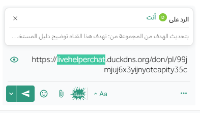

import { Image } from 'astro:assets';
import { Tabs, TabItem,Aside } from '@astrojs/starlight/components';
import FAIcon from '../../../../components/FAIcon.astro';

{/* استيراد الصور */}
import forwardMessageImg from '../../../../images/forward-message.png';
import permalinkPreviewsImg from '../../../../images/forwarded-previews.png';
import mobileForwardMessages from '../../../../images/mobile-messages-forward.gif';

  <Tabs>
  <TabItem label="الويب/سطح المكتب" icon="laptop">
          لإعادة توجيه رسالة:

          1. اختر أيقونة **المزيد** <FAIcon name="ellipsis-vertical" /> بجانب الرسالة، ثم اختر **عادة توجيه**.

          2. حدد المكان الذي تريد إعادة توجيه الرسالة إليه، وقم بتضمين تعليق اختياري.

          تؤدي إعادة توجيه الرسالة أيضًا إلى إنشاء معاينة للرسالة.

          

         
  </TabItem>

  <TabItem label="الهاتف المحمول" icon="mobile">
    اضغط مطولاً على رسالة، ثم اضغط على **تمييز كغير مقروء**.
    <Image 
        src={mobileForwardMessages} 
        alt="يقوم منصة تعاون بإنشاء معاينات للروابط التي تتم مشاركتها في القنوات." 
      />
   
  </TabItem>
</Tabs>

      تحترم المعاينات أذونات عضوية القناة، لذا فهي مرئية فقط للمستخدمين الذين لديهم وصول إلى الرسالة الأصلية. إذا كان الرابط لرسالة في قناة عامة، فيمكن لأي عضو في الفريق رؤية معاينة الرسالة. إذا كان الرابط لرسالة في قناة خاصة أو رسالة مباشرة، فيمكن فقط للأعضاء في تلك القناة رؤية معاينة الرسالة.

<Aside type="note">
  لا يمكن إعادة توجيه القنوات الخاصة، والرسائل المباشرة، والرسائل الجماعية الموجهة لأشخاص محددين.
</Aside>

 