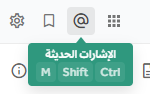

عندما ترغب في جذب انتباه مستخدمين محددين في منصة تعاون، يمكنك استخدام الإشارات (@mentions). يدعم منصة تعاون الأنواع التالية من الإشارات:

- @اسم_المستخدم
- @channel و @all
- @here
- @اسم_المجموعة
- @اسم_مجموعة_المستخدمين_المخصصة

:::note

- إذا نسيت الإشارة إلى شخص ما في رسالة، فإن تعديل الرسالة الحالية لإضافة إشارة لن يؤدي إلى إرسال إشعارات إشارة جديدة، أو إشعارات سطح مكتب، أو أصوات تنبيه.
- يدعم منصة تعاون الإشارات للأسماء التي تتضمن علامات التشكيل. تظهر الأسماء مثل **علي صالح** أو **عبد الرحمن** أو **محمد اليمني** في نتائج الإكمال التلقائي.
  :::

## `@اسم_المستخدم`

يمكنك الإشارة إلى زميل في الفريق باستخدام الرمز _@_ متبوعاً باسم المستخدم الخاص به لإرسال إشعار إشارة إليه.

اكتب _@_ أو الرمز "＠"  لعرض قائمة بأعضاء الفريق الذين يمكن الإشارة إليهم. لتصفية القائمة، اكتب الأحرف الأولى من أي اسم مستخدم، أو الاسم الأول، أو اسم العائلة، أو الاسم المستعار.

:::note
أضاف إصدار منصة تعاون v11.3 دعماً للرمز @ بعرض كامل، مما يحسن التجربة لمستخدمي لوحة المفاتيح اليابانية ومستخدمي لوحة المفاتيح الدولية الآخرين. لم تتأثر إشارات @ الحالية. راجع ملاحظات إصدار v11.3 لمزيد من التفاصيل.
:::

:::tip
عند استخدام منصة تعاون في متصفح الويب أو تطبيق سطح المكتب، يمكنك أيضاً الضغط على مفتاحي السهمين <kbd>↑</kbd> و <kbd>↓</kbd> للتمرير عبر الإدخالات في القائمة، والضغط على <kbd>ENTER</kbd> في ويندوز أو لينكس، أو <kbd>↵</kbd> في ماك، لاختيار الشخص المراد الإشارة إليه. عند الاختيار، يحل اسم المستخدم محل الاسم الكامل أو الاسم المستعار.
:::

يرسل المثال التالي إشعار إشارة خاصاً إلى محمد، التي يكون اسم المستخدم الخاص بها هو **محمد**. ينبهها الإشعار بالقناة والرسالة التي تم الإشارة إليها فيها. إذا كان محمد بعيداً عن منصة تعاون وقام بتفعيل إشعارات البريد الإلكتروني، فستتلقى تنبيهاً عبر البريد الإلكتروني بالإشارة الخاصة بها مع نص الرسالة.

```text
@محمد كيف سارت مقابلتك مع المرشح الجديد؟
```

إذا كان الشخص الذي أشرت إليه لا ينتمي إلى القناة أو الفريق، فسيتم نشر رسالة نظام لإعلامك بذلك، وسيُتاح لك خيار إضافة الشخص إلى القناة. أنت الوحيد الذي يمكنه رؤية هذه الرسالة.

## `@channel` و `@all`

يمكنك الإشارة إلى قناة بأكملها عن طريق كتابة `@channel` أو `@all`. يتلقى جميع أعضاء القناة إشعار إشارة يتصرف بنفس الطريقة كما لو تم الإشارة إلى الأعضاء شخصياً. إذا تم استخدامها في القناة العامة ، فسيتم تنبيه جميع أعضاء فريقك.

يمكنك تجاهل الإشارات على مستوى القناة في قنوات معينة عبر **قائمة القناة > تفضيلات الإشعارات > تجاهل الإشارات لـ @channel و @here و @all**.

```text
@channel عمل رائع في المقابلات هذا الأسبوع. أعتقد أننا وجدنا بعض المرشحين المحتملين الممتازين!
```

إذا كانت القناة تضم خمسة أعضاء أو أكثر، فقد يُطلب منك تأكيد رغبتك في إرسال الإشعارات إلى الجميع في القناة.

## `@here`

يمكنك الإشارة إلى كل من هو متصل في القناة عن طريق كتابة `@here`. يرسل هذا إشعار سطح مكتب وإشعاراً فورياً لأعضاء القناة المتصلين. يتم احتسابها كإشارة في الشريط الجانبي. لا يتلقى الأعضاء غير المتصلين إشعاراً. وعند عودتهم إلى منصة تعاون، لن يروا إشارة محسوبة في الشريط الجانبي للقناة. يتلقى الأعضاء الموجودون في وضع "بعيد" إشعار سطح مكتب فقط إذا كانت إشعاراتهم مضبوطة على **لكل النشاطات**، ولن يروا إشارة محسوبة في الشريط الجانبي.

```text
@here هل يمكن لشخص ما إجراء مراجعة سريعة لهذا؟
```

إذا كانت القناة تضم خمسة أعضاء أو أكثر، فقد يُطلب منك تأكيد رغبتك في إرسال الإشعارات إلى الجميع في القناة.

يمكنك تجاهل الإشارات على مستوى القناة في قنوات معينة عن طريق تفعيل خيار **قائمة القناة > تفضيلات الإشعارات > تجاهل الإشارات لـ @channel، @here، و @all**.

## `@groupname`

تتيح هذه الميزة لمسؤولي النظام تهيئة إشارات مخصصة لـ مجموعات LDAP المتزامنة عبر صفحة تهيئة المجموعة. هذه الوظيفة مدعومة أيضاً في تطبيق الهاتف من الإصدار v1.34 إذا تم تفعيل ميزة مجموعات AD/LDAP. يدعم تطبيق الهاتف الاقتراح التلقائي للمجموعات، ويبرز إشارات أعضاء المجموعة، ويقدم أيضاً حوار تحذير عندما تؤدي الإشارة إلى تنبيه أكثر من خمسة مستخدمين.

بمجرد تفعيلها لمجموعة معينة، يمكن للمستخدمين الإشارة إلى المجموعة بأكملها وتنبيهها في قناة بشكل مشابه لـ `@channel` أو `@all`. سيتلقى أعضاء المجموعة في تلك القناة إشعاراً. إذا لم يكن أعضاء المجموعة المشار إليهم أعضاءً في القناة، فسيُطلب من المستخدم الذي نشر الإشارة دعوتهم.

تستخدم معرفات الإشارة للمجموعة اسم مجموعة LDAP بشكل افتراضي. لتخصيص أو إعادة تسمية المعرف:

1. افتح **لوحة تحكم النظام > إدارة المستخدمين > المجموعات**.
2. اختر **تعديل** بجانب المجموعة التي تريد تعديلها.
3. في **ملف تعريف المجموعة > إشارة المجموعة**، أدخل المعرف الجديد.
4. اختر **حفظ**.

كما هو الحال مع إشارات `@username` استخدم _@_ لعرض قائمة بالمجموعات التي يمكن الإشارة إليها. لتصفية القائمة، اكتب الأحرف الأولى من أي مجموعة. اضغط على مفتاحي السهمين <kbd>↑</kbd> و <kbd>↓</kbd> للتمرير عبر الإدخالات في القائمة، ثم اضغط على <kbd>Enter</kbd> في ويندوز أو لينكس، أو اضغط على <kbd>↵</kbd> في ماك لاختيار المجموعة التي تريد الإشارة إليها.

```text
@dev-managers عمل رائع في تحقيق جميع أهداف تغطية الكود الخاصة بنا هذا الربع!
```

## `@customusergroupname`

يمكنك إضافة مجموعات من المستخدمين إلى قناة أو فريق عن طريق [إنشاء مجموعة مخصصة](/messaging-collaboration/extend-workspace-with-integrations) والإشارة إلى تلك المجموعة المخصصة في القناة.

- يطلب منك منصة تعاون إضافة أي مستخدمين ليسوا أعضاءً بالفعل في تلك القناة إليها.
- بدءاً من إصدار منصة تعاون v9.1، يُمنح لك خيار إضافة أي مستخدمين ليسوا أعضاءً بالفعل في ذلك الفريق إليه، إذا كانت لديك الأذونات اللازمة للقيام بذلك.

## الكلمات التي تحفز الإشارات

يمكنك تخصيص الكلمات التي تحفز إشعارات الإشارة في **الإعدادات > الإشعارات > الكلمات التي تحفز الإشارات**. بشكل افتراضي، تتلقى إشعارات إشارة لاسم المستخدم الخاص بك ولـ `@channel` و `@all` و `@here`. يمكنك اختيار أن يكون اسمك الأول كلمة تحفز الإشارات.

يمكنك إضافة قائمة بالكلمات المخصصة لتلقي إشعارات الإشارة عن طريق كتابتها في مربع الإدخال، مفصولة بفاصلات. هذا مفيد إذا كنت ترغب في أن يتم تنبيهك بجميع المنشورات حول مواضيع معينة، مثل "المقابلات" أو "التسويق".

## عرض جميع الإشارات الأخيرة

اختر أيقونة **@** الموجودة على يمين مربع **البحث** للاستعلام عن أحدث إشارات @ الخاصة بك والكلمات التي تحفز الإشارات (باستثناء إشارات مجموعات LDAP).



تظهر إشاراتك الأخيرة لجميع فرقك.

اختر **انتقال** بجانب نتيجة البحث في الشريط الجانبي الأيمن للانتقال باللوحة المركزية إلى القناة وموقع الرسالة التي تحتوي على الإشارة.

## تحذيرات حوار التأكيد

عندما يقوم مسؤول النظام بتهيئة منصة تعاون لطلب تأكيدات لإشارات @، يجب عليك تأكيد أي إشارة ستؤدي إلى تنبيه أكثر من خمسة مستخدمين قبل إرسال الإشعار.

لا يظهر حوار التأكيد هذا إلا عندما يقوم مسؤول النظام بتهيئة هذا الإعداد في لوحة تحكم النظام. راجع توثيق المنتج الخاص بنا حول إعدادات التهيئة لمزيد من التفاصيل. إعداد التهيئة هذا مدعوم في تطبيق منصة تعاون للهاتف من الإصدار v1.34 إذا تم تفعيل ميزة مجموعات AD/LDAP.

## تمييز الإشارات

سيكون للإشارات الصالحة نص بخط مميز مع بعض الاستثناءات، على سبيل المثال إذا تم تعطيل الإشارات على مستوى القناة. يصبح النص المميز ارتباطاً تشعبياً عند عرض اسم المستخدم. عند اختيار اسم المستخدم، يظهر الملف الشخصي المنبثق.

عندما تحفز الإشارات إشعاراً، سيرى المستخدم الذي يتم تنبيهه نصاً بخلفية مميزة. يعمل هذا كمعرف لأي الإشارات في المنشور حفزت الإشعار للمستخدم.