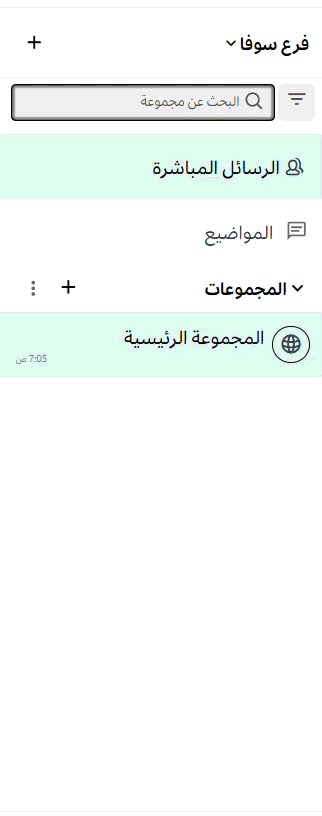

import { Tabs, TabItem } from "@astrojs/starlight/components";

تساعدك اختصارات التنقل عبر لوحة المفاتيح على استخدام منصة تعـــاون في متصفح الويب أو تطبيق سطح المكتب دون الحاجة إلى الماوس. فيما يلي قائمة باختصارات إمكانية الوصول المدعومة.

| اختصار لوحة المفاتيح                                                  | الوصف                                                                            |
| :-------------------------------------------------------------------- | :------------------------------------------------------------------------------- |
| تطبيق سطح المكتب: `F6`<br/>المتصفح: `Ctrl` + `F6`                     | نقل التركيز إلى القسم التالي.                                                    |
| تطبيق سطح المكتب: `Shift` + `F6`<br/>المتصفح: `Ctrl` + `Shift` + `F6` | نقل التركيز إلى القسم السابق.                                                    |
| `Tab`                                                                 | نقل التركيز إلى العنصر التالي.                                                   |
| `Shift` + `Tab`                                                       | نقل التركيز إلى العنصر السابق.                                                   |
| `↑` أو `↓`                                                            | نقل التركيز بين الرسائل في قائمة المنشورات أو الأقسام في الشريط الجانبي للقنوات. |
| `Enter`                                                               | تنفيذ إجراء على العنصر المحدد.                               |

## التنقل بين المناطق

يتكون منصة تعـــاون من ثماني مناطق أساسية يمكن التركيز عليها للتنقل. استخدم مفتاح `F6` في تطبيق سطح المكتب، أو `Ctrl` + `F6` في المتصفح بشكل متكرر لنقل التركيز والتنقل بين المناطق بهذا الترتيب:

1. منطقة قائمة الرسائل.
2. منطقة إدخال الرسائل.
3. منطقة قائمة الرسائل في الشريط الجانبي الأيمن.
4. منطقة إدخال الرسائل في الشريط الجانبي الأيمن.
5. منطقة قائمة الفريق.
6. منطقة الشريط الجانبي للقنوات.
7. منطقة ترويسة القناة.
8. البحث.


## التنقل بين الرسائل

عندما يكون التركيز على "منطقة قائمة الرسائل"، استخدم مفاتيح الأسهم `↑` أو `↓` للتنقل عبر الرسائل وسلاسل الردود . اضغط على مفتاح `Tab` للتنقل بين الإجراءات المتاحة لكل رسالة.


### صياغة الرسائل وقارئات الشاشة

يتوافق منصة تعـــاون مع أشهر قارئات الشاشة، مثل Apple VoiceOver أو JAWS for Windows. يتم تكوين قراءة صوتية مخصصة لكل رسالة عبر دمج عناصرها وقراءتها في جمل كاملة. تُقرأ عناصر الرسالة بالترتيب التالي:

1. **الترويسة:** الكاتب، الطابع الزمني، ونوع الرسالة.
2. **المحتوى الرئيسي:** نص الرسالة الذي كتبه المؤلف.
3. **المرفقات:** عدد المرفقات (إن وجدت).
4. **تفاعلات الرموز التعبيرية:** عدد التفاعلات الفريدة (إن وجدت).
5. **الحفظ/التثبيت:** ما إذا كانت الرسالة محفوظة أو مثبتة.

**مثال على ما قد ينطقه قارئ الشاشة:**

```text
كتب إريك سيثنا في الساعة 12:57 مساءً، يوم الخميس 13 يونيو، رداً نصُّه "شكراً على المراجعة"، 3 مرفقات، تفاعلان، الرسالة محفوظة ومثبتة.
```

## التنقل في الشريط الجانبي للقنوات

عندما يكون التركيز على منطقة "الشريط الجانبي للقنوات"، استخدم مفاتيح الأسهم `↑` أو `↓` للتركيز على أقسام الشريط الجانبي الفردية، مثل "الرؤى" ، "المواضيع" ، "المفضلة" ، الفئات المخصصة، القنوات العامة والخاصة، والرسائل المباشرة. اضغط على `Tab` للتنقل بين القنوات أو الأزرار الأخرى داخل كل قسم.


