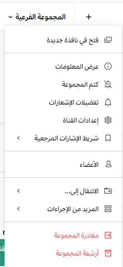
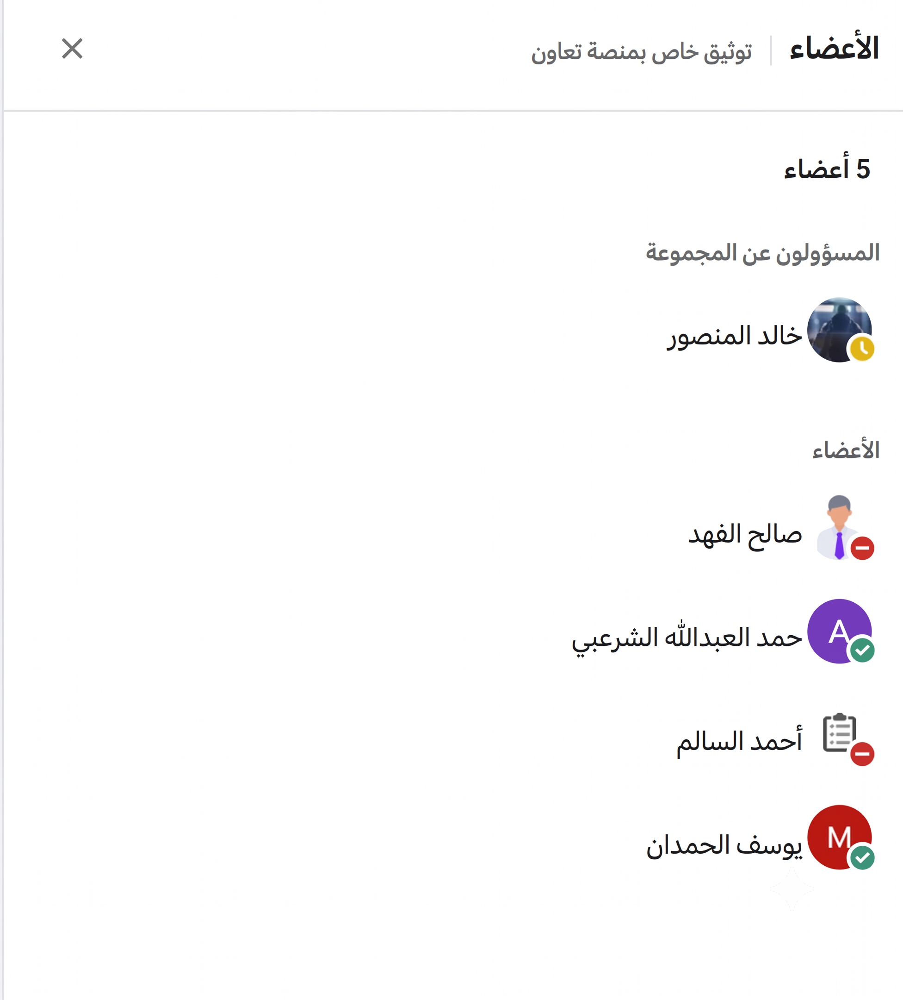
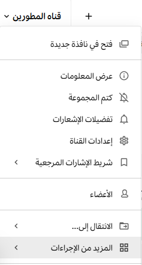
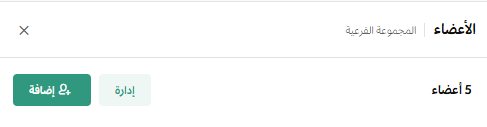
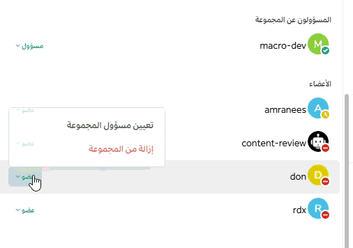

import { Aside, Steps } from '@astrojs/starlight/components';
import { Image } from 'astro:assets';

تقلل المجموعات المخصصة من الضجيج الرقمي وتحسن التركيز عبر إخطار الأشخاص المناسبين في القناة في الوقت المناسب، مع الحفاظ على الشفافية لجميع الأعضاء. تتيح لك مجموعات المستخدمين المخصصة إخطار ما يصل إلى 256 مستخدمًا في وقت واحد بدلاً من مراسلتهم بشكل فردي.

على سبيل المثال، قد ترغب في الإشارة (`@mention`) إلى فريق عمل محدد حول تحديثات عاجلة دون إزعاج بقية الأعضاء في القناة. استخدام المجموعة المخصصة يخطر المعنيين فوراً، مع إبقاء أصحاب المصلحة الآخرين على اطلاع بالنشاط العام.

بمجرد إنشاء مجموعة، يمكنك ذكرها بنفس الطريقة التي تشير بها إلى أي عضو آخر. راجع وثائق [الإشارة إلى الأشخاص في الرسائل](/messaging-collaboration/communicate-with-messages-and-threads/mention-people) للحصول على التفاصيل.

<Aside type="note">
- يجب على مسؤولي النظام تمكين هذه الميزة أولاً.
- يمكن للمسؤولين تحديد من يحق له إدارة هذه المجموعات عبر دور "مدير المجموعات المخصصة".
- إنشاء المجموعات عبر الهاتف سيكون متاحاً في تحديثات مستقبلية؛ حالياً تتوفر ميزة الإشارة إليها فقط.
</Aside>

---

## إنشاء مجموعة مخصصة

<Steps>
1. باستخدام **منصة تعاون** عبر المتصفح أو تطبيق سطح المكتب، انقر على أيقونة **قائمة المنتجات** (المربعات التسعة) في أعلى الشريط الجانبي، ثم اختر **مجموعات المستخدمين**.
2. حدد **إنشاء مجموعة مستخدمين جديدة**.
3. اختر اسماً للمجموعة و"إشارة" . يجب أن تكون الأسماء فريدة؛ إذا كان الاسم مستخدماً لقناة أو لمجموعة أخرى، فلن يقبله النظام.
4. ابحث عن الأعضاء المطلوبين وأضفهم، ثم اضغط على **إنشاء مجموعة**.
</Steps>

---

## مراجعة وإدارة المجموعات المخصصة

يمكنك مراجعة قائمة المجموعات، إضافة أشخاص، تعديل البيانات، أو حتى أرشفة المجموعات غير النشطة. للوصول لأدوات الإدارة .

### الإجراءات المتاحة

#### مراجعة الأعضاء
يمكنك النقر على إشارة المجموعة داخل أي محادثة لعرض قائمة فورية بجميع أعضائها الحاليين.

#### تغيير الاسم أو الإشارة
1. من أيقونة **المزيد من الإجراءات** (النقاط الثلاث) بجانب المجموعة، اختر **عرض المجموعة**.
   

#### إضافة أو إزالة الأعضاء
* **لإضافة أعضاء:** انقر على **إضافة** وابحث عن أسمائهم.
   

* **لإزالة أعضاء:** قم بالتحويم فوق اسم العضو وانقر على أيقونة ** ازالة من المجموعة**.
   

#### الانضمام والمغادرة
* يمكنك الانضمام لأي مجموعة مفتوحة عبر خيار **انضمام للمجموعة**.
* يمكنك التوقف عن تلقي إشعارات المجموعة عبر خيار **مغادرة المجموعة**.

---

## أرشفة واستعادة المجموعات

### أرشفة المجموعة
عندما تنتهي الحاجة لمجموعة معينة، يمكنك اختيار **أرشفة المجموعة**. 
* **ماذا يحدث؟** لن يكون بالإمكان الإشارة للمجموعة أو رؤية أعضائها في القنوات، لكن البيانات تظل محفوظة ولا يتم حذفها نهائياً.

### استعادة المجموعة
إذا أردت إعادة تفعيل مجموعة مؤرشفة:
1. قم بتصفية قائمة المجموعات لعرض **المجموعات المؤرشفة فقط**.
2. اختر المجموعة المطلوبة ثم انقر على **استعادة المجموعة**.

---

<Aside type="tip" title="دعوة الأعضاء الجدد">
عندما تشير إلى مجموعة مخصصة في قناة، ستقوم **منصة تعاون** تلقائياً بسؤالك ما إذا كنت تريد إضافة أعضاء هذه المجموعة الذين ليسوا أعضاء في القناة الحالية بعد.
</Aside>