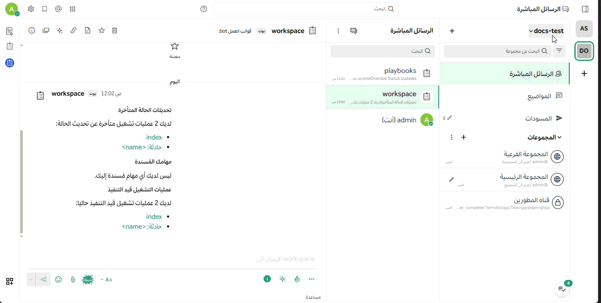

import { Aside, Steps, TabItem, Tabs } from '@astrojs/starlight/components';
import { Image } from 'astro:assets';

الفريق هو **مساحة عمل رقمية** داخل **منصة تعاون** تتيح لك ولزملائك التعاون بفعالية. اعتماداً على إعدادات مؤسستك، يمكنك الانتماء إلى فريق واحد أو عدة فرق، وقد يكون الوصول إلى الفريق مفتوحاً للجميع أو مقيداً بدعوات خاصة.

---

### 🔗 روابط سريعة
* [إعدادات الفريق المتقدمة](/messaging-collaboration/organize-using-teams/team-settings)
* [اختصارات لوحة المفاتيح الخاصة بالفرق](/messaging-collaboration/organize-using-teams/team-keyboard-shortcuts)

---

## فريق واحد مقابل فرق متعددة

نوصي عادةً بنشر **منصة تعاون** بتنسيق **فريق واحد** لتعزيز التواصل الشامل، ولكن في بعض الحالات المؤسسية قد تبرز الحاجة لاستخدام **فرق متعددة**.

### لماذا نوصي بالفريق الواحد؟
* **شفافية التواصل:** يمنع انعزال المجموعات ويضمن وصول المعلومات للجميع.
* **البحث الموحد:** تتركز نتائج البحث في مكان واحد لسهولة الوصول للمعلومات.
* **تكامل الأدوات:** تظل الروابط البرمجية (Webhooks) والأوامر فعالة وممركزة.

### متى نستخدم الفرق المتعددة؟
* **الفصل الإداري:** مثل تخصيص فريق للموظفين الدائمين وفريق آخر للمقاولين أو الشركاء الخارجيين.
* **تحسين الأداء:** توزيع المستخدمين في المؤسسات الضخمة يجعل تحميل البيانات أسرع.
* **الخصوصية الصارمة:** التحكم الدقيق في من يمكنه رؤية القنوات الحساسة.

---

## التنقل عبر شريط الفرق

إذا كنت عضواً في أكثر من فريق، سيظهر شريط جانبي يتيح لك التنقل السريع:
* **إعادة الترتيب:** يمكنك سحب وإسقاط أيقونات الفرق لتغيير ترتيبها حسب أولوياتك.
* **الاختصارات:** استخدم لوحة المفاتيح (مثلاً `Ctrl + Alt + [رقم]`) للتنقل السريع.

---

## إنشاء فريق جديد

يمكنك إنشاء فريق عبر المتصفح أو تطبيق سطح المكتب (ما لم يقم المسؤول بتعطيل هذه الصلاحية).

<Steps>
1. اضغط على اسم الفريق الحالي في القائمة العلوية للواجهة.
2. اختر **إنشاء فريق جديد**.
3. أدخل اسم الفريق الجذاب واختر الرابط الخاص به (URL).
</Steps>

### متطلبات التسمية والروابط

| العنصر | القيود والمتطلبات |
| :--- | :--- |
| **اسم الفريق** | من 2 إلى 64 حرفاً؛ يمكن استخدام الرموز والأرقام. |
| **رابط الفريق (URL)** | حروف صغيرة وأرقام وشرطات فقط؛ يجب أن يبدأ بحرف. |

---

## إدارة العضوية

### الانضمام إلى فريق
يمكنك الانضمام إلى أي فريق "مفتوح" أو فريق تلقيت دعوة رسمية إليه. عند تسجيل دخولك الأول لـ **منصة تعاون**، ستظهر لك قائمة بالفرق المتاحة. للانضمام لفريق إضافي، استخدم خيار **انضمام إلى فريق آخر** من قائمة الفريق.

### مغادرة الفريق
تتم عبر **قائمة الفريق > مغادرة الفريق**. 
<Aside type="caution">
عند المغادرة، ستتم إزالتك من جميع القنوات العامة والخاصة داخل ذلك الفريق، وستحتاج لدعوة جديدة للعودة ما لم يكن الفريق متاحاً للجميع.
</Aside>

### إزالة الأعضاء
يمكن لمديري الفريق إزالة المستخدمين عبر خيار **إدارة الأعضاء**:
* الإزالة لا تحذف الحساب، بل تمنع الوصول لمحتوى هذا الفريق فقط.
* تظل بيانات المستخدم ومساهماته محفوظة لأغراض الأرشفة.

---

## أرشفة الفرق

يقوم مسؤول النظام بأرشفة الفرق غير النشطة لتقليل الازدحام البصري:
* **بعد الأرشفة:** يختفي الفريق من الشريط الجانبي لجميع الأعضاء.
* **استعادة البيانات:** الأرشفة في **منصة تعاون** لا تعني الحذف النهائي؛ تظل البيانات محفوظة ويمكن استعادتها عند الحاجة.

---

<Aside type="tip" title="تحتاج للمساعدة؟">
اتصل بمسؤول النظام في مؤسستك أو راجع [دليل الوصول للمنصة](/access-your-workspace/access-your-workspace) إذا واجهت مشاكل في العضوية.
</Aside>