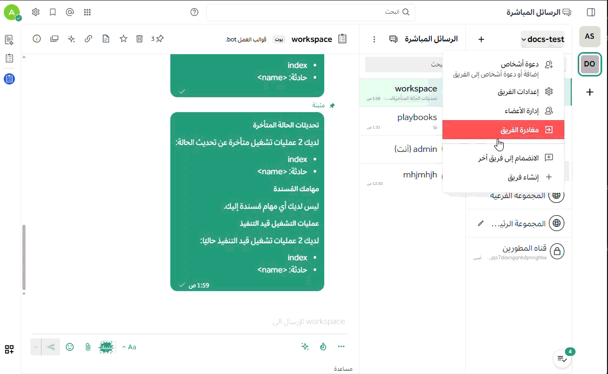
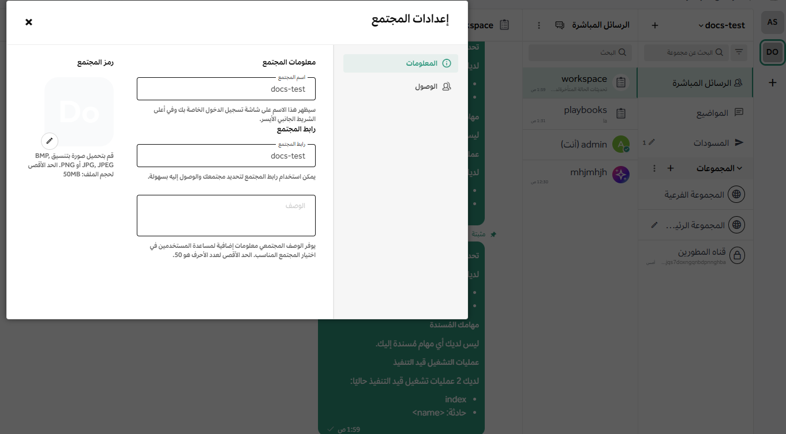
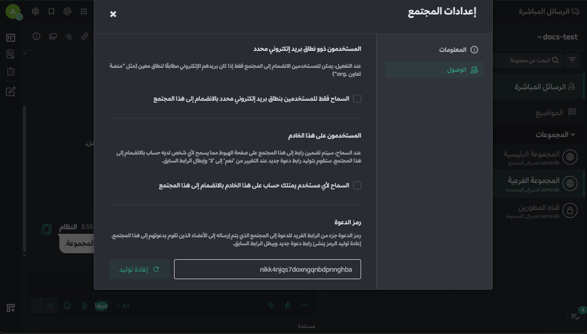

import { Aside, Steps } from '@astrojs/starlight/components';
import { Image } from 'astro:assets';

تسمح إعدادات الفريق لمسؤولي النظام ومسؤولي الفرق بتعديل التفضيلات الخاصة بكل فريق بشكل مستقل. للوصول إلى هذه الإعدادات عبر المتصفح أو تطبيق سطح المكتب، اضغط على اسم الفريق في أعلى القائمة الجانبية ثم اختر **إعدادات الفريق**.

---

## 1. الهوية والمعلومات التعريفية

تتحكم هذه الإعدادات في كيفية ظهور الفريق وتمييزه بصرياً بين بقية الفرق في المؤسسة.

### اسم الفريق
يظهر **اسم الفريق** في شاشة تسجيل الدخول وفي الجزء العلوي من شريط القنوات.
* **المواصفات:** يمكن أن يحتوي الاسم على أحرف، أرقام، أو رموز.
* **الطول:** يجب أن يتراوح طول الاسم بين 2 إلى 64 حرفاً.

### وصف الفريق
يظهر **وصف الفريق** في قائمة الفرق المتاحة للانضمام، وكتلميح (Tooltip) عند تمرير الفأرة فوق أيقونة الفريق.
* **الحد الأقصى:** يمكن كتابة وصف يصل إلى 50 حرفاً يشرح هدف الفريق.

### أيقونة الفريق
تظهر **أيقونة الفريق** في شريط الفرق الجانبي. بشكل افتراضي، تعرض المنصة أول حرفين من اسم الفريق.

**لتخصيص الأيقونة:**
<Steps>
1. انتقل إلى **إعدادات الفريق**.
2. اختر **تعديل** بجانب خيار "أيقونة الفريق".
   
3. ارفع صورة بصيغة (JPG أو PNG). نوصي باستخدام صور مربعة بخلفية ملونة ثابتة لضمان الوضوح.
4. اضغط على **حفظ**.
</Steps>

<Aside type="tip">
إذا كنت ترغب في التراجع عن التعديلات، يمكنك دائماً اختيار **إزالة الصورة** للعودة للشكل الافتراضي.
</Aside>

---

## 2. سياسات الوصول والعضوية

   
تتيح لك هذه الإعدادات التحكم في خصوصية الفريق ومن يحق له الانضمام.

### تقييد النطاق البريدي 
يمكنك حصر الانضمام للفريق بموظفي الإدارات التي تمتلك نطاق بريد إلكتروني محدد.
* **مثال:** إدخال `company.com` سيسمح فقط لمن يملكون هذا البريد بالانضمام.
* **تنبيه:** هذا الإعداد لا يطرد الأعضاء الحاليين، بل ينطبق على طلبات الانضمام الجديدة فقط.

### الظهور في قائمة الفرق العامة
عند تفعيل خيار **"المستخدمون على هذا الخادم"**، سيظهر الفريق في قائمة "الفرق المتاحة للانضمام" لجميع مستخدمي المؤسسة، مما يسهل عليهم العثور عليه دون الحاجة لدعوة خاصة.

### إدارة كود الدعوة
يُعد **كود الدعوة** جزءاً حيوياً من رابط الدعوة المرسل للأعضاء.
* في حال تسرب الرابط لأشخاص غير مصرح لهم، يمكنك الضغط على **إعادة توليد** لإنشاء كود جديد فوراً، مما سيعطل كافة الروابط القديمة ويؤمن خصوصية الفريق.

---

<Aside type="note" title="روابط ذات صلة">
اطلع أيضاً على دليل [إدارة أعضاء الفريق](/messaging-collaboration/collaborate-within-channels/manage-channel-members) ودليل [اختصارات التنقل بين الفرق](/messaging-collaboration/organize-using-teams/team-keyboard-shortcuts).
</Aside>