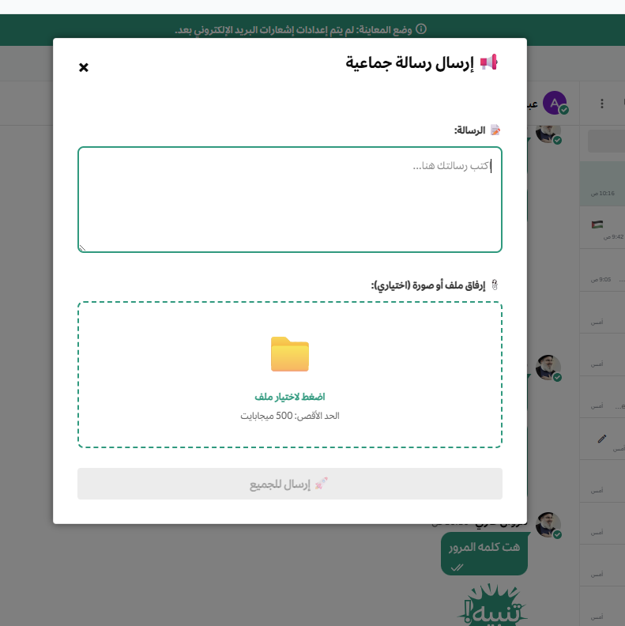
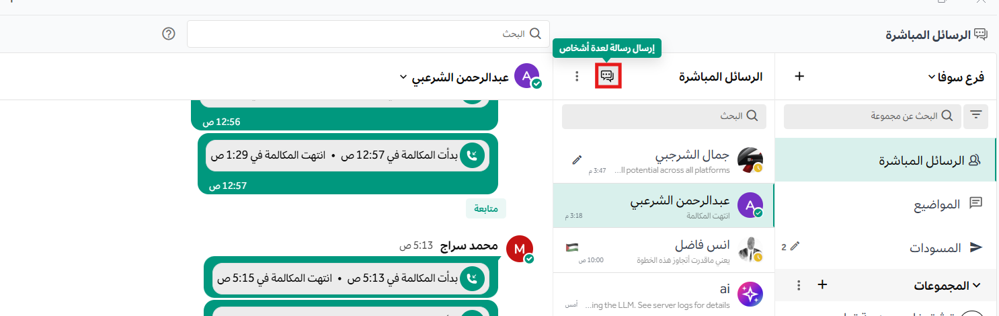
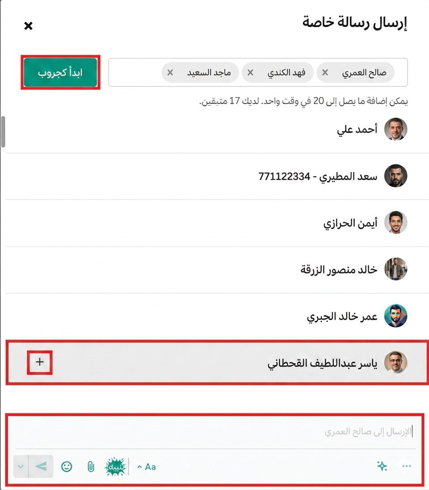
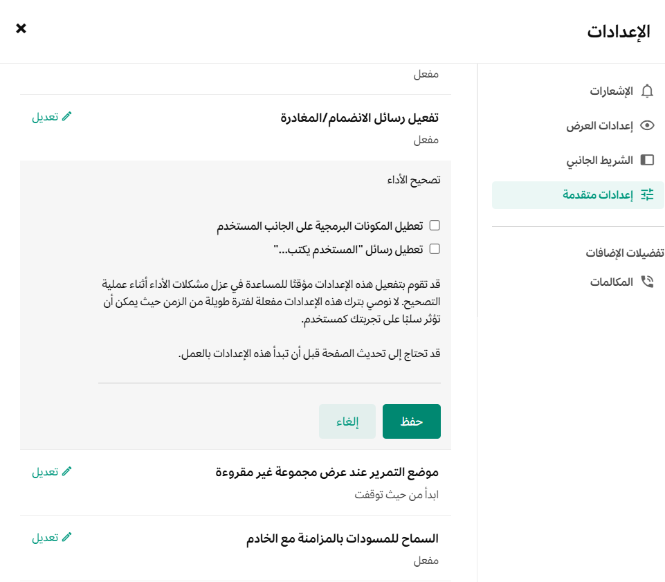

import { Tabs, TabItem, Steps, Aside } from '@astrojs/starlight/components';
import FAIcon from "../../../components/FAIcon.astro";

### رسالة للجميع

تتيح ميزة **رسالة للجميع** لمسؤولي النظام (Admins) فقط إرسال رسائل عامة أو إعلانات تصل إلى جميع أعضاء مساحة العمل دفعة واحدة، وذلك باستخدام أمر مائل مخصص.

#### كيفية إرسال رسالة للجميع

<Steps>
1. اكتب الأمر المائل التالي في حقل إدخال الرسائل في أي محادثة:
   
   ``/workspace-message``

2. اضغط على زر <kbd>Enter</kbd> لتشغيل الأمر.
3. ستظهر لك نافذة منبثقة تطلب منك إدخال نص الرسالة التي ترغب في إرسالها لجميع الأعضاء.

4. اكتب نص الرسالة في الحقل المخصص، ثم اضغط على زر **إرسال للجميع**.
</Steps>

<Aside type="caution" title="صلاحيات المسؤول">
هذه الميزة حصرية لمسؤولي النظام فقط، ولا يمكن للمستخدمين العاديين تشغيل الأمر المائل لإرسال رسائل جماعية للجميع.
</Aside>

### رسالة لعدة أشخاص

تتيح لك ميزة **الرسائل لعدة أشخاص** إرسال رسالة واحدة إلى مستخدمين متعددين في نفس الوقت. عند تحديد هؤلاء المستخدمين، يتاح لك خياران للتعامل مع الرسالة:

* **إرسال كرسالة منفردة:** أرسل رسالة مستقلة لكل مستخدم على حدة (دون إنشاء مجموعة).
* **إضافتهم كمجموعة (Group):** أرسل الرسالة في محادثة جماعية مشتركة تضم جميع الأعضاء المحددين.

#### كيفية إرسال الرسالة لعدة أشخاص

<Steps>
1. اختر أيقونة **الرسالة الجديدة** <FAIcon name="pen-to-square"/> الموجودة فوق قائمة الدردشات في الشريط الجانبي.

2. ستظهر لك نافذة منبثقة، حدد منها **المستخدمين** الذين تريد إرسال الرسالة إليهم.
3. بعد تحديد الأسماء، اختر آلية الإرسال التي تفضلها:
   
   
   - **إرسال كرسالة منفردة** :أرسل الرسالة كرسالة مباشرة (Direct Message) منفصلة لكل شخص تم تحديده مسبقاً، دون علم بقية المستلمين.
   - **إضافتهم كمجموعة** : أنشئ مجموعة دردشة مشتركة تجمع كل الأشخاص الذين تم تحديدهم، بحيث تظهر الرسالة وجميع الردود المستقبلية للجميع.
   
</Steps>

<Aside type="tip" title="نصيحة">
استخدم خيار **إرسال كرسالة منفردة** لتوفير الوقت عندما ترغب في توجيه نفس الإشعار أو السؤال لعدة أشخاص بشكل منفصل دون إزعاجهم بردود المحادثات الجماعية.
</Aside>

---

### تحديد رسائل متعددة وإعادة توجيهها

تتيح لك ميزة **تحديد عدة رسائل** إمكانية اختيار مجموعة من الرسائل داخل المحادثة دفعة واحدة للقيام بإجراءات جماعية عليها، مثل إعادة التوجيه لقناة أو مستخدم آخر، أو حذفها بالكامل.

#### خطوات تحديد الرسائل وإعادة توجيهها:

1. قم بتوجيه مؤشر الفأرة فوق الرسالة التي ترغب في بدء التحديد منها لتظهر قائمة الخيارات السريعة.
2. انقر على زر **النقاط الثلاث (خيارات أكثر)** المتاح بجانب زر التفاعل بالإيموجي.
3. حدد خيار **تحديد** من القائمة المنسدلة.
4. ستظهر لك مربعات اختيار بجانب كافة الرسائل في المحادثة؛ قم بتحديد الرسائل التي ترغب في التعامل معها (يمكنك تحديد أي عدد من الرسائل).
5. بعد اختيار الرسائل، ستظهر لك خيارات الإجراءات المتاحة في شريط الأدوات:
   - **إعادة توجيه :** لإرسال الرسائل المحددة دفعة واحدة إلى قناة أخرى أو محادثة مباشرة.
   - **مسح / حذف :** لحذف الرسائل المحددة جماعياً (في حال كنت تملك صلاحية حذفها).

---

### مرشح الألفاظ البذيئة

يعد **مرشح الألفاظ البذيئة** إضافة مخصصة لمسؤولي النظام لتصفية وتنقية المحادثات داخل مساحة العمل. تمكّن هذه الميزة المسؤول من تحديد قائمة بالكلمات غير اللائقة، ليعمل النظام على حجبها وتغطيتها بالنجوم (`***`) تلقائياً فور إرسالها.

:::note[صلاحيات الإدارة]
هذه الميزة وإعداداتها متاحة **لمسؤولي النظام فقط**.
:::

#### آلية عمل المرشح

1. يقوم مسؤول النظام بإعداد قائمة الكلمات المحظورة عبر إعدادات الإضافة.
2. عندما يكتب أي مستخدم كلمة من القائمة المحظورة ويرسلها في أي قناة أو محادثة، يقوم النظام تلقائياً باستبدال أحرفها بنجمات (مثل: `***`).
3. تظهر الكلمات المحجوبة بشكل مشوش لكافة المستخدمين للحفاظ على بيئة عمل مهنية ولائقة.

### تعطيل مؤشر الكتابة (المستخدم يكتب...)

لتعطيل ميزة "المستخدم يكتب..."، يمكنك اتباع الخطوات التالية:

1. اضغط على أيقونة **الترس** (الإعدادات) في الزاوية اليسرى من الشريط العلوي.
2. اختر **الإعدادات المتقدمة**.
3. اختر **تحسين الأداء**.
4. قم بتعطيل خيار **رسائل "المستخدم يكتب..."**.

5. اضغط على زر **حفظ**.