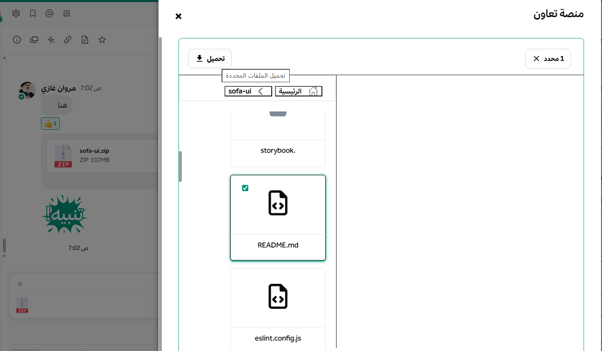

import { Steps, Aside } from '@astrojs/starlight/components';
import FAIcon from "../../../components/FAIcon.astro";

تتضمن منصة التعاون مستعرضاً مدمجاً للملفات المضغوطة، مما يتيح لك الاطلاع على محتويات الملفات المضغوطة مباشرة دون الحاجة لتحميلها وفك ضغطها بالكامل على جهازك.

### استعراض الملفات المضغوطة

يمكنك فتح مستعرض الملفات المضغوطة بسهولة باتباع الآتي:
1. توجه إلى القناة أو المحادثة المباشرة التي تحتوي على الملف المضغوط المرسل.
2. انقر مباشرة على أي ملف أو مجلد مضغوط تم إرساله بواسطة أي مستخدم لفتح واجهة المستعرض داخل نافذة منبثقة.

---

### استخراج الملفات المضغوطة

يوفر المستعرض ميزات متقدمة لاستخراج وتنزيل الملفات من المجلد المضغوط:
* **استخراج ملف فردي:** يمكنك تحميل ملف واحد محدد من داخل الأرشيف دون الحاجة لفك ضغط المجلد بأكمله.
* **دعم الملفات المشفرة:** يمكنك استعراض واستخراج محتويات الملفات المضغوطة حتى وإن كانت محمية أو مشفرة بكلمة مرور.

#### كيفية استخراج وتنزيل ملفات محددة

<Steps>
1. افتح الملف المضغوط بالنقر عليه.
2. حدد مربع الاختيار بجانب الملف أو الملفات التي ترغب في استخراجها. يمكنك تحديد ملفات متعددة في نفس الوقت.
3. انقر على زر **تحميل** المتاح في أعلى النافذة المنبثقة لحفظ الملفات المحددة على جهازك.

</Steps>

<Aside type="note" title="ملاحظة حول الملفات المشفرة">
عند محاولة استخراج ملف من أرشيف محمي بكلمة مرور، سيطلب منك النظام إدخال كلمة المرور الصحيحة قبل بدء عملية التنزيل.
</Aside>
