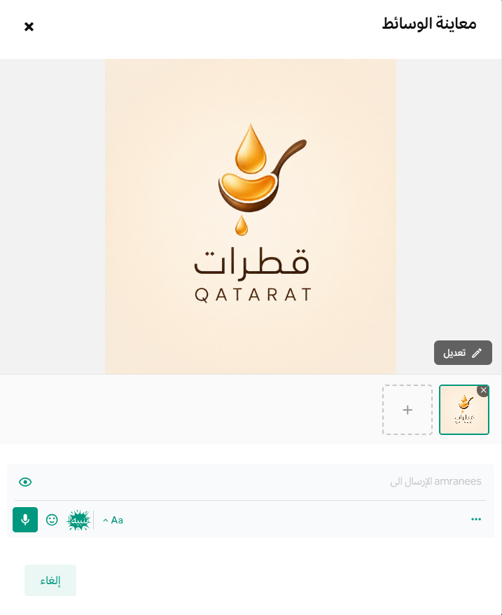
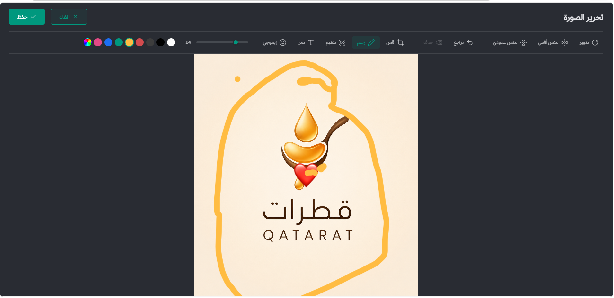
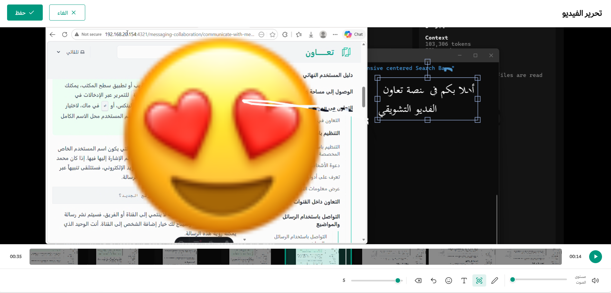

import { Steps, Aside } from '@astrojs/starlight/components';
import { Image } from 'astro:assets';
import FAIcon from "../../../components/FAIcon.astro";

تتضمن **منصة تعاون** محركاً مدمجاً وأصيلاً لمعالجة وتعديل الصور ومقاطع الفيديو  قبل إرسالها؛ مما يتيح لك تحرير الوسائط، وقصها، والكتابة أو الرسم عليها، وإدراج العناصر التفاعلية مباشرةً من واجهة الدردشة دون الحاجة للاستعانة بتطبيقات خارجية.

---

## كيفية تعديل الوسائط قبل إرسالها

يمكنك فتح واستخدام محرر الصور ومقاطع الفيديو بسهولة من خلال اتباع الخطوات التالية:

1. توجه إلى حقل إدخال الرسائل في القناة أو المحادثة المباشرة، وانقر على زر **تحميل الملفات** (أيقونة مشبك الأوراق <FAIcon name="paperclip" />) المتواجد أسفل الدردشة.
2. حدد ملف الصورة أو مقطع الفيديو الذي ترغب في إرساله من مستكشف الملفات الخاص بجهازك.
3. ستظهر لك نافذة منبثقة لمعاينة الملف المرفوع. اضغط على زر **تعديل** المتواجد في زاوية نافذة المعاينة للانتقال مباشرةً إلى واجهة المحرر.

4. قم بإجراء التعديلات المطلوبة باستخدام شريط الأدوات العلوي، ثم اضغط على **حفظ** أو **إرسال** لمشاركة الملف المعدّل مع بقية أعضاء الفريق.

---

## أدوات تحرير وصياغة الصور

عند فتح ملف صورة في المحرر، يوفر لك النظام حزمة من الأدوات الاحترافية لمعالجة الأبعاد والمحتوى:

* **قص وتأطير الصورة:** لتحديد الأجزاء الهامة فقط من الصورة، وإعادة ضبط أبعادها، وإزالة الحواف غير المرغوب فيها للتركيز على محتوى تقني أو إداري محدد.
* **إدراج النصوص:** لإضافة تعليقات توضيحية، أو شروحات، أو عناوين بارزة مباشرةً فوق الصورة مع التحكم الكامل بحجم الخط، واللون، وموضع الكتل النصية.
* **الرسم والتخطيط الحر:** لاستخدام القلم أو الفرشاة الذكية للإشارة الحرة إلى عناصر معينة في الصورة أو رسم أشكال هندسية وتوضيحية (كالأسهم والمربعات).
* **الملصقات والرموز التعبيرية:** لإدراج التفاعلات والرموز التعبيرية القياسية فوق طبقات الصورة لجعل الرسالة الموجهة أكثر وضوحاً وتفاعلية.

---

## أدوات معالجة وتشذيب مقاطع الفيديو

عند اختيار تعديل مقطع فيديو، يمنحك المحرر الأدوات البرمجية التالية لتهيئة إطارات الفيديو قبل نشرها:

* **قص وتشذيب الفيديو:** لتحديد نقطة بداية ونهاية المقطع بدقة ميلي ثانية، وقص الأجزاء الزائدة بهدف تقليل حجم الملف الإجمالي والتركيز على اللقطة المطلوبة فقط.
* **إضافة الملصقات والإيموجي المتراكب:** لوضع الرموز التعبيرية على واجهة تشغيل الفيديو وتعديل حجمها، وموضعها، والتحكم في إطار ظهورها الزمني.
* **الرسم والكتابة الديناميكية:** لإضافة نصوص إرشادية أو شروحات مرسومة يدوياً تظهر متراكبة فوق إطارات الفيديو؛ لتسهيل عمليات المراجعة وفحص الأخطاء.

---

<Aside type="tip" title="الأمن السيبراني وحماية البيانات الحساسة">
يُعد استخدام محرك تعديل الوسائط المدمج قبل الإرسال خياراً ممتازاً وممارّسة آمنة لتظليل البيانات الحساسة أو طمس المعلومات الشخصية والسرية (مثل أرقام الحسابات، أو العناوين، أو كلمات المرور) من لقطات الشاشة قبل مشاركتها مع زملاء العمل أو فرق الدعم الفني.
</Aside>