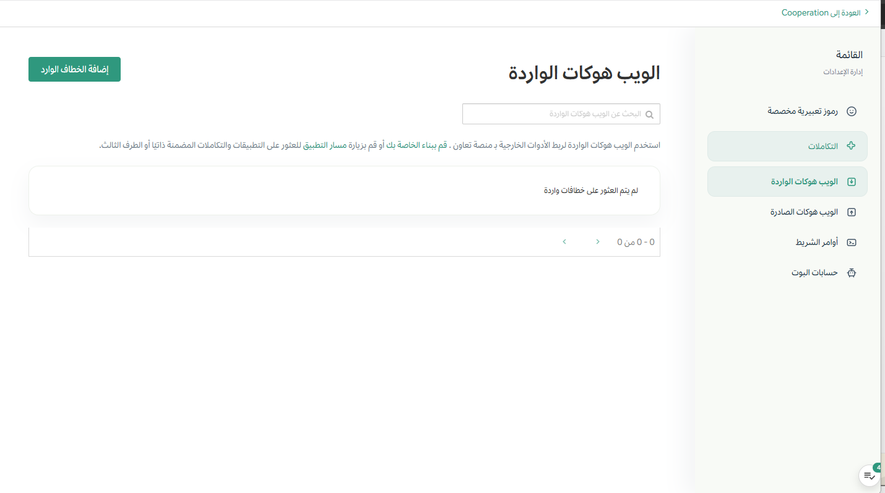
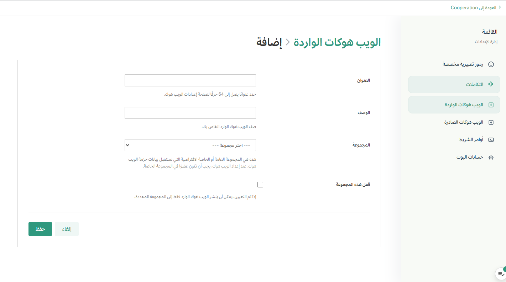
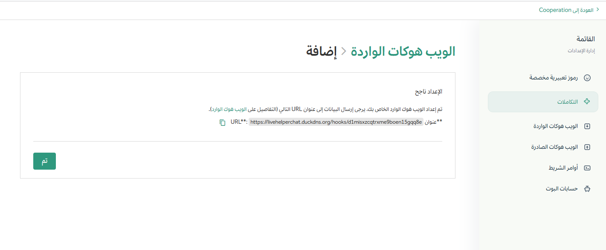

# استقبال الروابط الخارجية

**التعقيد الفني:** بدون برمجة

إرسال البيانات أو استقبالها من أدوات خارجية في الوقت الفعلي. تتطلب الروابط الخارجية حدًا أدنى من البرمجة، وسهلة الإعداد مع أي أداة أو منصة، لأنها تستخدم طلبات HTTP POST خفيفة الوزن مع حمولات بيانات بصيغة JSON.

يتطلب استخدام خطافات الويب الواردة في منصة تعاون إجراءات إعداد أساسية فقط. تقوم بإنشاء خطاف ويب باستخدام واجهة تعاون، ثم توجّه خدمة أخرى لإرسال البيانات إلى ذلك العنوان. لا تتطلب الأمر أي برمجة إذا كان النظام الخارجي الذي يُطلق الأحداث قادرًا على إرسال البيانات عبر خطافات الويب أو طلبات HTTP POST، وهو ما يدعمه معظم التطبيقات والمنصات الحديثة. عادةً ما يتطلب إعداد ذلك لصق عنوان URL الخاص بالرابط الخارجي في إعدادات الخدمة، وتحديد نوع الأحداث التي تريد إرسالها.

## حالات الاستخدام المثالية

فيما يلي بعض حالات الاستخدام المثالية لخطافات الويب الواردة في منصة تعاون:

### تنبيهات المراقبة

إرسال تنبيهات فورية من أنظمة المراقبة (مثل Prometheus أو Datadog) إلى قناة مخصصة في تعاون، بحيث يتم إبلاغ فريقك فورًا بأي مشكلة أو توقف في الأنظمة.

### إشعارات البناء والنشر

نشر تحديثات آلية من مسارات CI/CD (مثل Jenkins أو GitLab CI) إلى قناة، لإبقاء المطورين على اطلاع بحالة البناء، ونتائج الاختبارات، وتقدم عمليات النشر.

### تحديثات دعم العملاء

تحويل إشعارات تذاكر الدعم الجديدة من أنظمة مثل Zendesk أو ServiceNow إلى قناة الدعم، لضمان قدرة الفريق على الاستجابة بسرعة للطلبات الواردة.

## إنشاء خطاف ويب وارد

1. في منصة تعاون، انتقل إلى **قائمة المنتج > التكاملات**. إذا لم ترَ خيار **التكاملات**، فقد لا تكون خطافات الويب الواردة مُفعلة على خادم تعاون، أو قد تكون معطلة لغير المدراء. يمكن لمدير النظام تفعيلها عبر **لوحة إدارة النظام > التكاملات > إدارة التكاملات**.

   

2. من صفحة التكاملات، اختر **خطافات الويب الواردة**.

   

3. اختر **إضافة رابط استقبال خارجي**.

   

4. أدخل اسمًا ووصفًا للرابط الخارجي، ثم اختر القناة. يمكنك اختياريًا تقييد مشاركات الروبوت للقناة المحددة فقط عن طريق تحديد **تثبيت على هذه القناة**، أو السماح للرابط الخارجي بالنشر في أي قناة عامة أو خاصة يكون منشئ الرابط عضوًا فيها. لاحظ أن الإداريين يمكنهم فرض تثبيت القنوات لجميع روابط الاستقبال عبر **لوحة إدارة النظام > التكاملات > إدارة التكاملات**. اختر **حفظ**.

   

5. اختر **تم** للتأكيد. تقوم تعاون بإنشاء عنوان URL فريد للرابط الخارجي، وسيبدو مشابهًا لهذا:

   `https://your-mattermost-server.com/hooks/xxx-generatedkey-xxx`

   احرص على التعامل مع هذا العنوان كسرّ. سيتمكن أي شخص يمتلكه من نشر رسائل في نسخة تعاون الخاصة بك.

   

## الاستخدام

لنشر رسالة، يجب على تطبيقك إرسال طلب HTTP POST إلى عنوان URL الخاص بالرابط الخارجي مع حمولة بيانات JSON في نص الطلب.

```bash
curl -i -X POST -H 'Content-Type: application/json' -d '{"text": "Hello, this is some text\nThis is more text. :tada:"}' https://your-mattermost-server.com/hooks/xxx-generatedkey-xxx
```

سيتلقى الطلب الناجح استجابة HTTP 200 مع `ok` في نص الاستجابة.

للتوافق مع روابط Slack الواردة، إذا لم يتم تعيين ترويسة `Content-Type`، يجب أن يبدأ نص الطلب بـ `payload=`.

### أمثلة على المشاركات

فيما يلي بعض الأمثلة على الرسائل البسيطة المنشورة باستخدام خطافات الويب الواردة:


## المعلمات

يمكن لحمولة JSON أن تحتوي على المعلمات التالية:

| المعلمة | إلزامي | الوصف |
| :--- | :---: | :--- |
| `text` | نعم (إذا لم يتم تعيين `attachments`) | رسالة بصيغة Markdown. استخدم Tenant@channel، و `@here` للإشعارات. |
| `channel` | لا | يتجاوز القناة الافتراضية. استخدم اسم القناة (مثل `town-square`)، وليس الاسم المعروض. استخدم `@<username>` لإرسال رسالة مباشرة. يمكن للرابط الخارجي النشر في أي قناة عامة، وأي قناة خاصة يكون فيها المنشئ عضوًا. |
| `username` | لا | يتجاوز اسم المستخدم الافتراضي. يجب تمكين إعداد **تمكين التكاملات لتجاوز أسماء المستخدمين**. |
| `icon_url` | لا | يتجاوز رابط صورة الملف الشخصي الافتراضية. يجب تمكين إعداد **تمكين التكاملات لتجاوز أيقونات صور الملف الشخصي**. |
| `icon_emoji` | لا | يتجاوز `icon_url` برموز تعبيرية. استخدم اسم الرمز التعبيري (مثل `:tada:`). يجب تمكين إعداد **تمكين التكاملات لتجاوز أيقونات صور الملف الشخصي**. |
| `attachments` | نعم (إذا لم يتم تعيين `text`) | مصفوفة من كائنات [مرفقات الرسالة](https://developers.mattermost.com/integrate/reference/message-attachments/) لتنسيق أكثر ثراءً. |
| `type` | لا | يعين نوع المشاركة، ويُستخدم بشكل أساسي من قبل الإضافات. إذا تم تعيينه، يجب أن يبدأ بـ `custom_`. |
| `props` | لا | كائن JSON لتخزين البيانات الوصفية. يمكن استخدام الخاصية `card` لعرض نص Markdown إضافي في لوحة معلومات المشاركة (RHS). متاح في تعاون الإصدار 5.14 والإصدارات الأحدث، وغير مدعوم حاليًا على الجوال. |
| `priority` | لا | يعين أولوية الرسالة. راجع [أولويات الرسائل](https://developers.mattermost.com/integrate/reference/message-priority/). |

### مثال مع معلمات

```json
{
  "channel": "town-square",
  "username": "test-automation",
  "icon_url": "https://mattermost.com/wp-content/uploads/2022/02/icon.png",
  "text": "#### Test results for July 27th, 2017\n@channel please review failed tests.\n\n| Component  | Tests Run   | Tests Failed                                   |\n|:-----------|:-----------:|:-----------------------------------------------|\n| Server     | 948         | :white_check_mark: 0                           |\n| Web Client | 123         | :warning: 2 [(see details)](https://linktologs) |\n| iOS Client | 78          | :warning: 3 [(see details)](https://linktologs) |"
}
```

ينتج عن ذلك:


### مثال مع خاصية Card

باستخدام الخاصية `card` داخل `props`، سيتم عرض أيقونة معلومات على المشاركة. النقر على الأيقونة يفتح الشريط الجانبي الأيمن لعرض المحتوى.

```json
{
  "channel": "town-square",
  "username": "Winning-bot",
  "text": "#### We won a new deal!",
  "props": {
    "card": "Salesforce Opportunity Information:\n\n [Opportunity Name](https://salesforce.com/OPPORTUNITY_ID)\n\n-Salesperson: **Bob McKnight** \n\n Amount: **$300,020.00**"
  }
}
```


## التوافق مع Slack

توفر تعاون توافقًا مع صيغة روابط Slack لتسهيل عملية الانتقال.

### تحويل صيغة بيانات Slack

يقوم تعاون تلقائيًا بتحويل حمولات البيانات JSON من صيغة Slack:

- يتم عرض `<https://mattermost.com/>` كرابط.
- يتم عرض `<https://mattermost.com/|Click here>` كنص مرتبط.
- يؤدي `<userid>` إلى تنشيط إشعار مستخدم.
- يؤدي `<!channel>`، `<!here>`، أو `<!all>` إلى تنشيط إشعارات على مستوى القناة.

يمكنك أيضًا إرسال رسالة مباشرة عن طريق تجاوز اسم القناة بـ `@username`، على سبيل المثال: `"channel": "@jim"`.

### استخدام روابط تعاون في GitLab

يمكنك استخدام تكامل Slack المدمج في GitLab لإرسال الإشعارات إلى تعاون:

1. في GitLab، انتقل إلى **الإعدادات > الخدمات** واختر **Slack**.
2. ألصق عنوان URL لرابط تعاون الوارد.
3. اختياريًا، عيّن **اسم المستخدم**. اترك حقل **القناة** فارغًا.
4. اختر **حفظ** واختبر التكامل.

### مشاكل التوافق المعروفة مع Slack

- الإشارة إلى القنوات باستخدام `<#CHANNEL_ID>` غير مدعومة.
- `<!everyone>` و `<!group>` غير مدعومة.
- تنسيق `*bold*` غير مدعوم؛ استخدم `**bold**` بدلاً من ذلك.
- لا يمكن للروابط الخارجية إرسال رسالة مباشرة إلى المستخدم الذي أنشأ الرابط الخارجي.

## استكشاف الأخطاء وإصلاحها

لمساعدة استكشاف أخطاء خطافات الويب الواردة، يمكن لمدير النظام تمكين **تصحيح أخطاء الروابط الخارجية** وتعيين **مستوى السجل في وحدة التحكم** على **DEBUG** عبر **لوحة إدارة النظام > السجلات**.

تتضمن رسائل الخطأ الشائعة ما يلي:

- **Couldn't find the channel**: القناة المحددة في معلمة `channel` غير موجودة.
- **Couldn't find the user**: المستخدم المحدد غير موجود.
- **Unable to parse incoming data**: حمولة JSON البيانات غير صالحة.

إذا كان التكامل الخاص بك ينشر حمولة JSON كنص عادي بدلاً من رسالة منسقة، تأكد من أن الطلب يتضمن ترويسة `Content-Type: application/json`.

## المزيد من الإمكانات مع خطافات الويب الواردة

حوّل المشاركات البسيطة إلى إشعارات تفاعلية غنية من خلال تضمين أزرار وقوائم وعناصر تفاعلية أخرى في رسائل روابطك الخارجية، مما يجعلها أكثر جاذبية وفائدة لفريقك.

- [مرفقات الرسائل](https://developers.mattermost.com/integrate/reference/message-attachments/): تقديم ملخصات منظمة وغنية بمعلومات مثل الحالة، والأولوية، والحقول، والروابط، أو الصور للتصنيف والفهم بشكل أسرع. (صيغة متوافقة مع Slack.)
- [الرسائل التفاعلية](https://developers.mattermost.com/integrate/plugins/interactive-messages): جعل الإشعارات قابلة للتنفيذ باستخدام أزرار أو قوائم مثل تقديم، تعيين، أو تصعيد التي تمكن المستخدم من الاستجابة فورًا دون تبديل الأدوات أو السياق.
- [مربعات الحوار التفاعلية](https://developers.mattermost.com/integrate/plugins/interactive-dialogs/): توجيه المستخدمين لتحقيق النتائج المرجوة عندما تتطلب التفاعلات إدخال أو تأكيد منظم. تحسين جودة البيانات باستخدام حقول مطلوبة، وأطوال إدخال محددة، ومحددات مستخدم/قناة مدفوعة بالخادم، وقيم افتراضية تم التحقق منها، ورسائل خطأ مضمنة، ونصوص توضيحية، ونصوص مساعدة تساعد المستخدمين على إدخال البيانات الصحيحة من المرة الأولى.
- [أولوية الرسائل](https://developers.mattermost.com/integrate/reference/message-priority/): تعيين `priority` لترقية المشاركات الهامة واختياريًا طلب إقرارات بالاستلام أو إشعارات مستمرة.

:::tip

- هل تحتاج إلى هوية مخصصة، أو نطاق صلاحيات، أو تحتاج إلى النشر خارج مسارات الروابط/الأوامر؟ استخدم [حساب روبوت](https://developers.mattermost.com/integrate/reference/bot-accounts/) إذا كنت بحاجة إلى حل أكثر ديمومة من تجاوزات المعلومات الأساسية.
- إذا كان نظامك يحتاج لاحقًا إلى استدعاء واجهات برمجة تطبيقات تعاون (مثلاً، نشر المتابعات، فتح مربعات حوار)، فقم بالمصادقة باستخدام [رمز وصول شخصي](https://developers.mattermost.com/integrate/reference/personal-access-token/) لمستخدم روبوت. نوصي بتجنب استخدام رموز الوصول الشخصية للبشر/مدراء النظام في الأتمتة، وبتدوير وتخزين الرموز بشكل آمن.

:::
