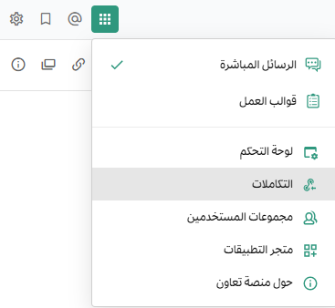
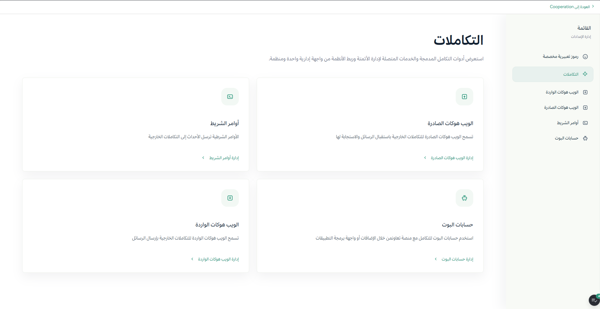
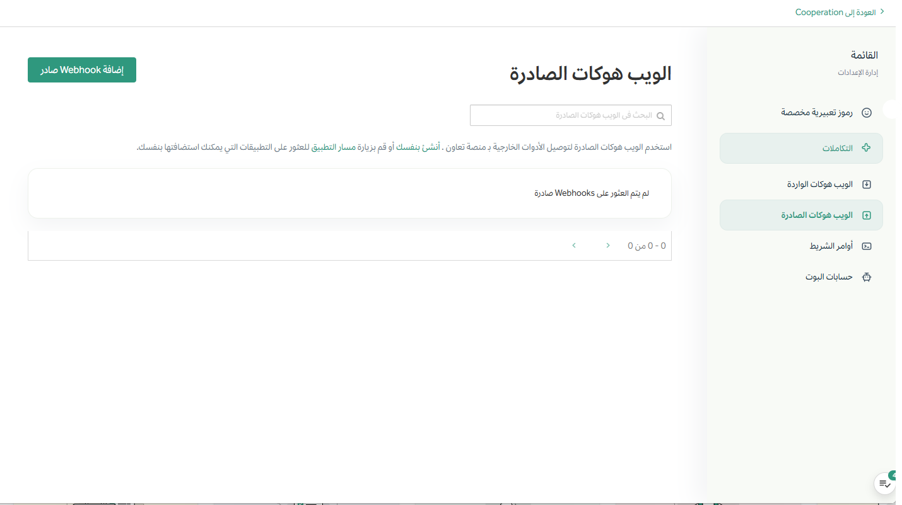
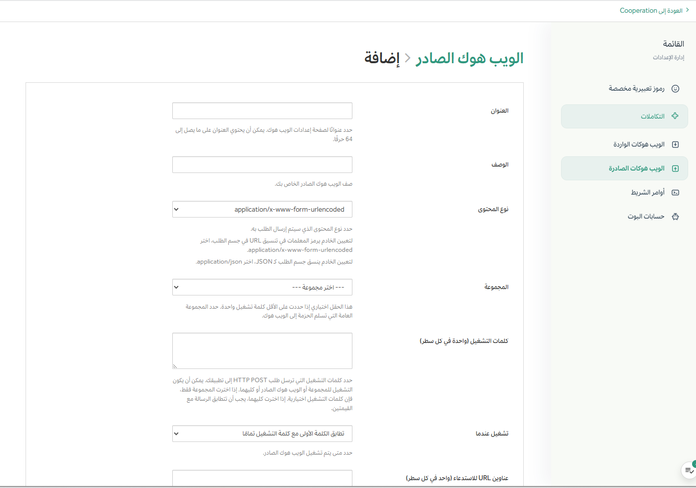
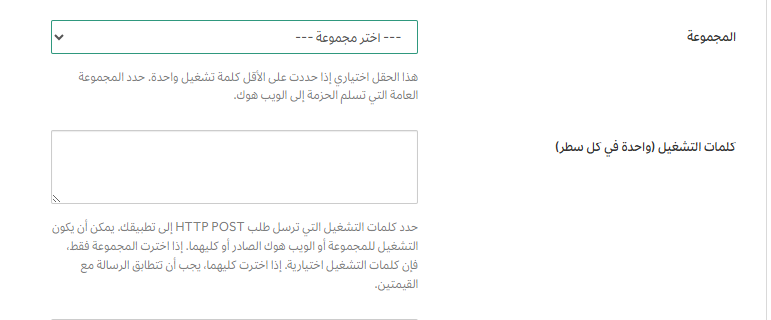
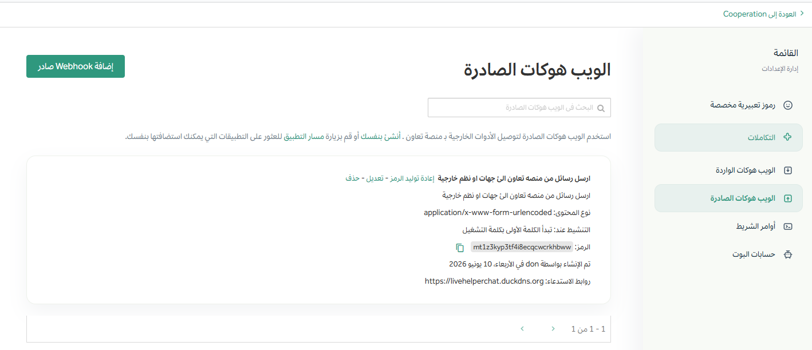

# إرسال الروابط الخارجية

**التعقيد الفني:** برمجة بسيطة

يمكن استخدام الويب هوكات الصادرة لإنشاء تجارب غنية وتفاعلية في منصة تعاون من خلال السماح للخدمات الخارجية بالاستجابة بمرفقات رسائل غنية، مثل الحقول المنظمة، والأزرار، والقوائم. بالإضافة إلى ذلك، يمكن لهذه الاستجابات تشغيل نماذج حوار تفاعلية حيث يقدم المستخدمون إدخالات إضافية مباشرة في منصة تعاون، أو رسائل تفاعلية تتغير ديناميكيًا استنادًا إلى إجراءات المستخدم. مجتمعةً، تحول هذه الإمكانات محفزات الكلمات المفتاحية البسيطة إلى مسارات عمل قوية داخل المنتج، تعمل على تبسيط كيفية تفاعل الفرق مع الأنظمة الخارجية، وكل ذلك مع الحاجة إلى برمجة بسيطة.

لا تتطلب الويب هوكات الصادرة أي برمجة للإعداد في منصة تعاون، ولكن الخدمة الخارجية التي تتلقى طلب HTTP POST تحتاج إلى معالجة البيانات، وتنسيق وإرسال استجابة برسالة إلى منصة تعاون. يتطلب ذلك عادةً برمجة خفيفة لتحليل الطلب وتنسيق حمولة استجابة JSON، على الرغم من أن العديد من [منصات الأتمتة](../../messaging-collaboration/extend-workspace-with-integrations) تتعامل مع ذلك دون كتابة كود مخصص.

فيما يلي بعض حالات الاستخدام المثالية لخطافات الويب الصادرة في منصة تعاون:

**تكامل تتبع المشكلات**

عندما يكتب المستخدم `bug` في قناة، يرسل رابط إرسال خارجي الرسالة إلى خدمة خارجية تحلل التفاصيل وتستجيب بمربع حوار تفاعلي في منصة تعاون. يمكن للمستخدم إدخال حقول مثل الأولوية، والوصف، والمسؤول، وإرسال الحوار يُنشئ تلقائيًا تذكرة في برنامج تتبع المشكلات.

**البحث في قاعدة المعرفة**

كلمة مفتاحية مثل `docs` تُشغل رابط إرسال خارجي يستعلم خدمة التوثيق ويعيد رسالة تفاعلية غنية مع قائمة من المقالات المقترحة، لكل منها أزرار أو قوائم قابلة للنقر. يمكن للمستخدمين تحسين البحث أو فتح الروابط دون مغادرة منصة تعاون.

**إثراء الحوادث الأمنية**

كتابة كلمة مفتاحية مثل `ioc` (مؤشر الاختراق) في قناة أمنية يمكن أن يُشغل رابط إرسال خارجي يستعلم منصة استخبارات التهديدات. يمكن أن تعيد الاستجابة مرفق رسالة منسق مع درجات السمعة، وحوادث ذات صلة، وأزرار إجراءات سريعة للتصعيد، أو التحقيق، أو إغلاق التنبيه.

## إنشاء رابط إرسال خارجي

1. في منصة تعاون، انتقل إلى **قائمة المنتج > التكاملات**. إذا لم ترَ خيار **التكاملات**، فقد لا تكون الويب هوكات الصادرة مُفعلة على خادم تعاون، أو قد تكون معطلة لغير المدراء. يمكن لمدير النظام تفعيلها عبر **لوحة إدارة النظام > التكاملات > إدارة التكاملات**.

   

2. من صفحة التكاملات، اختر **الويب هوكات الصادرة**.

   

3. اختر **إضافة رابط إرسال خارجي**.

   

4. أدخل اسمًا ووصفًا للرابط الخارجي.
5. عيّن **نوع المحتوى** للطلب.

   - `application/json` سيرسل كائن JSON.
   - `application/x-www-form-urlencoded` سيرمّز المعلمات في عنوان URL.

6. عيّن **قناة** و/أو واحدة أو أكثر من **كلمات المحفز**.

   - إذا حددت قناة، سيُطلق الرابط الخارجي فقط للرسائل في تلك القناة.
   - إذا حددت كلمات محفز، سيُطلق الرابط الخارجي فقط عندما تبدأ الرسالة بواحدة من تلك الكلمات.
   - إذا تم تحديد كليهما، يجب أن تلبي الرسالة الشرطين.
   - إذا تركت القناة فارغة، سيستمع الرابط الخارجي إلى جميع القنوات العامة في فريقك.
   - إذا تركت كلمات المحفز فارغة، سيستجيب الرابط الخارجي لجميع الرسائل في القناة المحددة.

   

7. عيّن واحد أو أكثر من **عناوين URL للرد** التي ستُرسل إليها طلبات HTTP POST. اختر **حفظ**.

   

8. انسخ قيمة **الرمز**. يُستخدم هذا الرمز للتحقق من أن الطلبات تأتي من منصة تعاون.

   

## الاستخدام

عندما تُشغل رسالة الرابط الخارجي، ستُرسل منصة تعاون طلب HTTP POST إلى عنوان URL للرد الذي حددته.

### حمولة الطلب

سيتضمن نص الطلب البيانات التالية (إما كـ JSON أو مشفرة في عنوان URL، استنادًا إلى نوع المحتوى الذي اخترته):

| المعلمة | الوصف |
| :--- | :--- |
| `token` | الرمز المُنشأ عند إنشاء الرابط الخارجي. |
| `team_id` | معرف الفريق الذي نُشرت فيه الرسالة. |
| `team_domain` | نطاق الفريق. |
| `channel_id` | معرف القناة التي نُشرت فيها الرسالة. |
| `channel_name` | اسم القناة. |
| `timestamp` | وقت نشر الرسالة. |
| `user_id` | معرف المستخدم الذي نشر الرسالة. |
| `user_name` | اسم المستخدم الذي نشر الرسالة. |
| `post_id` | معرف المشاركة. |
| `text` | النص الكامل للرسالة. |
| `trigger_word` | كلمة المحفز التي تطابقت. |

يجب على تطبيقك التحقق من صحة `token` لضمان أن الطلب يأتي من منصة تعاون.

### حمولة الاستجابة

يمكن لتطبيقك الاستجابة لطلب POST بكائن JSON لنشر رسالة إلى منصة تعاون.

```json
{
  "text": "| Component  | Tests Run | Tests Failed |\n|:-----------|:----------|:-------------|\n| Server     | 948       | :white_check_mark: 0 |"
}
```


### معلمات الاستجابة

يمكن لاستجابة JSON أن تحتوي على المعلمات التالية:

| المعلمة |_description|
| :--- | :--- |
| `text` | (مطلوب إذا لم يتم تعيين `attachments`) رسالة بصيغة Markdown. |
| `response_type` | عيّن على `comment` للرد على الرسالة التي أطلقت الرابط الخارجي. الافتراضي هو `post`، الذي ينشئ رسالة جديدة. |
| `username` | يتجاوز اسم المستخدم الافتراضي. يتطلب تمكين **تمكين التكاملات لتجاوز أسماء المستخدمين**. |
| `icon_url` | يتجاوز صورة الملف الشخصي الافتراضية. يتطلب تمكين **تمكين التكاملات لتجاوز أيقونات صور الملف الشخصي**. |
| `attachments` | (مطلوب إذا لم يتم تعيين `text`) مصفوفة من كائنات [مرفقات الرسالة](https://developers.workspace.com/integrate/reference/message-attachments/). |
| `type` | يعين نوع المشاركة، ويُستخدم بشكل أساسي من قبل الإضافات. إذا تم تعيينه، يجب أن يبدأ بـ `custom_`. |
| `props` | كائن JSON لتخزين البيانات الوصفية. |
| `priority` | يعين أولوية الرسالة. راجع [أولويات الرسائل](https://developers.workspace.com/integrate/reference/message-priority/). |

### مثال مع معلمات

```json
{
  "response_type": "comment",
  "username": "test-automation",
  "icon_url": "https://workspace.com/wp-content/uploads/2022/02/icon.png",
  "text": "#### Test results for July 27th, 2017\n@channel here are the requested test results.",
  "props": {
    "test_data": {
      "server": 948,
      "web": 123,
      "ios": 78
    }
  }
}
```


يمكنك أيضًا تضمين [مرفقات الرسائل](https://developers.workspace.com/integrate/reference/message-attachments/) و[الرسائل التفاعلية](https://developers.workspace.com/integrate/plugins/interactive-messages/) في استجابتك لإنشاء مسارات عمل أكثر تقدمًا.

## المزيد من الإمكانات مع الويب هوكات الصادرة

حوّل عمليات الرد المُشغّلة بالكلمات المفتاحية إلى مسارات عمل موجهة داخل القنوات من خلال إعادة أزرار وقوائم وعناصر تفاعلية أخرى في استجابات روابطك الخارجية، بحيث يمكن للمستخدمين التصرف فورًا.

- **مرفقات الرسائل**:: إعادة نتائج منظمة وغنية (معرفات، حالات، حقول، روابط، صور) للتأكيد السريع والمتابعة.
- **الرسائل التفاعلية**:: تقديم إجراءات الخطوة التالية (إقرار، تعيين، تصعيد) كأزرار/قوائم مباشرة في استجابتك - دون تبديل السياق.
- **مربعات الحوار التفاعلية**: عندما يتطلب النقر على زر/قائمة المزيد من المعلومات (مثل "إقرار مع ملاحظة"، "تعيين لمستخدم")، افتح حوارًا لجمع إدخالات منظمة مع حقول مطلوبة، أطوال إدخال min/max، ومحددات مستخدم/قناة مدفوعة بالخادم، وقيم افتراضية تم التحقق منها، ورسائل خطأ مضمنة، ونصوص توضيحية، ونصوص مساعدة.

:::note

- تدعم استجابات الويب هوكات الصادرة المرفقات والإجراءات التفاعلية. عندما ينقر المستخدم على إجراء، تتلقى تكاملك معرف تشغيل موقع ويمكنه فتح حوار تفاعلي عبر واجهة برمجة تطبيقات الحوار. يمكنك أيضًا التحكم في الرؤية باستخدام نوع الاستجابة (داخل القناة مقابل مؤقت).
- هل تحتاج إلى هوية مخصصة، أو نطاق صلاحيات، أو تحتاج إلى النشر خارج مسارات الروابط/الأوامر؟ استخدم [حساب روبوت](https://developers.workspace.com/integrate/reference/bot-accounts/) إذا كنت بحاجة إلى حل أكثر ديمومة من تجاوزات المعلومات الأساسية.
- إذا كانت خلفية الأمر الخاص بك تحتاج إلى استدعاء واجهات برمجة تطبيقات تعاون (مثلاً، نشر الرسائل، المشاركات المؤقتة، فتح مربعات حوار تفاعلية، إلخ)، فقم بالمصادقة باستخدام [رمز وصول شخصي](https://developers.workspace.com/integrate/reference/personal-access-token/) لمستخدم روبوت. نوصي بتجنب استخدام رموز الوصول الشخصية للبشر/مدراء النظام في الأتمتة، وبتدوير وتخزين الرموز بشكل آمن.
- هل تبحث عن دعم القنوات الخاصة، والرسائل المباشرة، والإكمال التلقائي؟ استخدم [أمر مائل مدمج](./built-in-slash-commands)، أو أنشئ [أمر مائل مخصص](https://developers.workspace.com/integrate/slash-commands/custom/). يمكنك أيضًا ربط تعاون مع تكاملات مخصصة مستضافة ضمن بنية OAuth الداخلية الخاصة بك . يجعل تعاون من السهل أيضًا [ترحيل التكاملات المكتوبة لـ Slack إلى تعاون](https://developers.workspace.com/integrate/slash-commands/slack/).

:::
