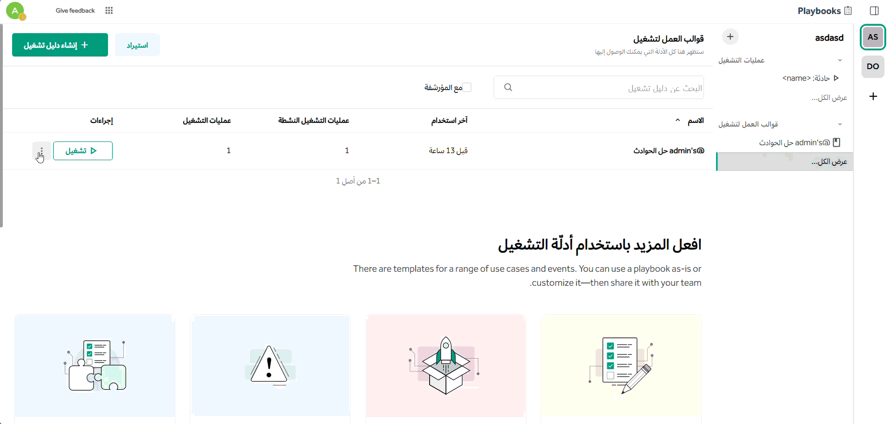

import FAIcon from "../../../components/FAIcon.astro";

هناك طرق مختلفة للفرق للوصول إلى قوالب العمل التعاونية والتفاعل معها؛ حيث تُدار هذه الصلاحيات في لوحة تحكم النظام باستخدام الأذونات. ويمكن منح الأذونات بمجموعة متنوعة من الطرق للسماح بمستويات مختلفة من الوصول والرؤية.

تُمنح الأذونات باستخدام:

- **مخطط النظام:** يُطبّق الأذونات بشكل شامل عبر جميع الفرق والقنوات وقوالب العمل.
- **مخططات تجاوز الفريق:** تتيح للمسؤولين تخصيص الأذونات لكل فريق.

لمزيد من المعلومات حول مخططات النظام وتجاوز الفريق، راجع توثيق الأذونات المتقدمة في لوحة تحكم النظام.

:::note[ملاحظة]
بعض وظائف الأذونات متاحة فقط لعملاء منصة تعاون Enterprise. لمزيد من المعلومات، تفضل بزيارة taawon-workspace.com/pricing.
:::

في سياق قوالب العمل التعاونية، يُعيَّن دور لكل عضو؛ وبناءً على الأذونات المحددة، يُحدّد ذلك كيفية تفاعله مع قوالب العمل. ويمكن للمستخدم أن يكون عضوًا في قالب عمل ما، ومسؤولاً في قالب عمل آخر، مما يتيح أذونات دقيقة عبر الفرق والأقسام. وعلى سبيل المثال، يمكن ضبط رؤية قالب العمل بحيث لا يظهر إلا لفرق معينة، أو ضبط الأذونات للسماح للمؤسسة بعرض قالب العمل مع قصر إجراء التعديلات على أعضاء الفريق المعنيين فقط.

وتنطبق الأذونات فقط على قوالب العمل، حيث لا توجد أذونات محددة لدورات التشغيل.

:::important[هام]
بدءًا من إصدار قوالب العمل v2.6.0، تستخدم قوائم مهام القنوات الأذونات المستندة إلى القناة بدلاً من الأذونات الخاصة بقالب العمل. وهذا يعني أن المستخدمين الذين لديهم أذونات القناة المناسبة يمكنهم إنشاء وإدارة قوائم المهام والتفاعل معها مباشرة داخل القنوات دون الحاجة إلى أذونات وصول منفصلة لقالب العمل.
:::

## أدوار قالب العمل

- **العضو:** في سياق قوالب العمل التعاونية، الأعضاء هم مستخدمو منصة تعاون الذين يُضافون إلى قالب عمل.
- **مسؤول قالب العمل:** مسؤولو قوالب العمل هم أيضاً أعضاء، ولديهم أذونات متقدمة لتغيير رؤية قالب العمل ودورة التشغيل بالإضافة إلى الإعدادات الوظيفية. ولا يمتلك هؤلاء صلاحية الوصول إلى لوحة تحكم النظام، حيث يُدير مسؤول النظام امتيازاتهم بالكامل. ويتطلب الأمر ترقية الأعضاء إلى هذا الدور من داخل قالب العمل المعني؛ إذ يُطبَّق دور مسؤول قالب العمل لكل قالب عمل على حدة.

:::note[ملاحظة]
قبل إجراء تغييرات في النظام أو الفريق على الأذونات، تأكد من عدم فقدان الوصول إلى قوالب العمل الحالية الخاصة بك. انتقل إلى قالب العمل الذي تشارك فيه، ثم اختر أيقونة **إدارة الوصول** وغيّر دورك من **عضو** إلى **مسؤول**.
:::

## أذونات قوالب العمل

تكون إعدادات قوالب العمل الافتراضية مفتوحة بالكامل، مما يُمكّن جميع الأعضاء من المشاركة في دورات التشغيل، وتحرير قوالب العمل، وعرض دورات التشغيل والقوالب، وإزالة أعضاء آخرين من الدورات، وتحرير الإجراءات، وإجراء التعديلات الأخرى. وتوفر الأذونات تحكمًا أفضل في دورات التشغيل وقوالب العمل الحساسة والسرية، بالإضافة إلى إدارة الأعضاء. وتجدر الإشارة إلى أنه حتى مع الإعدادات الافتراضية، فإن قوالب العمل الخاصة تقصر هذه الإجراءات على أعضاء قالب العمل المعني فقط.

### إنشاء قوالب عمل للقراءة فقط

في المثال التالي، يمكن لمسؤولي قوالب العمل فقط تحرير القوالب. ويمكن للمستخدمين الآخرين عرض قوالب العمل العامة والخاصة التي هم أعضاء فيها، لكن لا يمكنهم تحرير أي قالب عمل أو تغيير عضويات قوالب العمل.

1. انتقل إلى **لوحة تحكم النظام** > **إدارة المستخدمين** > **الأذونات**.
2. في قسم **جميع الأعضاء**، قم بإلغاء تحديد **إدارة قوالب العمل العامة** وإلغاء تحديد **إدارة قوالب العمل الخاصة**.
3. قم بالتمرير لأسفل إلى قسم **مسؤول قالب العمل** وتأكد من تحديد **إدارة قوالب العمل العامة** و **إدارة قوالب العمل الخاصة**.
4. اختر **حفظ**.

### تقييد من يمكنه إنشاء قوالب العمل

يمكنك أيضاً ضبط أذونات لقوالب العمل للقراءة فقط تسمح للأعضاء بإنشاء قوالب عمل عامة أو خاصة جديدة.

1. انتقل إلى **لوحة تحكم النظام** > **إدارة المستخدمين** > **الأذونات**.
2. في قسم **جميع الأعضاء**، قم بإلغاء تحديد **إدارة قوالب العمل العامة** وإلغاء تحديد **إدارة قوالب العمل الخاصة**.
3. بعد ذلك، حدد **إنشاء قالب عمل عام** و **إنشاء قالب عمل خاص**.
4. اختر **حفظ**.

### تقييد من يمكنه تحويل قوالب العمل من عامة إلى خاصة

يمكنك التحكم في ما إذا كان بإمكان الأعضاء تحويل قوالب العمل من عامة إلى خاصة.

1. انتقل إلى **لوحة تحكم النظام** > **إدارة المستخدمين** > **الأذونات**.
2. في قسم **جميع الأعضاء**، حدد **تحويل قوالب العمل**.
3. اختر **حفظ**.

بدلاً من ذلك، لتقييد هذا الإجراء بحيث يمكن لمسؤولي قوالب العمل فقط تحويل القوالب، قم بإلغاء تحديد الإعداد أعلاه ثم:

1. انتقل إلى **لوحة تحكم النظام** > **إدارة المستخدمين** > **الأذونات**.
2. قم بالتمرير لأسفل إلى **مسؤول قالب العمل**.
3. حدد **تحويل قوالب العمل**.
4. اختر **حفظ**.

### التحكم في من يبدأ دورة تشغيل

بشكل افتراضي، يمكن لجميع الأعضاء بدء دورة تشغيل باستخدام قالب عمل. ويمكنك تقييد ذلك بحيث لا يمكن إلا لمسؤولي قوالب العمل بدء دورة تشغيل. ولاحظ أنه مع هذه التهيئة، لن يتمكن الأعضاء من بدء دورات التشغيل أو تحرير قوالب العمل.

1. انتقل إلى **لوحة تحكم النظام** > **إدارة المستخدمين** > **الأذونات**.
2. في قسم **جميع الأعضاء**، قم بإلغاء تحديد **إدارة دورات التشغيل**. ويؤدي هذا أيضاً إلى إلغاء تحديد **إنشاء دورات التشغيل**.
3. قم بالتمرير لأسفل إلى **مسؤول قالب العمل** وتأكد من تحديد **إدارة دورات التشغيل**.
4. اختر **حفظ**.

إذا كنت ترغب في الاستمرار في السماح للأعضاء بتحرير قوالب العمل، فإن البديل لهذه التهيئة هو جعل قالب العمل خاصاً.

## تكرار قالب عمل

قوالب العمل هي تدفقات عمل متكررة، وأحياناً يكون من الأسهل النسخ والتحسين بدلاً من البدء من الصفر.

يمكنك القيام بذلك عن طريق تكرار قالب عمل في شاشة قوالب العمل. اختر أيقونة النقاط الثلاث **...** تحت **الإجراءات** ثم اختر **تكرار**. سيتم إضافة عبارة "نسخة من" إلى الاسم الأصلي لقالب العمل المنسوخ، والتي يمكنك تحريرها.

لاستيراد قالب عمل، انتقل إلى شاشة قوالب العمل، واختر **استيراد**، ثم حدد الفريق الذي ترغب في الاستيراد إليه، واختر ملف JSON. ويمكنك أيضاً تصدير أي قالب عمل إلى ملف JSON لمشاركته بسهولة مع خوادم منصة تعاون الأخرى.

## أرشفة قالب عمل

:::note[ملاحظة]
لأرشفة قالب عمل، يجب أن تكون عضواً في قالب العمل أو مسؤولاً عنه ولديك إذن **إدارة تهيئات قوالب العمل** المناسب الممنوح من قبل مسؤول النظام.
:::

لأرشفة قالب عمل:

1. انتقل إلى أيقونة <FAIcon name="table-cells"/> **قائمة المنتجات** واختر **قوالب العمل**.
2. اختر **عرض الكل...** تحت قسم **قوالب العمل** في القائمة اليسرى.
3. اختر أيقونة النقاط الثلاث **...** في عمود **الإجراءات** لقالب العمل الذي ترغب في أرشفته.
4. اختر خيار القائمة **أرشفة** ثم زر **أرشفة** لتأكيد رغبتك في أرشفة قالب العمل.

## استعادة قالب عمل مؤرشف

:::note[ملاحظة]
لاستعادة قالب عمل مؤرشف، يجب أن يكون لديك إذن **إدارة إعدادات قوالب العمل** المناسب الممنوح من قبل مسؤول النظام.
:::

لاستعادة قالب عمل مؤرشف:

1. انتقل إلى أيقونة <FAIcon name="table-cells"/> **قائمة المنتجات** واختر **قوالب العمل**.
2. اختر **عرض الكل...** تحت قسم **قوالب العمل** في القائمة اليسرى.
3. تأكد من تحديد خانة الاختيار **عرض قوالب العمل المؤرشفة** بجانب شريط البحث الخاص بقوالب العمل.
4. اختر أيقونة النقاط الثلاث **...** في عمود **الإجراءات** لقالب العمل الذي ترغب في استعادته.
5. اختر خيار القائمة **استعادة** ثم زر **استعادة** لتأكيد رغبتك في استعادة قالب العمل.

