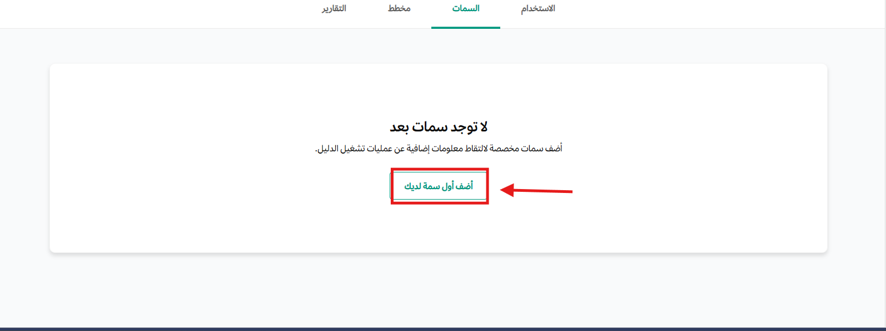
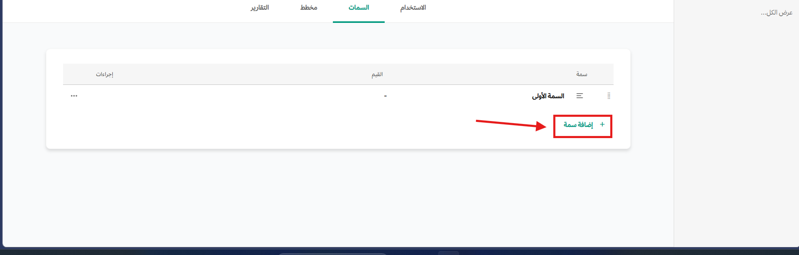
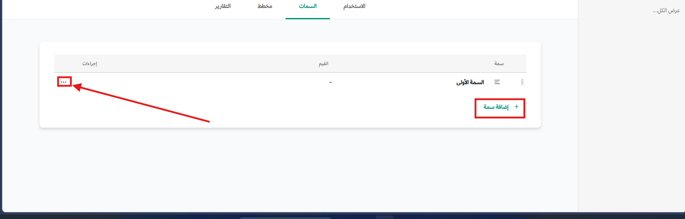

import FAIcon from "../../../components/FAIcon.astro";

يُعد "قالب العمل التعاوني" بمثابة قائمة مهام تضم كافة الخطوات التي تشكل عملياتك. وتتيح لك قوالب العمل تحويل المعرفة والعمليات الموثقة إلى إجراءات سهلة الوصول وقابلة للتعديل من قبل مؤسستك وفريقك. وعند إعداد قالب العمل، ستتمكن من تقسيم المهام وتعيين إجراءات لها - مثل تشغيل أمر مائل لبدء مكالمة Zoom. كما يمكنك تحديد ما إذا كنت تريد استخدام نفس القناة في كل مرة يُشغل فيها قالب العمل، أو إنشاء قناة جديدة.

تتضمن قوالب العمل أجزاءً أخرى، مثل إعدادات الأتمتة والمقاييس. وتطبق تهيئة قالب العمل على كل من تنفيذ القالب وإدارته وتحسينه.

ولكن أول شيء ستحتاج إلى إعداده هو قائمة المهام.

في كل مرة تستخدم فيها العملية التي قمت بتوثيقها، مثل تهيئة عميل جديد، يُستخدَم قالب العمل لبدء "دورة تشغيل" - وهي استخدام فردي ومستقل للعملية - وتُسجل هذه الدورة في قناة مخصصة أو قناة جديدة في كل مرة تُشغل فيها القالب.

يتضمن إعداد قالب العمل تهيئة كيفية إدارة القالب لإنشاء قناته وكيفية إخطار المعنيين.

لفتح قالب عمل وعرض إحصاءاته، اختر اسم قالب العمل. ولبدء دورة تشغيل باستخدام قالب عمل معين، اختر **تشغيل** بجانب اسم ذلك القالب.

## القوالب

قد يكون إنشاء قالب عمل من الصفر أمرًا شاقًا، حتى لو كانت العملية مرسومة بوضوح في ذهنك. وإحدى الطرق للبدء بسرعة هي استخدام أحد القوالب المعدة مسبقًا والمتاحة في النظام. وتأتي هذه القوالب مزودة بمحتوى وإعدادات لتوفير الإرشاد وهي قابلة للتخصيص بالكامل.

قوالب قوالب العمل هي تدفقات عمل أساسية يمكنك استخدامها للبدء بسرعة. ومع تعلّمك المزيد عن تدفقات العمل الخاصة بك، يمكنك تخصيصها لتصبح قوالب عمل محددة.

### اختيار قالب

الخطوة الأولى هي اختيار القالب المناسب لحالة الاستخدام الخاصة بك. وتتوفر قوالب معدة مسبقًا لسيناريوهات محددة؛ حيث تكون قوائم المهام والإجراءات وتحديثات الحالة وإعدادات المراجعة اللاحقة لهذه القوالب معبأة بالفعل ومفعلة حيثما كان ذلك مناسبًا. ويمكنك دائمًا تحرير وتعديل هذه الإعدادات - فهي موجودة لإرشادك فقط - وحذفها لا يؤثر سلبًا على دورة تشغيل قالب العمل.

:::tip[نصيحة]
ألقِ نظرة على قالب **تعلم كيفية استخدام قوالب العمل**. يشرح هذا القالب مكونات قالب العمل، ويمكنك أيضاً بدء دورة تشغيل تجريبية لرؤية كيف يترابط كل شيء معاً. فإذا اخترت هذا الخيار، يمكنك التوقف عن القراءة هنا والاستمتاع بالدورة التجريبية. كما يمكنك اختيار قالب فارغ والبدء من الصفر - وهو خيار جيد إذا كانت حالة استخدامك فريدة.
:::

في قالب الاستجابة للحوادث، يحتوي القالب على عناصر ذات صلة بحل الحوادث، وهي عناصر عامة لمساعدتك على البدء.

## تحرير قالب العمل

يمكنك تغيير تهيئة قالب العمل في أي وقت، ولكن التغييرات لن تنطبق إلا على دورات التشغيل المستقبلية. أما الدورات الجارية أو المنتهية التي بدأت سابقًا من ذلك القالب فستبقى دون تغيير.

1. انتقل إلى **أيقونة <FAIcon name={"table-cells"}/> > قوالب العمل**.
2. ابحث عن قالب العمل الذي تريد تحريره.
   - تُسرَد قوالب العمل العامة فقط وقوالب العمل الخاصة التي أنت عضو فيها. ويمتلك مسؤولو النظام وصولاً غير مقيد إلى جميع قوالب العمل في الفريق.
3. اختر اسم قالب العمل.
   - لتحرير قالب العمل مباشرة، اختر قائمة الإجراءات بجانب اسم القالب، ثم اختر **تعديل**.
   - للوصول إلى لوحة معلومات قالب العمل، اختر اسم القالب المرتبط برابط.
4. اختر تبويب **المخطط**.
5. قم بتحرير الأجزاء النصية من قالب العمل مباشرة. واستخدم القائمة الموجودة على اليسار للتنقل إلى الأجزاء الأخرى من قالب العمل التي ترغب في تحريرها.

## إنشاء قوائم المهام

تقتصر قوائم المهام في قالب العمل أو دورة التشغيل على المشاركين والمالكين في قالب العمل.

لإنشاء قائمة مهام في قالب العمل، انتقل إلى قسم **المهام**. ابدأ من مهام منمذجة أو أنشئ مهامك الخاصة. اختر **أضف المهمة** أو **أضف قسم** لبناء قوائم المهام في قالب العمل. ويمكنك السحب والإفلات لإعادة ترتيب المهام والأقسام حسب الحاجة. وتدعم أوصاف المهام تنسيق Markdown بشكل محدود، بما في ذلك تنسيق النص والروابط التشعبية.

تتكون مهام قالب العمل من نص يُعرَض بتنسيق Markdown عند توفره. ولا يمكنك تشغيل الأوامر مباشرة من مهمة في قالب العمل، ولكن يمكنك ضبط **الأوامر المائلة المدمجة** والأوامر المائلة المخصصة، أو الويب هوكات الصادرة، ليتم تشغيلها كجزء من إجراء المهمة عن طريق بدء المهمة بعلامة `/`.

## قوائم مهام القنوات

بدءًا من إصدار **قوالب العمل** v2.6.0، يمكنك أيضًا إنشاء وإدارة قوائم المهام المستندة إلى القنوات مباشرة داخل [القنوات العامة](/messaging-collaboration/collaborate-within-channels/channel-types#public-channels) و[القنوات الخاصة](/messaging-collaboration/collaborate-within-channels/channel-types#private-channels) دون الحاجة إلى قالب قالب عمل أو دورة تشغيل. وتستخدم قوائم مهام القنوات أذونات قنوات منصة تعاون الحالية للتحكم في الوصول، لذا يمكن لأي عضو في القناة لديه صلاحية إدارة أسماء القنوات ورؤوسها وأهدافها إنشاء قوائم مهام القناة وتحريرها وإدارتها.

لإنشاء قائمة مهام قناة جديدة أو تعديل قائمة موجودة، اختر خيار **قائمة المهام** (Checklist) في الزاوية العلوية اليسرى من واجهة منصة تعاون.

:::note[ملاحظة]
- قوائم مهام القنوات غير متوفرة في [الرسائل المباشرة](/messaging-collaboration/collaborate-within-channels/channel-types#direct-messages) أو [رسائل المجموعات](/messaging-collaboration/collaborate-within-channels/channel-types#group-messages).
- لإنشاء قائمة مهام قناة، يجب أن تكون [عضوًا](/messaging-collaboration/learn-about-taawon-roles#member) في القناة (وليس [ضيفًا](/messaging-collaboration/learn-about-taawon-roles#guest)). أما بالنسبة لتحرير قائمة مهام القناة، فيمكن لأي عضو يمكنه النشر في القناة القيام بذلك، بما في ذلك الضيوف.
- لا يمكن تعديل قوائم مهام القنوات في القنوات [المؤرشفة](/messaging-collaboration/collaborate-within-channels/channel-types#archived-channels). ويجب [إلغاء أرشفة](/messaging-collaboration/collaborate-within-channels/archive-and-unarchive-channels#unarchive-a-channel) القنوات المؤرشفة للوصول إلى قوائم مهامها وتحريرها.
- يمكن أن تحتوي القناة الواحدة على كل من دورات تشغيل قوالب العمل وقوائم مهام القنوات.
- عند استخدام منصة تعاون في متصفح الويب أو تطبيق سطح المكتب، يمكنك تحويل قائمة مهام القناة إلى قالب عمل عن طريق اختيار اسم قائمة المهام ثم اختيار **الحفظ كقالب عمل**.
:::

## دورات تشغيل متعددة في قناة واحدة

بدءًا من إصدار منصة تعاون v7.7، يمكنك اختيار بدء كل دورة تشغيل في قناة جديدة أو إعادة استخدام قناة موجودة بالفعل.

إليك بعض السيناريوهات التي قد تجعلك ترغب في بدء كل دورة تشغيل في نفس القناة:

- العمليات القصيرة والمتكررة تستفيد من وجودها في نفس القناة - مما يحافظ على انسيابية العملية.
- الفرق التي لديها تدفقات عمل متعددة ومستقلة، مثل فرق الإصدارات، تستفيد من وجودها في مكان واحد.
- تقليل عدد القنوات الجديدة المنشأة يسهل العثور على قنوات دورات التشغيل مرة أخرى.
- اسم دورة التشغيل غير مرتبط باسم القناة، لذا يمكنك التمييز بين تدفقات العمل المتعددة.

عند تهيئة قالب العمل الخاص بك:

- يمكنك ربطه بقناة موجودة بحيث تبدأ كل دورة تشغيل في تلك القناة.
- يمكنك اختيار إنشاء قناة جديدة في كل مرة يُشغّل فيها قالب العمل.

لوصول إلى هذا الإعداد، افتح تبويب **قوالب العمل**. اختر قالب العمل الذي تريد تحريره، ثم اختر تبويب **المخطط**. اختر **الإجراءات** من القائمة اليسرى وقم بالتحديد تحت عنوان **عند بدء دورة التشغيل**.

عند بدء دورة تشغيل، يكون اختيارك هو الافتراضي ولكن يمكن تغييره لكل دورة. بالإضافة إلى ذلك، من الممكن أيضاً نقل دورة تشغيل بدأت بالفعل إلى قناة أخرى، لذا فأنت لست مقيداً بأي خيار تحدده.

## تحديثات الحالة

قد يكون هناك عدة دورات تشغيل نشطة في أي يوم معين.

تعد تهيئة وتيرة التحديث طريقة سهلة لمركزية تحديثات الحالة، وتقليل الضجيج، وتذكر مكان كل شيء. ويمكنك القيام بذلك عند إعداد قالب العمل الخاص بك. انتقل إلى قسم **الاستخدام** وقم بضبط المعايير بناءً على دورات التحديث المتوقعة ومكان نشر التحديثات.

## الكلمات المفتاحية

يمكنك استخدام الكلمات المفتاحية لتشغيل قالب عمل. ويتم ضبط الكلمات المفتاحية في قائمة **إجراءات القناة** وهي تنطبق على قناة محددة. وعند استخدام إجراء الكلمات المفتاحية، سيُطالَب أي عضو في القناة لديه حق الوصول إلى قالب العمل ويستخدم إحدى الكلمات المفتاحية المدرجة بتشغيل قالب العمل المرتبط.

إذا وجدت أن كلماتك المفتاحية تؤدي إلى الكثير من النتائج الخاطئة، ففكر في تحسين قائمتك واعلم أيضاً أن الروابط التي يستخدمها أعضاء دورة التشغيل قد تحتوي أيضاً على كلمات مفتاحية مراقبة.

## الإجراءات

يمكنك تخصيص الإجراءات المرتبطة بقالب العمل الخاص بك لضمان بداية سلسة عند بدء دورة تشغيل. اختر تبويب **الإجراءات** لعرض خيارات الأتمتة المتاحة.

تشمل الخيارات ما يلي:

- إنشاء قناة عند بدء دورة تشغيل.
- دعوة الأعضاء إلى دورة التشغيل.
- إرسال الويب هوكات الصادرة.
- إضافة قناة دورة التشغيل تلقائياً إلى فئة في الشريط الجانبي.

يتم ضبط إجراءات مثل إنشاء القناة وإضافتها إلى فئة الشريط الجانبي لكل قالب عمل وتنطبق على كل دورة تشغيل تستخدم ذلك القالب.

إذا كنت مسؤول نظام أو مسؤول قناة لقناة دورة التشغيل، يمكنك أيضاً تحرير هذه الإعدادات في قناة دورة التشغيل، عبر قائمة القناة، في **إجراءات القناة**. وسيؤثر تحرير الإعدادات في قناة دورة التشغيل على تلك القناة فقط ولا تنطبق التغييرات على قالب العمل. ويمكن فقط لمسؤولي القناة تحرير عناصر **إجراءات القناة** مثل رسالة الترحيب ولكن يمكن للأعضاء الذين لديهم وصول إلى قالب العمل تحرير رسالة الترحيب وإعدادات سلوك دورة التشغيل. ولن يؤدي تحرير هذه الإعدادات إلى تغيير رسالة الترحيب لدورة تشغيل قيد التنفيذ - بل ينطبق فقط من الآن فصاعداً. فإذا كنت تريد تغيير سلوك جميع دورات التشغيل المستقبلية المرتبطة بقالب العمل، فقم بتحرير قالب العمل مباشرة في قائمة **الإجراءات**.

## سمات قالب العمل

بدءًا من إصدار منصة تعاون v11.1، عند استخدام منصة تعاون في متصفح الويب أو تطبيق سطح المكتب، يمكنك تحديد سمات مخصصة لقوالب العمل الخاصة بك لإنشاء تدفقات عمل تكيفية تستجيب لتغيّر المهام أو سياق العمليات. ومن تطبيق منصة تعاون للجوال v2.37.0، يمكنك عرض وتحرير سمات دورة تشغيل قالب العمل على أجهزة الجوال، بما في ذلك حقول النص، والاختيار، والاختيار المتعدد. ويمكن تهيئة سمات مثل الخطورة أو الفئة أو معرف التذكرة المرتبط لتشغيل مهام تراعي السياق وتمكين التكيف الذكي مع الظروف الطارئة.

:::note[ملاحظة]
تتطلب هذه الميزة إصدار قوالب العمل v2.5.0 أو أحدث في منصة تعاون.
:::

تمكنك السمات من:

- تحديد معلومات سياقية تختلف بين دورات التشغيل مثل خطورة الحادث، مستوى الأولوية، ونوع العميل.
- تشغيل مهام أو تدفقات عمل مختلفة بناءً على قيم السمات.
- إنشاء منطق شرطي في قوالب العمل الخاصة بك لأتمتة أكثر تعقيداً.
- الحفاظ على جمع بيانات متسق عبر دورات التشغيل.

تكون سمات قالب العمل مرئية لجميع المشاركين في دورة التشغيل ويمكن الإشارة إليها في تحديثات الحالة.

:::note[ملاحظة]
عند عرض وتحرير سمات دورة تشغيل قالب العمل على أجهزة الجوال، لا يتم دعم تنسيق الألوان وروابط URL في السمات وتظهر كنص عادي.
:::

### تهيئة السمات

لتهيئة السمات:

1. انتقل إلى أيقونة <FAIcon name="table-cells"/> واختر **قوالب العمل**.
2. اختر قالب العمل الذي تريد تحديد السمات له.
3. اختر تبويب **السمات**.
4. اختر **أضف أول سمة**.

5. أدخل اسماً للسمة وحدد نوعها كـ **نص** أو **رابط** أو **اختيار** أو **اختيار متعدد**.
6. بالنسبة لأنواع **اختيار** و **اختيار متعدد**، قم بتحديد القيم المتاحة.
7. اختر **أضف سمة** لإضافة سمات وقيم إضافية.

:::tip[نصيحة]
- تحكم في كيفية ظهور الشروط المستندة إلى السمات في مخطط قالب العمل عن طريق سحبها وإفلاتها بالترتيب الذي تفضله.
- استخدم قائمة **الإجراءات** لإعادة تسمية السمات أو تكرارها أو حذفها.
:::

## قوالب العمل الشرطية

بدءًا من إصدار منصة تعاون v11.1، عند استخدام منصة تعاون في متصفح الويب أو تطبيق سطح المكتب، يمكنك إنشاء قوالب عمل شرطية بتدفقات عمل أكثر تعقيداً تستجيب بذكاء للظروف المتغيرة. ومن تطبيق منصة تعاون للجوال v2.37.0، يمكنك أيضاً عرض وتحرير سمات دورة تشغيل قالب العمل على أجهزة الجوال. ومن خلال الاستفادة من سمات قالب العمل، يمكنك تحديد شروط تحدد المهام وقوائم المهام التي يتم تضمينها في دورة تشغيل قالب العمل بناءً على البيانات الآنية.

تمكنك قوالب العمل الشرطية من:

- إضافة مهام تنطبق فقط عند استيفاء شروط معينة.
- تحديد المهام وقوائم المهام التي تتغير بناءً على قيم السمات.
- إنشاء تدفقات عمل تكيفية تتغير بناءً على البيانات الآنية.

راجع توثيق [المهام الشرطية](/workflow-automation/work-with-tasks#conditional-tasks) لمزيد من التفاصيل حول تهيئة المهام الشرطية داخل قوالب العمل.

## مقاييس دورة التشغيل

يوفر تبويب **الاستخدام** في لوحة معلومات سير العمل مقاييس دورة التشغيل لذلك القالب. وتكون هذه المقاييس متاحة لجميع المشاهدين، ولا يمكن تحرير هذه المقاييس أو الإضافة إليها.

## الويب هوكات

- للحصول على معلومات حول حمولة الويب هوك لـ `run start`، راجع هيكل `PlaybookRunWebhookPayload` في GitHub. ويتوفر مثال لحمولة JSON لبدء دورة تشغيل هنا.
- للحصول على معلومات حول حمولة الويب هوك لـ `status update`، راجع هيكل `PlaybookRunWebhookPayload`. ويتوفر مثال لحمولة JSON لتحديث الحالة هنا.

:::tip[نصيحة]
شاهد هذه الندوة عبر الويب حول تأمين أعمالك الحساسة للتعرف على الميزات والوظائف الرئيسية التي يجب البحث عنها في أدوات الاستجابة للحوادث.
:::