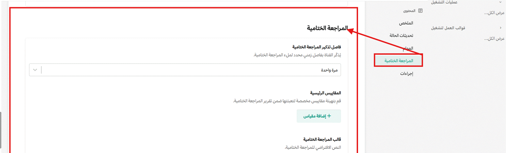
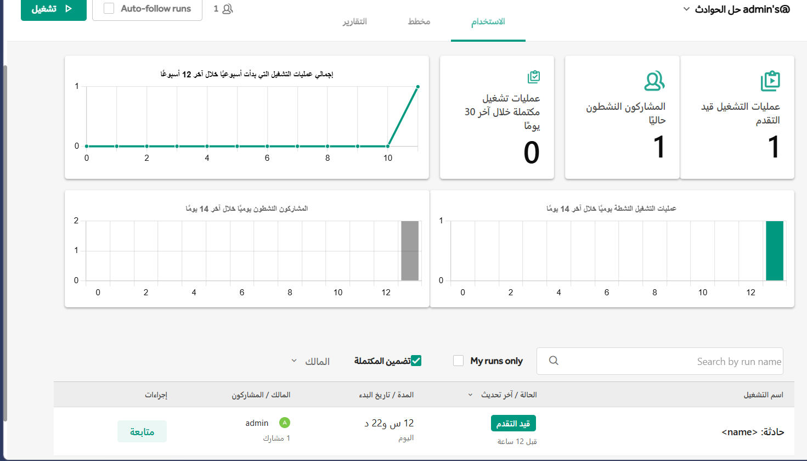

توفر لوحات معلومات سير العمل رؤى قيمة حول أداء تدفقات العمل عبر المؤسسة؛ حيث تقارن مقاييس المخرجات من دورات تشغيل مختلفة لقوالب العمل التعاونية مقابل الأهداف والأداء التاريخي. وفي كل مرة تُشغّل فيها دورة قالب عمل تعاوني، يمكنك تحديث لوحة معلومات سير العمل ليراجعها الفريق والمعنيون؛ إذ تُخصَّص مكونات لوحة المعلومات لكل قالب عمل.

من أمثلة لوحات معلومات سير العمل القائمة على المقاييس التي يمكن إعدادها لمراقبة الأداء: "وقت الكشف"، و"وقت الحل" في تدفقات عمل الاستجابة للحوادث، ونسبة إنجاز خطة العمل لإصدارات البرمجيات الشهرية، ومعدل نجاح الإطلاق للعمليات اللوجستية التي تتضمن عمليات الإطلاق.

## تهيئة المراجعات الختامية قبل بدء دورة التشغيل

انتقل إلى تبويب **قوالب العمل** في منصة تعـــاون. ابحث عن دليل العمل الذي تريد تعديله، اختر أيقونة النقاط الثلاث **...** تحت **الإجراءات** ثم اختر **تعديل**. في الشاشة التالية، اختر **المراجعة الختامية**.

يمكنك ضبط تذكير لملء المراجعة الختامية بعد انتهاء دورة التشغيل. يتم تعبئة القالب المهيأ مسبقاً في المراجعة الختامية لدورة التشغيل.

استخدم الجدول الزمني لدورة التشغيل للمساعدة في كتابة مراجعة ختامية دقيقة. تظهر أحداث مثل تغييرات المالك، وتحديثات الحالة، وتعيينات المهام تلقائياً. يمكن أيضاً إضافة منشورات مختارة إلى الجدول الزمني باستخدام قائمة سياق المنشور.

## المقاييس

استخدم المقاييس لتحديد المجالات الرئيسية التي ترغب في الحصول على رؤى قيمة منها لقياس الأداء وتحسينه. وتُفعَّل المقاييس عند تفعيل المراجعات اللاحقة؛ حيث يمكنك معايرة نوع المقياس الذي تريد قياسه، وعرض النتائج في المراجعة اللاحقة بمجرد انتهاء دورة التشغيل. كما يمكنك تهيئة مقاييس متعددة لكل قالب عمل وتحريرها في أي وقت، وتهيئة المقاييس بناءً على إدخال رقمي أو زمني أو قيمة محددة.

ويمكن أن تكون هذه المقاييس أي شيء يهمك ويهم فريقك؛ فعلى سبيل المثال، بالنسبة لقالب عمل إصدار البرمجيات، قد ترغب في تتبع مقياس لعدد الأخطاء التي اكتُشِفت أثناء دورة التشغيل. وتُوفَّر مخرجات المقاييس التي أضفتها في تقرير المراجعة اللاحقة. وبمرور الوقت، يمكنك استخدام المقاييس عبر المراجعات اللاحقة المختلفة لفحص الحالات الشاذة وتحسين الأهداف المحددة.

مثال آخر هو قالب عمل حوادث الدعم؛ حيث يمكن تطبيق مقياس "وقت الحل" واستخدامه لتحديد المجالات التي تحتاج إلى مزيد من التحسين، مثل المهام التي قد تعمل بشكل أفضل إذا تم تقسيمها بحيث يتم الوصول إلى الأهداف بشكل أسرع.

عند حذف مقاييس مهيأة من قالب عمل، لا يتم حذف البيانات، لكنك لن ترى تلك المقاييس بعد الآن في لوحة المعلومات. بالإضافة إلى ذلك، يتم إزالة حقل المقياس المقابل من نموذج المراجعة الختامية ومن المراجعات الختامية المنشورة.

## لوحة معلومات المقاييس

لكل دورة تشغيل، يمكنك إدخال قيمة لكل مقياس تحت قسم المراجعة الختامية. يمكن أن تستند هذه القيمة إلى أي شيء تقيسه، مثل عدد الأخطاء التي تم العثور عليها في كل دورة تشغيل.

يمكنك تحرير هذه القيمة عدة مرات كما تشاء - على سبيل المثال للتأكد من حصولك على المعايير الصحيحة لمقياسك - حتى تقوم بنشر المراجعة الختامية، وعند هذه النقطة لن تعد المقاييس والتقرير قابلين للتحرير. لا تظهر القيمة الختامية في لوحة معلومات دليل العمل إلا بعد نشر المراجعة الختامية.

تعرض لوحة معلومات قالب العمل تقارير عن كل مقياس لجميع دورات التشغيل من خلال عرض:

- القيمة المتوسطة لجميع دورات التشغيل.
- متوسط قيمة آخر 10 دورات والفرق مع متوسط الـ 10 دورات السابقة.
- نطاق القيم لجميع دورات التشغيل.
- القيمة المستهدفة.
- مخطط القيم الفعلية لآخر 10 دورات تشغيل.

يعرض النصف السفلي من الصفحة قائمة بالدورات المنتهية مع قيم المقاييس. ويمكنك تصفية أو فرز القائمة حسب قيم المقاييس.

