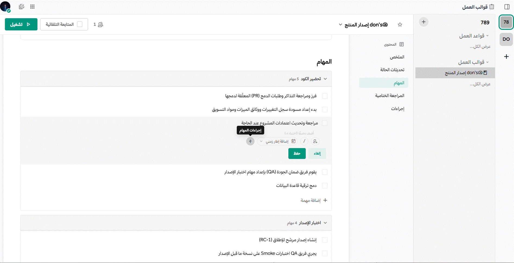
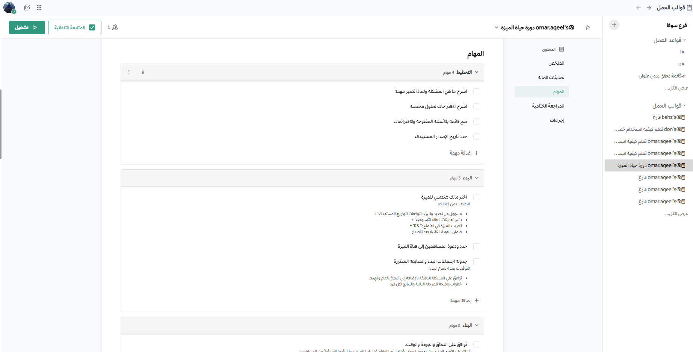

import FAIcon from "../../../components/FAIcon.astro";

## المهام وتواريخ الاستحقاق

في بعض تدفقات العمل، توجد قيود زمنية على المهام بينما قد يكون للبعض الآخر أطر زمنية أكثر مرونة. ويساعد ربط المهام بتواريخ تسليم محددة في توفير رؤية واضحة لأعباء العمل ويساعد الجميع على تحمل المسؤولية أثناء دورة التشغيل.

لتعيين تاريخ استحقاق لمهمة ما، اختر أيقونة **تفاصيل دورة التشغيل** لفتح شاشة **تفاصيل دورة التشغيل**. وقم بتمرير مؤشر الماوس فوق المهمة التي ترغب في تحريرها، ثم اختر أيقونة التقويم لتعيين تاريخ الاستحقاق. ويمكن استخدام تواريخ الاستحقاق لفرز المهام في النظرة العامة لدورة التشغيل.

عند تعيين تاريخ استحقاق لمهمة ما، وتكون المهمة متأخرة أو مستحقة اليوم، يُضاف تذكير إلى الموجز اليومي لقالب العمل جنباً إلى جنب مع المهام التي ليس لها تاريخ استحقاق محدد. وبمجرد اكتمال المهام، يتم إزالتها من تذكيرات الموجز اليومي. ويمكنك تحديث قائمة المهام المعينة في أي وقت باستخدام الأمر المائل `/playbook todo`.

يمكن إدخال تواريخ الاستحقاق نصياً مثل "منذ دقيقتين" أو رقمياً مثل "15 مارس 2026".

## إجراءات المهام

يمكنك إكمال المهام تلقائياً في دورة تشغيل قالب العمل باستخدام محفزات الكلمات المفتاحية. فعندما تُذكَر الكلمات المفتاحية التي أدخلتها في قناة دورة التشغيل، يتم وضع علامة "مكتمل" على المهمة تلقائياً.

لهذه الميزة، يجب استخدام سلسلة نصية بدلاً من كلمات فردية. والبحث هو بحث من نوع `ANY` (أي من الكلمات)، مما يعني أنه إذا استخدمت الكلمتين الفرديتين "هدف" و "مكتمل"، فإن أي من هاتين الكلمتين ستؤدي إلى وضع علامة مكتمل على المهمة. وإذا كنت تستخدم عبارات تحتوي على تنسيق، فتأكد من استخدام تنسيق Markdown في الحقل النصي.

عند تحرير مهمة، سترى ما يلي:

- النص المطلوب البحث عنه في الرسائل.
- القدرة على قصر هذا البحث على المشاركات من مستخدم معين (أو بوت).
- خيار وضع علامة "تم" على المهمة (أو لا).

## المهام الشرطية

بدءًا من إصدار منصة تعاون v11.1، عند استخدام منصة تعاون في متصفح الويب أو تطبيق سطح المكتب، يمكن تضمين المهام بشرط في قوالب العمل بناءً على قيم السمات أو ظروف وقت التشغيل. يتيح ذلك تدفقات عمل تكيفية حيث لا تُعرض المهام إلا عندما تكون ذات صلة بالسياق الحالي. على سبيل المثال:

- **الحوادث الأمنية**: تضمين مهام جنائية إضافية للحوادث المصنفة كأمنية.
- **تدفقات عمل فئات العملاء**: إظهار عمليات موافقة مختلفة بناءً على مستوى اشتراك العميل.
- **العمليات الجغرافية**: تضمين مهام امتثال خاصة بالمنطقة بناءً على خاصية الموقع.
- **التعيينات القائمة على المهارات**: تعيين المهام تلقائياً لأعضاء الفريق بناءً على مجالات خبرتهم.

### تهيئة المنطق الشرطي

لإعداد السلوك الشرطي في قالب العمل:

1. انتقل إلى أيقونة <FAIcon name="table-cells"/> واختر **قوالب العمل**.
2. اختر قالب العمل أو دورة التشغيل التي تريد إضافة شروط إليها.
3. اختر تبويب **المخطط**.
4. تحت قسم **المهام**، حدد المهمة التي تريد جعلها شرطية.
5. من أيقونة **المزيد** <FAIcon name="ellipsis-vertical"/> (النقاط الثلاث الرأسية) بجانب المهمة، اختر **إضافة شرط**.
6. اختر السمة والشرط والقيمة لتحديد متى يجب تضمين المهمة. ثم اختر **اكتمل التعديل**.

يتم تقييم المهام الشرطية وإضافتها أو إزالتها تلقائياً من قائمة المهام بناءً على الشروط المحددة. يقلل هذا من العبء الذهني من خلال إظهار المهام ذات الصلة فقط ويضمن عدم إغفال الخطوات الحاسمة في السيناريوهات المختلفة.

:::tip[نصيحة]
يمكنك إضافة ما يصل إلى شرطين لكل مهمة لإنشاء شرط "إما/أو".
:::

## صندوق وارد المهام

بالإضافة إلى الموجز اليومي، يمكنك أيضاً الوصول إلى صندوق وارد المهام. يوفر لك صندوق الوارد نظرة عامة عبر جميع دورات التشغيل للمهل التي تتحمل مسؤوليتها، مرتبة حسب تاريخ الاستحقاق.

يمكنك القيام بما يلي:

- الوصول إلى كل مهمة مباشرة، دون الحاجة لزيارة دورات التشغيل الفردية.
- وضع علامة "مكتمل" على المهام أو تخطيها.
- تغيير الشخص المعين للمهمة من نفسك إلى عضو آخر في الفريق، وسيتم حينها إزالة المهمة من صندوق الوارد الخاص بك.
- يمكنك تغيير تاريخ استحقاق المهام لإدارة الأولويات وحالات الاستعجال.

لعرض صندوق وارد المهام، انتقل إلى تبويب **قوالب العمل** في منصة تعاون. في الرأس، بجانب صورة ملفك الشخصي، اختر أيقونة قائمة المهام. سيتم عرض قائمة بكل مهمة معينة لك من كل دورة تشغيل قيد التنفيذ.

## إدارة مهام قوالب العمل على الجوال

بدءًا من إصدار منصة تعاون v11.0 وتطبيق الجوال v2.32.0، يمكن لمستخدمي الهواتف المحمولة إجراء عمليات إدارة المهام التالية في دورات تشغيل قوالب العمل:

### التفاعل مع مهام قالب العمل

- **التفاعل مع المهمة**: اضغط على أي مهمة لفتح عرض "ورقة سفلية" مفصل مع خيارات ومعلومات المهمة.
- **تحديد/إلغاء تحديد المهام**: إكمال المهام أو إعادة فتحها مباشرة من تطبيق منصة تعاون للجوال.
- **تخطي/إلغاء تخطي المهام**: وضع علامة "تخطي" على المهام أو إعادتها إلى الحالة النشطة مع تغير متطلبات سير العمل.

### تحديث المهام

- **تحديث الشخص المعين**: تغيير المسؤول عن إكمال المهمة مباشرة من تطبيق الجوال.
- **تعديل تواريخ الاستحقاق**: ضبط المواعيد النهائية للمهام لتلائم الأولويات والجداول المتغيرة.
- **تحرير أوامر المهام**: تحديث الأوامر المائلة أو التعليمات المرتبطة بالمهام.
- **تغيير ملكية دورة التشغيل**: نقل ملكية دورة التشغيل بين أعضاء الفريق.
- **إعادة تسمية المهام**: تحديث اسم المهمة ليعكس نطاق العمل أو الأولويات المتطورة من تطبيق الجوال v2.38.0.
- **إضافة أو تحرير أوصاف المهام**: إضافة سياق للمهمة أو تحديث وصف موجود من تطبيق الجوال v2.38.0.
- **حذف مهمة**: لا يمكن التراجع عن هذا الإجراء من تطبيق الجوال v2.37.0.

توفر هذه الميزات على الجوال وظائف كاملة لإدارة المهام للفرق التي تعمل مع قوالب العمل أثناء التنقل، مما يثري تجربتك الحالية على سطح المكتب ومتصفح الويب.