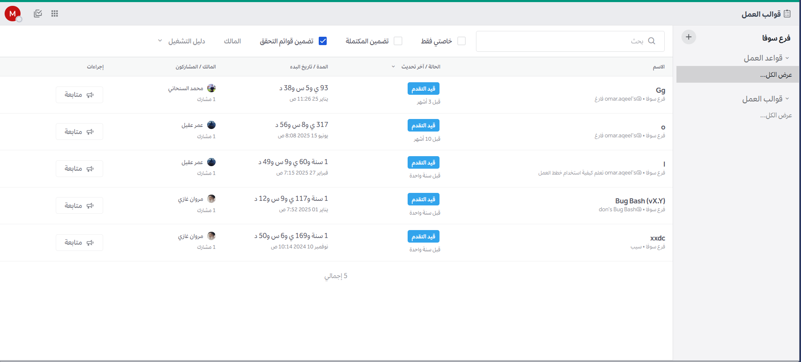

import { Tabs, TabItem } from "@astrojs/starlight/components";

توفر "قوالب العمل" الهيكلية والمراقبة والأتمتة للعمليات الجماعية المتكررة والمتكاملة مع منصة منصة تعـــاون. تعد قوالب العمل بمثابة [قوائم مهام قابلة للتكوين](/workflow-automation/work-with-tasks) تساعد الفرق على تحقيق [نتائج محددة ومتوقعة](/workflow-automation/work-with-metrics-and-goals)، مثل الاستجابة للحوادث، وإدارة إصدارات البرمجيات، والعمليات اللوجستية.

بدءاً من الإصدار 11.1، يمكن لعملاء باقات Entry وEnterprise وEnterprise Advanced تفعيل "سير العمل التكيفي" والشرطي الذي يستجيب لحظياً لتغير سياق المهمة أو العمليات. يمكن للمسؤولين تحديد سمات مثل "الخطورة"، أو "الفئة"، أو "معرف التذكرة المرتبط"، واستخدام هذه السمات لإخفاء أو إظهار المهام بناءً على قيمها التي يتم تعيينها وتعديلها أثناء دورة التشغيل. تعرف على المزيد حول [سمات دليل العمل](/workflow-automation/work-with-collaborative-playbooks#playbook-attributes) و[المهام الشرطية](/workflow-automation/work-with-tasks#conditional-tasks).

بينما تركز قوالب العمل بشكل أساسي على تنسيق الأفراد والمهام، فإنها توفر أيضاً نقاط تكامل برمجية؛ حيث يمكنك بدء "دورة تشغيل دليل عمل" عبر "خطاف ويب" خارجي. كما يمكنك داخل الدليل تحديد خطوات لتنفيذ خطافات ويب أو استدعاء واجهات برمجة تطبيقات خارجية. بالإضافة إلى ذلك، تعمل قوالب العمل بالتزامن مع "الملحقات"، مما يبقي سير العمل بالكامل مرئياً داخل منصة تعـــاون ويقلل الحاجة للتنقل بين التطبيقات أثناء العمليات الحساسة.

تقوم قوالب العمل بمراقبة القنوات بحثاً عن كلمات مفتاحية أو إجراءات محددة من المستخدمين لبدء عملية هيكلية، والتي تظهر كمجموعة من المهام الفردية أو المشتركة، يرتبط كل منها بإجراءات يدوية أو مؤتمتة. وأثناء تنفيذ هذه الأدلة، قد تتطلب بعضها [بث تحديثات الحالة لأصحاب المصلحة](/workflow-automation/work-with-notifications-and-updates) على فترات منتظمة، أو ملء لوحات معلومات سير العمل عبر إجراء [مراجعات لاحقة](/workflow-automation/work-with-metrics-and-goals#configure-retrospectives-before-a-run) بعد اكتمال العملية الأساسية، أو استيفاء متطلبات أخرى كمعايير لخروج [دورة تشغيل دليل العمل](/workflow-automation/work-with-runs).

تتوفر أيضاً [أذونات متقدمة](/workflow-automation/share-and-collaborate) لتفويض وإدارة ضوابط قوالب العمل في المؤسسات الكبيرة.

## الإعداد والتكوين

تأتي قوالب العمل مدمجة ومثبتة ومفعلة مسبقاً مع خادم منصة تعـــاون.

## الوصول إلى الخدمة

<Tabs>
  <TabItem label="الويب وسطح المكتب">
    يمكنك الوصول إلى قوالب العمل عبر متصفح الويب أو تطبيق سطح المكتب من خلال النقر على "قائمة المنتجات" الموجودة في الزاوية العلوية اليسرى من واجهة منصة تعـــاون، ثم اختيار **قوالب العمل**.
  </TabItem>
  <TabItem label="الجوال">
    بدءاً من إصدار منصة تعـــاون 11.0 وتطبيق الجوال 2.34.0، يمكن لمستخدمي الجوال:
    - **نشر تحديثات الحالة مباشرة**: عند فتح دورة تشغيل دليل عمل، يتيح زر تحديث الحالة الجديد نشر التقدم ومشاركة الحالة مع الفريق أثناء التنقل.
    - **إنشاء وإدارة دورات التشغيل** للتحكم العملياتي الميداني.

    بدءاً من الإصدار 11 وتطبيق الجوال 2.32.0، يمكن للمستخدمين [التفاعل مع مهام دليل العمل](/workflow-automation/work-with-tasks#interact-with-playbook-tasks) و[تحديث المهام](/workflow-automation/work-with-tasks#update-tasks).

    بدءاً من الإصدار 10.11 وتطبيق الجوال 2.31.0، يمكن لمستخدمي الجوال الوصول إلى قوالب العمل بوضع "القراءة فقط". تُدعم [أوامر قوالب العمل](/workflow-automation/interact-with-collaborative-playbooks#slash-commands) في التطبيق، لكن إجراءات مثل بدء الدورات أو تحديث قوائم المهام غير متاحة عبر واجهة الجوال.

  </TabItem>
</Tabs>

## كيفية الاستخدام

استخدم قوالب العمل التعاونية لتنظيم تدفقات العمل المقررة، وتبسيط وتوثيق العمليات المعقدة والمتكررة، مما يساعد مؤسستك على إبقاء زمام الأمور تحت السيطرة من خلال التواصل المتكامل ولوحات متابعة الحالة التي تدير دورة حياة سير العمل بالكامل.

:::tip[جربها بنفسك!]
اطلع على [العرض التوضيحي لدليل الاستجابة للحوادث](https://mattermost.com/demo/playbooks-incident-response/) للتعرف على الإمكانيات الكاملة لقوالب العمل.
:::

## تعلم المزيد

هذا التوثيق مخصص لكل من يرغب في بناء عمليات متكررة واحترافية داخل منصة تعـــاون:

- [نظرة عامة](/workflow-automation/learn-about-collaborative-playbooks): تعرف على ماهية قوالب العمل التعاونية وكيفية استخدامها.
- [إدارة قوالب العمل](/workflow-automation/work-with-collaborative-playbooks): خصص دليلاً لضمان نجاح دورات التشغيل.
- [إدارة دورات التشغيل](/workflow-automation/work-with-runs): عدّل المحفزات والإجراءات في دورة تشغيل نشطة.
- [إدارة المهام](/workflow-automation/work-with-tasks): تعامل مع المهام وصندوق الوارد الخاص بها.
- [الإشعارات والتحديثات](/workflow-automation/work-with-notifications-and-updates): تتبع كافة الدورات والمهام النشطة.
- [المقاييس والأهداف](/workflow-automation/work-with-metrics-and-goals): استخرج رؤى حول أداء سير العمل عبر المؤسسة باستخدام لوحات معلومات سير العمل.
- [المشاركة والتعاون](/workflow-automation/share-and-collaborate): أعِد استخدام ومشاركة قوالب العمل مع فريقك.
- [التفاعل البرمجي](/workflow-automation/interact-with-collaborative-playbooks): تفاعل مع قوالب العمل باستخدام الأوامر المائلة وواجهة REST API.